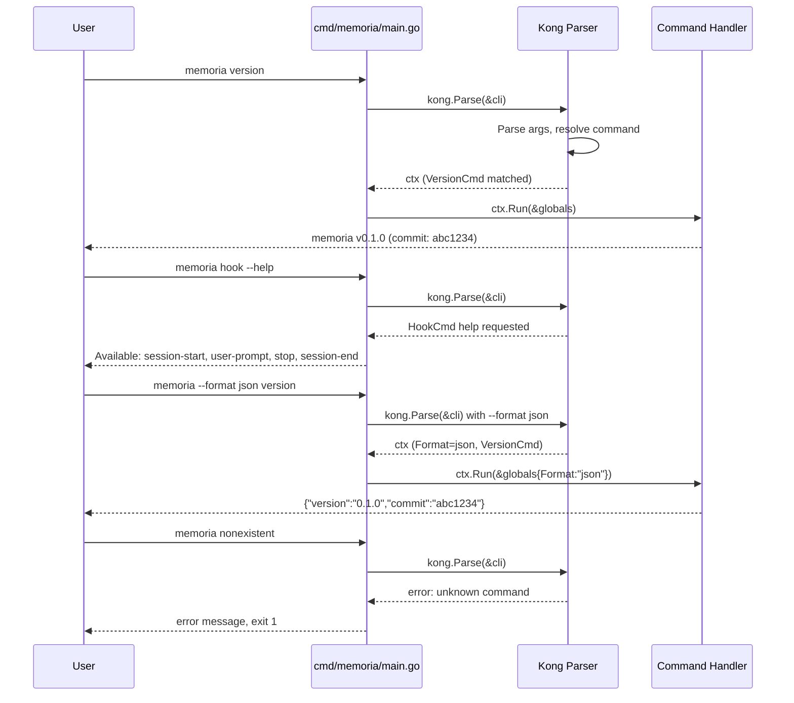

# M01: Go module + Kong CLI 骨格 (cli-skeleton)

## Overview

| 項目 | 値 |
|------|---|
| ステータス | 完了 |
| 依存 | なし |
| 対象ファイル | 12-14 |

## Goal

Go module を初期化し、Kong framework で全サブコマンドの空スケルトンとグローバルフラグを実装する。`memoria version` が動作する状態を作る。

## Sequence Diagram



## TDD Test Design (Red -> Green -> Refactor)

### Red Phase: 失敗するテストを先に書く

全テストを `internal/cli/cli_test.go` に table-driven test として記述する。
Kong の `kong.Parse` をテストヘルパーでラップし、stdout/stderr をキャプチャする。

| # | テストケース | 入力 | 期待出力 | TDDフェーズ |
|---|-------------|------|---------|------------|
| 1 | TestVersionCommand_Text | `version` | `memoria v<version>` を含む出力、exit 0 | Red -> Green |
| 2 | TestVersionCommand_JSON | `--format json version` | `{"version":"...","commit":"..."}` の JSON 形式 | Red -> Green |
| 3 | TestGlobalFlagHelp | `--help` | hook, worker, memory, config, doctor, version を含む | Red -> Green |
| 4 | TestHookSubcommands | `hook --help` | session-start, user-prompt, stop, session-end | Red -> Green |
| 5 | TestWorkerSubcommands | `worker --help` | start, stop, restart, status | Red -> Green |
| 6 | TestMemorySubcommands | `memory --help` | search, get, list, stats, reindex | Red -> Green |
| 7 | TestConfigSubcommands | `config --help` | init, show, path, print-hook | Red -> Green |
| 8 | TestCompletionSubcommands | `completion --help` | bash, zsh, fish | Red -> Green |
| 9 | TestPluginSubcommands | `plugin --help` | list, doctor | Red -> Green |
| 10 | TestUnknownCommand | `nonexistent` | エラー、exit 1 | Red -> Green |
| 11 | TestVerboseFlag | `--verbose version` | Globals.Verbose == true | Red -> Green |
| 12 | TestNoColorFlag | `--no-color version` | Globals.NoColor == true | Red -> Green |
| 13 | TestNotImplementedCommands | `doctor` | "not implemented" 出力、exit 0 | Red -> Green |

### Green Phase: テストを通す最小限の実装

各コマンド構造体と `Run()` メソッドを最小限で実装する。

### Refactor Phase: コード整理

- 共通パターンの抽出（出力ヘルパー等）
- ファイル分割の最適化
- lint / vet の通過確認

## テストヘルパー設計

```go
// parseForTest は Kong パーサーをテスト用に構成し、
// stdout/stderr をキャプチャして返す。
func parseForTest(args []string) (stdout string, stderr string, err error, globals *Globals)
```

Kong のテストでは `kong.Parse` を直接使うのではなく、`kong.New` で parser を生成し、
`parser.Parse(args)` で制御する。これにより `os.Exit` を回避できる。

### TDD の Red Phase 戦略

Go では「コンパイルエラーもテスト失敗」。ただし実用上、最小限の型定義（空の構造体）と
テストを同時に書く「コンパイル可能な Red」アプローチを採用する。
具体的には Step 2 で空の CLI 構造体 + テストを同時作成し、Run() 未実装によるテスト失敗を確認する。

### version コマンド JSON スキーマ

```json
{
  "version": "0.1.0",
  "commit": "abc1234",
  "date": "2026-03-28"
}
```

### ldflags ビルド変数

`cmd/memoria/main.go` に以下の変数を定義し、`-ldflags` で埋め込む:

```go
var (
    version = "dev"
    commit  = "none"
    date    = "unknown"
)
```

Makefile での埋め込み:
```makefile
LDFLAGS := -ldflags "-X main.version=$(VERSION) -X main.commit=$(COMMIT) -X main.date=$(DATE)"
```

## Implementation Steps

### Step 1: Go module 初期化 + 依存取得
- [ ] `go mod init github.com/youyo/memoria`
- [ ] `go get github.com/alecthomas/kong@latest`

### Step 2: テスト作成 (Red)
- [ ] `internal/cli/cli_test.go` に全テストケースを記述
- [ ] `go test ./...` で全テスト失敗を確認

### Step 3: CLI ルート構造体 + グローバルフラグ (Green)
- [ ] `internal/cli/root.go` に CLI 構造体と Globals を定義
- [ ] `--config`, `--verbose`, `--no-color`, `--format` グローバルフラグ

### Step 4: version コマンド実装 (Green)
- [ ] `internal/cli/version.go` に VersionCmd を実装
- [ ] text / json 両方の出力対応
- [ ] `-ldflags` 用のビルド変数定義

### Step 5: 全サブコマンドの空構造体登録 (Green)
- [ ] `internal/cli/hook.go` - HookCmd + 4サブコマンド
- [ ] `internal/cli/worker.go` - WorkerCmd + 4サブコマンド
- [ ] `internal/cli/memory.go` - MemoryCmd + 5サブコマンド
- [ ] `internal/cli/config.go` - ConfigCmd + 4サブコマンド
- [ ] `internal/cli/completion.go` - CompletionCmd + 3サブコマンド
- [ ] `internal/cli/plugin.go` - PluginCmd + 2サブコマンド
- [ ] `internal/cli/doctor.go` - DoctorCmd

### Step 6: エントリポイント作成 (Green)
- [ ] `cmd/memoria/main.go` に main() を実装
- [ ] kong.Parse + ctx.Run パターン

### Step 7: テスト全通過確認
- [ ] `go test ./...` で全テスト通過
- [ ] `go build ./...` でビルド成功
- [ ] `go vet ./...` で警告なし

### Step 8: Refactor
- [ ] コードの整理・共通化
- [ ] 不要なコードの除去

### Step 9: Makefile 作成
- [ ] build: `-ldflags` でバージョン埋め込み
- [ ] test: `go test ./...`
- [ ] lint: `go vet ./...`
- [ ] clean: ビルド成果物の削除

### Step 10: 最終検証
- [ ] `make build && make test` で全パス
- [ ] バイナリ実行確認: `./bin/memoria version`, `./bin/memoria --help`

## Directory Structure

```
cmd/
  memoria/
    main.go              # エントリポイント
internal/
  cli/
    root.go              # CLI ルート構造体 + Globals + グローバルフラグ
    version.go           # version コマンド
    hook.go              # hook サブコマンドグループ（空実装）
    worker.go            # worker サブコマンドグループ（空実装）
    memory.go            # memory サブコマンドグループ（空実装）
    config.go            # config サブコマンドグループ（空実装）
    completion.go        # completion サブコマンドグループ（空実装）
    plugin.go            # plugin サブコマンドグループ（空実装）
    doctor.go            # doctor コマンド（空実装）
    cli_test.go          # 全テスト
Makefile
go.mod
go.sum
```

## 設計判断

| 判断 | 理由 |
|------|------|
| Kong の struct tag ベースで CLI を定義 | 宣言的で見通しが良い。SPEC.ja.md の要件と合致 |
| Globals 構造体を ctx.Run に渡す | 各コマンドがグローバルフラグにアクセスできる標準パターン |
| 空コマンドは "not implemented" を出力 | 将来のマイルストーンで差し替えるプレースホルダー |
| テストは Kong parser を直接操作 | os.Exit を回避しテスト可能にする |
| internal/cli パッケージに集約 | cmd は薄くし、ロジックは internal に閉じ込める |

## Risks

| リスク | 影響度 | 対策 |
|--------|--------|------|
| Kong の API が Go 1.24+ で breaking change | 中 | Kong の latest tag を確認し、互換性を検証。go.sum で固定 |
| サブコマンド構造の設計ミス | 低 | SPEC.ja.md / CLI.ja.md に忠実に実装。テストで全コマンド存在を検証 |
| テストヘルパーの Kong 内部依存 | 低 | Kong 公式の推奨テストパターンに準拠 |
| completion コマンドの Kong 組み込み機能との競合 | 低 | Kong の completion 機能は使わず独自スタブとして実装 |

## 完了条件

- [x] `go mod init` 済み、Kong 依存あり
- [ ] 全テストケース（13件）が green
- [ ] `memoria version` が text/json 両方で正しく出力
- [ ] `memoria --help` で全サブコマンドが表示
- [ ] 各サブコマンドの `--help` が子コマンドを表示
- [ ] 未実装コマンドは "not implemented" を出力
- [ ] Makefile の build/test/lint/clean が動作
- [ ] `go vet ./...` が警告なし
