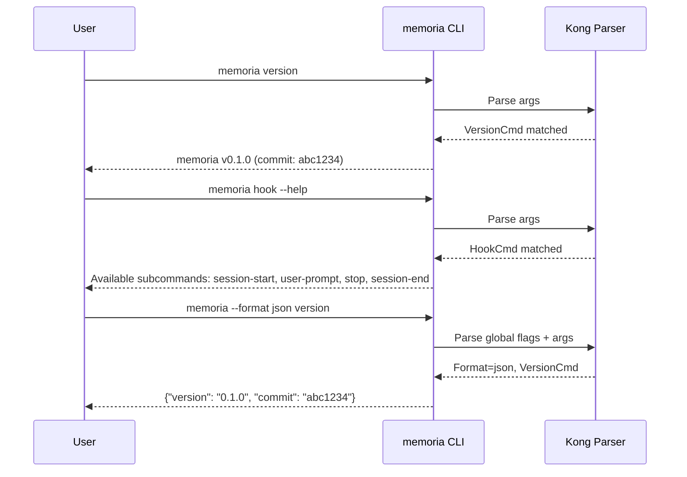

# M01: Go module + Kong CLI 骨格 (cli-skeleton)

## Overview

| 項目 | 値 |
|------|---|
| ステータス | 未着手 |
| 依存 | なし |
| 対象ファイル | 8-10 |

## Goal

Go module を初期化し、Kong framework で全サブコマンドの空スケルトンとグローバルフラグを実装する。`memoria version` が動作する状態を作る。

## Sequence Diagram



## TDD Test Design

| # | テストケース | 入力 | 期待出力 |
|---|-------------|------|---------|
| 1 | TestVersionCommand | `memoria version` | バージョン文字列を含む出力、exit 0 |
| 2 | TestGlobalFlagFormat | `memoria --format json version` | JSON 形式の出力 |
| 3 | TestGlobalFlagHelp | `memoria --help` | 全サブコマンド名を含むヘルプテキスト |
| 4 | TestHookSubcommands | `memoria hook --help` | session-start, user-prompt, stop, session-end を含む |
| 5 | TestWorkerSubcommands | `memoria worker --help` | start, stop, restart, status を含む |
| 6 | TestMemorySubcommands | `memoria memory --help` | search, get, list, stats, reindex を含む |
| 7 | TestConfigSubcommands | `memoria config --help` | init, show, path, print-hook を含む |
| 8 | TestUnknownCommand | `memoria nonexistent` | エラーメッセージ、exit 1 |
| 9 | TestVerboseFlag | `memoria --verbose version` | verbose が context に設定される |
| 10 | TestNoColorFlag | `memoria --no-color version` | no-color が context に設定される |

## Implementation Steps

- [ ] Step 1: `go mod init github.com/youyo/memoria` で Go module 初期化
- [ ] Step 2: Kong framework を `go get` でインストール
- [ ] Step 3: `cmd/memoria/main.go` にエントリポイント作成
- [ ] Step 4: グローバルフラグ構造体定義（`--config`, `--verbose`, `--no-color`, `--format`）
- [ ] Step 5: CLI ルート構造体に全サブコマンドグループを登録
  - `hook`: session-start, user-prompt, stop, session-end
  - `worker`: start, stop, restart, status
  - `memory`: search, get, list, stats, reindex
  - `config`: init, show, path, print-hook
  - `completion`: bash, zsh, fish
  - `plugin`: list, doctor
  - `doctor`: （単独コマンド）
  - `version`: （単独コマンド）
- [ ] Step 6: `version` コマンド実装（`-ldflags` でビルド時埋め込み）
- [ ] Step 7: 各サブコマンドの空 `Run()` メソッド実装（`fmt.Println("not implemented")` で仮実装）
- [ ] Step 8: Makefile 作成（build, test, lint, clean ターゲット）
- [ ] Step 9: テスト作成（TDD テーブルの全ケース）
- [ ] Step 10: `go build ./...` と `go test ./...` で検証

## Directory Structure

```
cmd/
  memoria/
    main.go           # エントリポイント
internal/
  cli/
    root.go           # CLI ルート構造体 + グローバルフラグ
    version.go        # version コマンド
    hook.go           # hook サブコマンドグループ（空）
    worker.go         # worker サブコマンドグループ（空）
    memory.go         # memory サブコマンドグループ（空）
    config.go         # config サブコマンドグループ（空）
    completion.go     # completion サブコマンドグループ（空）
    plugin.go         # plugin サブコマンドグループ（空）
    doctor.go         # doctor コマンド（空）
    cli_test.go       # テスト
Makefile
go.mod
go.sum
```

## Risks

| リスク | 影響度 | 対策 |
|--------|--------|------|
| Kong の API が Go 1.26 で breaking change | 中 | Kong の latest tag を確認し、互換性を検証 |
| サブコマンド構造の設計ミス | 低 | SPEC.ja.md / CLI.ja.md に忠実に実装 |
