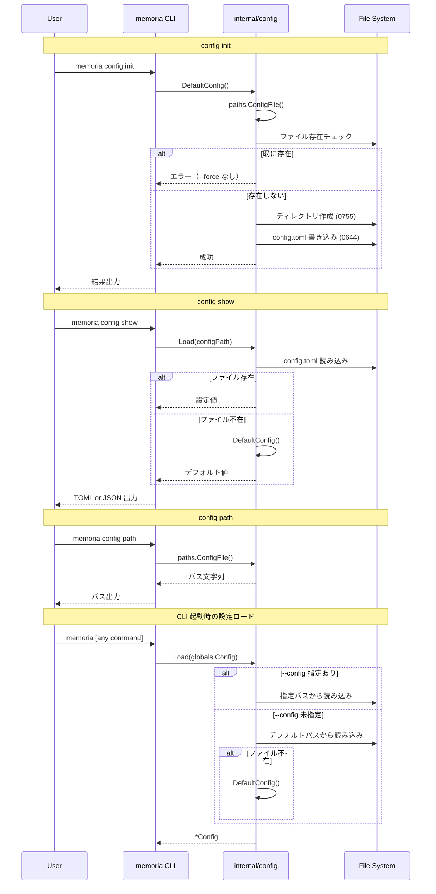

# M02: 設定ファイル + XDG パス 詳細計画

## 概要

memoria の設定管理基盤を実装する。XDG 風固定パスの解決、config.toml の読み書き、`config init/show/path` コマンドの実装を行う。

## スコープ

| 項目 | 含む | 含まない |
|------|------|---------|
| XDG パス解決 | config / data / state の3ディレクトリ | 環境変数による XDG 可変対応（SPEC §4 で明示的に非対応） |
| config.toml | 読み込み・デフォルト生成・バリデーション | 動的なホットリロード |
| CLI コマンド | `config init` / `config show` / `config path` | `config print-hook`（M12 で実装） |
| Globals 拡張 | `--config` フラグの実接続 | DB 接続等の他の DI |

## アーキテクチャ

### パッケージ構成

```
internal/
├── cli/
│   ├── root.go          # Globals 拡張（Config フィールド活用）
│   └── config.go        # config init/show/path コマンド実装
├── config/
│   ├── config.go        # Config 構造体 + Load/Save/Default
│   ├── config_test.go   # Config のユニットテスト
│   ├── paths.go         # XDG パス解決
│   └── paths_test.go    # パス解決のユニットテスト
```

### Config 構造体（config.toml のスキーマ）

```go
// Config は memoria の設定を表す。
type Config struct {
    Log      LogConfig      `toml:"log"`
    Worker   WorkerConfig   `toml:"worker"`
    Embedding EmbeddingConfig `toml:"embedding"`
}

type LogConfig struct {
    Level string `toml:"level"` // debug, info, warn, error
}

type WorkerConfig struct {
    IngestIdleTimeout  int `toml:"ingest_idle_timeout"`   // 秒。デフォルト 60
    EmbeddingIdleTimeout int `toml:"embedding_idle_timeout"` // 秒。デフォルト 600
}

type EmbeddingConfig struct {
    Model string `toml:"model"` // デフォルト "cl-nagoya/ruri-v3-30m"
}
```

### XDG パス（Linux 風固定、SPEC §4 準拠）

```go
func ConfigDir() string  // ~/.config/memoria/
func DataDir() string    // ~/.local/share/memoria/
func StateDir() string   // ~/.local/state/memoria/
func ConfigFile() string // ~/.config/memoria/config.toml
func DBFile() string     // ~/.local/share/memoria/memoria.db
func RunDir() string     // ~/.local/state/memoria/run/
func LogDir() string     // ~/.local/state/memoria/logs/
func SocketPath() string // ~/.local/state/memoria/run/embedding.sock
```

### シーケンス図



## TDD 実装ステップ（Red → Green → Refactor）

### Step 1: XDG パス解決 (`internal/config/paths.go`)

**Red:**
```go
// paths_test.go
func TestConfigDir(t *testing.T) {
    dir := ConfigDir()
    home, _ := os.UserHomeDir()
    expected := filepath.Join(home, ".config", "memoria")
    if dir != expected {
        t.Errorf("got %s, want %s", dir, expected)
    }
}
// 同様に DataDir, StateDir, ConfigFile, DBFile, RunDir, LogDir, SocketPath
```

**Green:** 各関数を最小実装。

**Refactor:** 共通の `homeDir()` ヘルパーを抽出。

### Step 2: Config 構造体 + Default + Load + Save (`internal/config/config.go`)

**Red:**
```go
// config_test.go
func TestDefaultConfig(t *testing.T) {
    cfg := DefaultConfig()
    if cfg.Log.Level != "info" { ... }
    if cfg.Worker.IngestIdleTimeout != 60 { ... }
    if cfg.Worker.EmbeddingIdleTimeout != 600 { ... }
    if cfg.Embedding.Model != "cl-nagoya/ruri-v3-30m" { ... }
}

func TestSaveAndLoad(t *testing.T) {
    dir := t.TempDir()
    path := filepath.Join(dir, "config.toml")
    cfg := DefaultConfig()
    err := Save(path, cfg)
    // assert no error
    loaded, err := Load(path)
    // assert loaded == cfg
}

func TestLoadNonExistent(t *testing.T) {
    cfg, err := Load("/nonexistent/config.toml")
    // err == nil, cfg == DefaultConfig()
}

func TestLoadInvalidTOML(t *testing.T) {
    // 不正な TOML → エラー
}
```

**Green:** `DefaultConfig()`, `Load()`, `Save()` を実装。TOML ライブラリに `github.com/BurntSushi/toml` を使用。

**実装ノート:** `Save()` は一時ファイルに書き込み後 `os.Rename()` で atomic に置換する。部分書き込みによる config 破損を防止するため。

**Refactor:** エラーメッセージの統一、`EnsureDir()` ヘルパー抽出。

### Step 3: config init コマンド (`internal/cli/config.go`)

**Red:**
```go
// cli_test.go に追加
func TestConfigInit_CreatesFile(t *testing.T) {
    // t.Setenv("MEMORIA_CONFIG", tmpDir) を使用（t.Parallel() との競合を自動防止）
    // config init 実行後にファイルが存在することを確認
}

func TestConfigInit_AlreadyExists(t *testing.T) {
    // 既存ファイルがある場合はエラー
}
```

**Green:** `ConfigInitCmd.Run()` に `config.Save(config.DefaultConfig())` を接続。`ConfigInitCmd` 構造体には `Force bool` フィールド（`--force` フラグ）を追加し、既存ファイルの上書きを制御する。

**Refactor:** エラーハンドリングの改善。

### Step 4: config show コマンド

**Red:**
```go
func TestConfigShow_DefaultOutput(t *testing.T) {
    // config ファイルなし → デフォルト値が TOML で出力される
}

func TestConfigShow_JSONOutput(t *testing.T) {
    // --format json → JSON 出力
}

func TestConfigShow_CustomConfig(t *testing.T) {
    // カスタム config を事前作成 → その値が出力される
}
```

**Green:** `ConfigShowCmd.Run()` を実装。

**Refactor:** 出力フォーマットの共通化。

### Step 5: config path コマンド

**Red:**
```go
func TestConfigPath_Output(t *testing.T) {
    // デフォルトパスが出力される
}

func TestConfigPath_CustomPath(t *testing.T) {
    // --config 指定時はそのパスが出力される
}

func TestConfigPath_JSONOutput(t *testing.T) {
    // --format json → JSON 出力
}
```

**Green:** `ConfigPathCmd.Run()` を実装。

**Refactor:** 不要。

### Step 6: Globals との統合

**Red:**
```go
func TestGlobalsConfigFlag(t *testing.T) {
    // --config /path/to/custom.toml が Globals.ConfigPath に設定される
}
```

**Green:** `Globals.ConfigPath` を `Load()` に接続。Kong Bind で `*config.Config` を全コマンドに注入可能にする。

既存の `Globals.Config string` を `Globals.ConfigPath string` にリネーム。ロード済み `*config.Config` 構造体は `kong.Bind(&cfg)` で全コマンドに注入する。

`parseForTest` にも `kong.Bind(&config.DefaultConfig())` を追加し、既存テストが Config nil エラーで失敗しないことを保証する。

**Refactor:** main.go の DI パターン整理。

### Step 7: config print-hook（スタブ維持）

`config print-hook` は M12 で実装するため、現在の "not implemented" スタブを維持する。

## 依存ライブラリ

| ライブラリ | 用途 | バージョン |
|-----------|------|-----------|
| `github.com/BurntSushi/toml` | TOML 読み書き | go get 時の最新安定版（go.sum で固定） |

## リスク評価

| リスク | 影響度 | 確率 | 軽減策 |
|--------|--------|------|--------|
| macOS の HOME パスが Linux と異なる | 中 | 低 | `os.UserHomeDir()` を使用し OS 差異を吸収 |
| TOML ライブラリの API 変更 | 低 | 低 | バージョン固定 |
| config.toml のスキーマ変更（将来） | 中 | 高 | 未知フィールドを無視する寛容なパース、バージョンフィールドは不要（TOML の特性で後方互換） |
| テスト時のファイルシステム依存 | 中 | 中 | `t.TempDir()` で隔離、環境変数でパス上書き |
| `--config` フラグと環境変数 `MEMORIA_CONFIG` の優先順位 | 低 | 低 | Kong の既存挙動（フラグ > 環境変数 > デフォルト）に従う |

## 完了基準

- [ ] `go test ./...` が全て green
- [ ] `internal/config/` パッケージが存在し、paths / config の全関数にテストがある
- [ ] `memoria config init` が `~/.config/memoria/config.toml` を生成する
- [ ] `memoria config show` が現在の設定を TOML / JSON で表示する
- [ ] `memoria config path` が設定ファイルパスを表示する
- [ ] `--config` フラグでカスタムパスを指定できる
- [ ] `config print-hook` は "not implemented" スタブを維持
- [ ] CLAUDE.md の関連箇所が更新されている

## 実装順序まとめ

1. `internal/config/paths.go` + テスト
2. `internal/config/config.go` + テスト（TOML 依存追加）
3. `internal/cli/config.go` の config init 実装 + テスト
4. `internal/cli/config.go` の config show 実装 + テスト
5. `internal/cli/config.go` の config path 実装 + テスト
6. `cmd/memoria/main.go` の Globals 統合
7. 統合テスト確認
