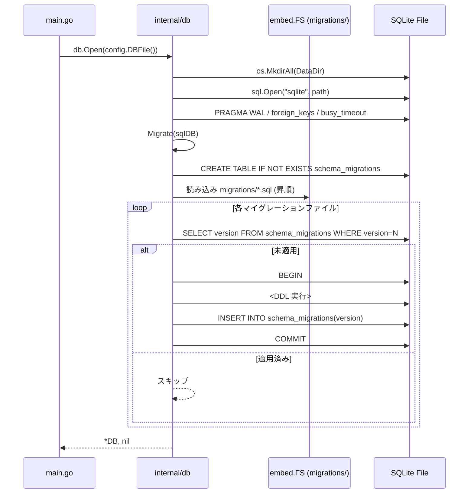
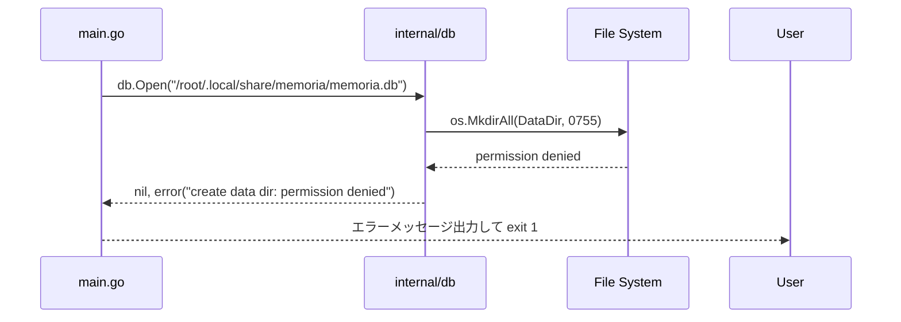
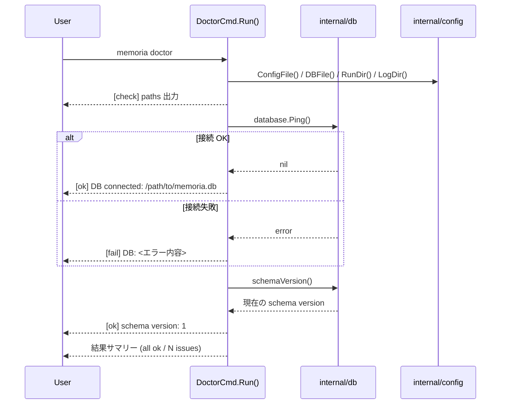

# M03: SQLite スキーマ + マイグレーション 詳細計画

## 概要

memoria の永続層の基盤として SQLite を導入する。全テーブル DDL の定義、マイグレーション管理機構の実装、および `doctor` コマンドの基本実装を行う。

M02 で確立した `internal/config` の `DBFile()` / `DataDir()` を DB パスの起点として利用し、Go CLI（Kong）のDI パターンに沿って `*db.DB` を各コマンドに注入可能にする。

## スコープ

| 項目 | 含む | 含まない |
|------|------|---------|
| SQLite ドライバ接続 | `internal/db/db.go` での Open / Close | コネクションプール（SQLite は single writer 前提） |
| 全テーブル DDL | SCHEMA.ja.md に記載の全テーブル | 将来のインデックス最適化 |
| マイグレーション管理 | embed + 版数管理、Up のみ | Down マイグレーション（MVP スコープ外） |
| doctor コマンド | DB 接続確認・スキーマ整合性確認・パス確認 | worker 状態確認（M07 で追加）、完全版（M15 で実装） |
| pragma 設定 | WAL mode / foreign_keys / busy_timeout | sqlite-vec 拡張（M14 で追加） |

## アーキテクチャ

### パッケージ構成

```
internal/
├── db/
│   ├── db.go            # Open/Close/Ping + pragma 設定
│   ├── db_test.go       # DB 接続・pragma のテスト
│   ├── migrate.go       # マイグレーション管理
│   ├── migrate_test.go  # マイグレーションのテスト
│   └── migrations/
│       └── 0001_initial.sql   # 初期スキーマ DDL（embed）
├── cli/
│   ├── doctor.go        # doctor コマンド（既存スタブを本実装に置換）
│   └── ...
```

### DB 構造体設計

```go
package db

import (
    "database/sql"
    "fmt"
    "os"
    "path/filepath"
)

// DB は memoria の SQLite データベース接続を管理する。
type DB struct {
    sql *sql.DB
    path string
}

// Open はデータディレクトリを作成し、SQLite データベースを開く。
// pragma を設定し、マイグレーションを実行してから返す。
func Open(path string) (*DB, error)

// Close はデータベース接続を閉じる。
func (d *DB) Close() error

// Ping は DB 接続が生きているか確認する。
func (d *DB) Ping() error

// SQL は生の *sql.DB を返す（テスト・高度なクエリ用）。
func (d *DB) SQL() *sql.DB

// Path は DB ファイルパスを返す。
func (d *DB) Path() string
```

### Pragma 設定

```sql
PRAGMA journal_mode = WAL;
PRAGMA foreign_keys = ON;
PRAGMA busy_timeout = 5000;   -- 5 秒（job queue の排他制御向け）
PRAGMA cache_size = -8000;    -- 8MB キャッシュ
PRAGMA synchronous = NORMAL;  -- WAL モードでは NORMAL で十分
```

### Kong DI パターン（M02 との整合）

M02 で確立したパターンを踏襲する。

```go
// main.go での DB 注入
cfg, _ := config.Load(globals.ConfigPath)
database, err := db.Open(config.DBFile())
// ...
k.BindTo(database, (*db.Opener)(nil))
```

各コマンドの `Run()` シグネチャは既存のパターンを維持：

```go
func (c *DoctorCmd) Run(globals *Globals, w *io.Writer, database *db.DB) error
```

## 依存ライブラリ

| ライブラリ | 用途 | バージョン |
|-----------|------|-----------|
| `modernc.org/sqlite` | CGo フリー SQLite ドライバ | v1.36.x（最新安定版） |

### modernc.org/sqlite を選択した理由

| 観点 | modernc.org/sqlite | mattn/go-sqlite3 |
|------|-------------------|-----------------|
| CGo 依存 | なし（Pure Go） | あり |
| クロスコンパイル | 容易（darwin/linux/windows 全対応） | CGo ツールチェーンが必要 |
| パフォーマンス | 若干劣る（~20%） | 高速 |
| 配布性 | シングルバイナリ完結 | gcc が必要 |
| 採用理由 | memoriaはローカルツール。配布性とビルドの簡便さが最優先 | — |

マイグレーション管理は**外部ライブラリを使わず内製**する。

理由：
- `golang-migrate` は SQLite のダウンマイグレーションで CGo 依存の `go-sqlite3` に引っ張られやすい
- memoriaのマイグレーションは「Up のみ・番号付き連番ファイル」という単純要件
- embed した `.sql` ファイルを順番に実行するだけで十分
- 外部依存を最小化し、ビルドの信頼性を保つ

## DDL 設計（`0001_initial.sql`）

```sql
-- Schema version tracking
CREATE TABLE IF NOT EXISTS schema_migrations (
    version     INTEGER PRIMARY KEY,
    applied_at  TEXT NOT NULL DEFAULT (strftime('%Y-%m-%dT%H:%M:%SZ', 'now'))
);

-- Projects
CREATE TABLE IF NOT EXISTS projects (
    project_id              TEXT PRIMARY KEY,
    project_root            TEXT NOT NULL UNIQUE,
    repo_name               TEXT,
    primary_language        TEXT,
    project_summary         TEXT,
    fingerprint_json        TEXT,
    fingerprint_text        TEXT,
    fingerprint_updated_at  TEXT,
    similarity_updated_at   TEXT,
    last_seen_at            TEXT NOT NULL DEFAULT (strftime('%Y-%m-%dT%H:%M:%SZ', 'now')),
    created_at              TEXT NOT NULL DEFAULT (strftime('%Y-%m-%dT%H:%M:%SZ', 'now'))
);

CREATE INDEX IF NOT EXISTS idx_projects_last_seen ON projects(last_seen_at);

-- Project aliases (パス変更・symlink 吸収)
CREATE TABLE IF NOT EXISTS project_aliases (
    alias_id    TEXT PRIMARY KEY,
    project_id  TEXT NOT NULL REFERENCES projects(project_id) ON DELETE CASCADE,
    alias_root  TEXT NOT NULL UNIQUE,
    created_at  TEXT NOT NULL DEFAULT (strftime('%Y-%m-%dT%H:%M:%SZ', 'now'))
);

-- Project similarity cache
CREATE TABLE IF NOT EXISTS project_similarity (
    project_id          TEXT NOT NULL REFERENCES projects(project_id) ON DELETE CASCADE,
    similar_project_id  TEXT NOT NULL REFERENCES projects(project_id) ON DELETE CASCADE,
    similarity          REAL NOT NULL CHECK (similarity >= 0.0 AND similarity <= 1.0),
    computed_at         TEXT NOT NULL DEFAULT (strftime('%Y-%m-%dT%H:%M:%SZ', 'now')),
    PRIMARY KEY (project_id, similar_project_id)
);

-- Sessions
CREATE TABLE IF NOT EXISTS sessions (
    session_id       TEXT PRIMARY KEY,
    project_id       TEXT REFERENCES projects(project_id),
    cwd              TEXT NOT NULL,
    transcript_path  TEXT,
    started_at       TEXT NOT NULL DEFAULT (strftime('%Y-%m-%dT%H:%M:%SZ', 'now')),
    ended_at         TEXT
);

CREATE INDEX IF NOT EXISTS idx_sessions_project ON sessions(project_id);

-- Turns (transcript の正規化レコード)
CREATE TABLE IF NOT EXISTS turns (
    turn_id     TEXT PRIMARY KEY,
    session_id  TEXT NOT NULL REFERENCES sessions(session_id) ON DELETE CASCADE,
    role        TEXT NOT NULL CHECK (role IN ('user', 'assistant', 'tool')),
    content     TEXT NOT NULL,
    created_at  TEXT NOT NULL DEFAULT (strftime('%Y-%m-%dT%H:%M:%SZ', 'now'))
);

CREATE INDEX IF NOT EXISTS idx_turns_session ON turns(session_id);

-- Chunks (memory 本体)
CREATE TABLE IF NOT EXISTS chunks (
    chunk_id                TEXT PRIMARY KEY,
    session_id              TEXT REFERENCES sessions(session_id),
    project_id              TEXT REFERENCES projects(project_id),
    turn_start_id           TEXT REFERENCES turns(turn_id),
    turn_end_id             TEXT REFERENCES turns(turn_id),
    content                 TEXT NOT NULL,
    summary                 TEXT,
    kind                    TEXT NOT NULL CHECK (kind IN ('decision','constraint','todo','failure','fact','preference','pattern')),
    importance              REAL NOT NULL DEFAULT 0.5 CHECK (importance >= 0.0 AND importance <= 1.0),
    scope                   TEXT NOT NULL DEFAULT 'project' CHECK (scope IN ('project','similarity_shareable','global')),
    project_transferability REAL DEFAULT 0.5,
    keywords_json           TEXT,
    applies_to_json         TEXT,
    content_hash            TEXT NOT NULL,
    created_at              TEXT NOT NULL DEFAULT (strftime('%Y-%m-%dT%H:%M:%SZ', 'now'))
);

CREATE UNIQUE INDEX IF NOT EXISTS idx_chunks_content_hash ON chunks(content_hash);
CREATE INDEX IF NOT EXISTS idx_chunks_project ON chunks(project_id);
CREATE INDEX IF NOT EXISTS idx_chunks_kind ON chunks(kind);
CREATE INDEX IF NOT EXISTS idx_chunks_importance ON chunks(importance DESC);
CREATE INDEX IF NOT EXISTS idx_chunks_created ON chunks(created_at DESC);

-- FTS5 仮想テーブル（content / summary / keywords の全文検索）
CREATE VIRTUAL TABLE IF NOT EXISTS chunks_fts USING fts5(
    content,
    summary,
    keywords,
    content='chunks',
    content_rowid='rowid'
);

-- chunks への trigger で FTS を自動同期
-- TODO(M06): keywords_json は JSON 文字列のまま投入している。
--            M06 で LLM enrichment 実装時にキーワードを展開して投入するよう改善する。
CREATE TRIGGER IF NOT EXISTS chunks_fts_insert AFTER INSERT ON chunks BEGIN
    INSERT INTO chunks_fts(rowid, content, summary, keywords)
    VALUES (new.rowid, new.content, COALESCE(new.summary, ''), COALESCE(new.keywords_json, ''));
END;

CREATE TRIGGER IF NOT EXISTS chunks_fts_delete AFTER DELETE ON chunks BEGIN
    INSERT INTO chunks_fts(chunks_fts, rowid, content, summary, keywords)
    VALUES ('delete', old.rowid, old.content, COALESCE(old.summary, ''), COALESCE(old.keywords_json, ''));
END;

CREATE TRIGGER IF NOT EXISTS chunks_fts_update AFTER UPDATE ON chunks BEGIN
    INSERT INTO chunks_fts(chunks_fts, rowid, content, summary, keywords)
    VALUES ('delete', old.rowid, old.content, COALESCE(old.summary, ''), COALESCE(old.keywords_json, ''));
    INSERT INTO chunks_fts(rowid, content, summary, keywords)
    VALUES (new.rowid, new.content, COALESCE(new.summary, ''), COALESCE(new.keywords_json, ''));
END;

-- Chunk embeddings (MVP: JSON blob、M14 で sqlite-vec へ移行)
CREATE TABLE IF NOT EXISTS chunk_embeddings (
    chunk_id        TEXT PRIMARY KEY REFERENCES chunks(chunk_id) ON DELETE CASCADE,
    model           TEXT NOT NULL,
    embedding_json  TEXT NOT NULL,
    created_at      TEXT NOT NULL DEFAULT (strftime('%Y-%m-%dT%H:%M:%SZ', 'now'))
);

-- Project embeddings (fingerprint text / summary の embedding)
CREATE TABLE IF NOT EXISTS project_embeddings (
    project_id      TEXT PRIMARY KEY REFERENCES projects(project_id) ON DELETE CASCADE,
    model           TEXT NOT NULL,
    embedding_json  TEXT NOT NULL,
    created_at      TEXT NOT NULL DEFAULT (strftime('%Y-%m-%dT%H:%M:%SZ', 'now'))
);

-- Jobs (ローカルキュー)
CREATE TABLE IF NOT EXISTS jobs (
    job_id        TEXT PRIMARY KEY,
    job_type      TEXT NOT NULL CHECK (job_type IN ('checkpoint_ingest','session_end_ingest','project_refresh','project_similarity_refresh')),
    payload_json  TEXT NOT NULL DEFAULT '{}',
    status        TEXT NOT NULL DEFAULT 'queued' CHECK (status IN ('queued','running','done','failed')),
    retry_count   INTEGER NOT NULL DEFAULT 0,
    max_retries   INTEGER NOT NULL DEFAULT 3,
    run_after     TEXT NOT NULL DEFAULT (strftime('%Y-%m-%dT%H:%M:%SZ', 'now')),
    started_at    TEXT,
    finished_at   TEXT,
    error_message TEXT,
    created_at    TEXT NOT NULL DEFAULT (strftime('%Y-%m-%dT%H:%M:%SZ', 'now'))
);

CREATE INDEX IF NOT EXISTS idx_jobs_status_run_after ON jobs(status, run_after);

-- Worker leases (heartbeat 管理)
CREATE TABLE IF NOT EXISTS worker_leases (
    worker_name         TEXT PRIMARY KEY,
    worker_id           TEXT NOT NULL,
    pid                 INTEGER NOT NULL,
    started_at          TEXT NOT NULL DEFAULT (strftime('%Y-%m-%dT%H:%M:%SZ', 'now')),
    last_heartbeat_at   TEXT NOT NULL DEFAULT (strftime('%Y-%m-%dT%H:%M:%SZ', 'now')),
    last_progress_at    TEXT,
    current_job_id      TEXT REFERENCES jobs(job_id)
);

-- Worker probes (liveness 確認)
CREATE TABLE IF NOT EXISTS worker_probes (
    probe_id           TEXT PRIMARY KEY,
    worker_name        TEXT NOT NULL,
    target_worker_id   TEXT NOT NULL,
    requested_at       TEXT NOT NULL DEFAULT (strftime('%Y-%m-%dT%H:%M:%SZ', 'now')),
    responded_at       TEXT,
    requested_by_pid   INTEGER NOT NULL
);

CREATE INDEX IF NOT EXISTS idx_worker_probes_worker ON worker_probes(worker_name, target_worker_id);
```

## マイグレーション管理設計

### 方針

- SQLファイルを `embed.FS` で Go バイナリに埋め込む
- `schema_migrations` テーブルで適用済み版数を管理
- 起動時に `db.Open()` から自動実行（cold start に対応）
- バイナリ更新時にも冪等に動作する

### マイグレーションロジック

```go
// migrate.go

//go:embed migrations/*.sql
var migrationsFS embed.FS

// Migrate は未適用のマイグレーションを順番に実行する。
// 冪等性を持つ（適用済みは再実行しない）。
func Migrate(sqlDB *sql.DB) error {
    // 1. schema_migrations テーブルを作成（まだなければ）
    // 2. migrations/ ディレクトリから *.sql を昇順に列挙
    //    NOTE: Go の fs.ReadDir はアルファベット順を保証する（Go 仕様）。
    //          ファイル名ソートに依存しているため、このコメントを残すこと。
    //          .sql 以外のファイル（.DS_Store 等）は拡張子チェックで除外すること。
    // 3. 各ファイルの version（ファイル名プレフィックス）を schema_migrations に問い合わせ
    // 4. 未適用のみ実行 → schema_migrations に記録
    // トランザクションで各マイグレーションをアトミックに適用
}
```

### ファイル命名規則

```
migrations/
  0001_initial.sql          # 初期スキーマ全テーブル
  0002_add_xxx.sql          # 将来の追加変更（M03 以降で必要になったら追加）
```

version 番号は 4 桁のゼロ埋め整数。ファイル名の先頭数字を `strconv.Atoi` で抽出する。

## シーケンス図

### 正常系: DB Open + マイグレーション



### エラー系: DB Open 失敗（ディレクトリ権限なし）



### doctor コマンドフロー



## TDD 実装ステップ（Red → Green → Refactor）

### Step 1: `modernc.org/sqlite` ドライバ追加

**作業内容:**
```bash
GOPROXY=direct go get modernc.org/sqlite
```

`go.mod` に `modernc.org/sqlite v1.36.x` が追加されることを確認する。

**FTS5 動作確認 smoke test:**

`go get` 直後に以下の最小テストを追加し、`modernc.org/sqlite` ビルドに FTS5 が含まれていることを確認する。

```go
// db_test.go（または fts5_smoke_test.go）
func TestFTS5Available(t *testing.T) {
    dir := t.TempDir()
    sqlDB, err := sql.Open("sqlite", filepath.Join(dir, "fts5_smoke.db"))
    if err != nil {
        t.Fatalf("sql.Open: %v", err)
    }
    defer sqlDB.Close()

    _, err = sqlDB.Exec(`CREATE VIRTUAL TABLE test_fts USING fts5(content)`)
    if err != nil {
        t.Fatalf("FTS5 not available in modernc.org/sqlite: %v", err)
    }
}
```

このテストが green であれば FTS5 拡張が有効であることを保証できる。

---

### Step 2: `internal/db/db.go` — DB Open / Close / Ping

**Red:**
```go
// db_test.go
func TestOpen_CreatesFile(t *testing.T) {
    dir := t.TempDir()
    path := filepath.Join(dir, "test.db")
    d, err := Open(path)
    if err \!= nil {
        t.Fatalf("Open: %v", err)
    }
    defer d.Close()
    if _, err := os.Stat(path); err \!= nil {
        t.Errorf("db file not created: %v", err)
    }
}

func TestOpen_Idempotent(t *testing.T) {
    // 同じパスで2回 Open → エラーなし
    dir := t.TempDir()
    path := filepath.Join(dir, "test.db")
    d1, _ := Open(path)
    d1.Close()
    d2, err := Open(path)
    if err \!= nil {
        t.Fatalf("second Open: %v", err)
    }
    d2.Close()
}

func TestPing(t *testing.T) {
    dir := t.TempDir()
    d, _ := Open(filepath.Join(dir, "test.db"))
    defer d.Close()
    if err := d.Ping(); err \!= nil {
        t.Errorf("Ping: %v", err)
    }
}

func TestPragmaWAL(t *testing.T) {
    dir := t.TempDir()
    d, _ := Open(filepath.Join(dir, "test.db"))
    defer d.Close()
    var mode string
    _ = d.SQL().QueryRow("PRAGMA journal_mode").Scan(&mode)
    if mode \!= "wal" {
        t.Errorf("journal_mode = %s, want wal", mode)
    }
}

func TestPragmaForeignKeys(t *testing.T) {
    dir := t.TempDir()
    d, _ := Open(filepath.Join(dir, "test.db"))
    defer d.Close()
    var fk int
    _ = d.SQL().QueryRow("PRAGMA foreign_keys").Scan(&fk)
    if fk \!= 1 {
        t.Errorf("foreign_keys = %d, want 1", fk)
    }
}
```

**Green:** `Open()` を最小限実装。`sql.Open("sqlite", path)` → pragma 設定 → `*DB` 返却。

**Refactor:** pragma 設定を `applyPragmas(db *sql.DB) error` に抽出。

---

### Step 3: `internal/db/migrate.go` — マイグレーション管理

**Red:**
```go
// migrate_test.go
func TestMigrate_AppliesInitial(t *testing.T) {
    dir := t.TempDir()
    d, _ := Open(filepath.Join(dir, "test.db"))
    defer d.Close()

    // Open 時に自動実行済みのはずだが、テーブルの存在を確認
    tables := []string{
        "projects", "project_aliases", "project_similarity",
        "sessions", "turns", "chunks", "chunks_fts",
        "chunk_embeddings", "project_embeddings",
        "jobs", "worker_leases", "worker_probes",
        "schema_migrations",
    }
    for _, tbl := range tables {
        var name string
        err := d.SQL().QueryRow(
            "SELECT name FROM sqlite_master WHERE type='table' AND name=?", tbl,
        ).Scan(&name)
        if err \!= nil {
            t.Errorf("table %s not found: %v", tbl, err)
        }
    }
}

func TestMigrate_Idempotent(t *testing.T) {
    // Migrate を2回実行しても重複エラーにならない
    dir := t.TempDir()
    sqlDB := openRawDB(t, dir)
    defer sqlDB.Close()

    if err := Migrate(sqlDB); err \!= nil {
        t.Fatalf("first Migrate: %v", err)
    }
    if err := Migrate(sqlDB); err \!= nil {
        t.Fatalf("second Migrate: %v", err)
    }
}

func TestMigrate_SchemaVersion(t *testing.T) {
    dir := t.TempDir()
    d, _ := Open(filepath.Join(dir, "test.db"))
    defer d.Close()

    var version int
    err := d.SQL().QueryRow("SELECT MAX(version) FROM schema_migrations").Scan(&version)
    if err \!= nil {
        t.Fatalf("query schema version: %v", err)
    }
    if version \!= 1 {
        t.Errorf("schema version = %d, want 1", version)
    }
}

func TestMigrate_FTSTrigger(t *testing.T) {
    // chunks への INSERT が chunks_fts に自動同期されることを確認
    dir := t.TempDir()
    d, _ := Open(filepath.Join(dir, "test.db"))
    defer d.Close()

    // project を先に作成（FK制約）
    _, _ = d.SQL().Exec(`INSERT INTO projects(project_id, project_root) VALUES ('p1', '/tmp/test')`)

    _, err := d.SQL().Exec(`
        INSERT INTO chunks(chunk_id, project_id, content, kind, content_hash)
        VALUES ('c1', 'p1', 'Go言語のエラーハンドリング設計', 'decision', 'hash1')
    `)
    if err \!= nil {
        t.Fatalf("insert chunk: %v", err)
    }

    var count int
    _ = d.SQL().QueryRow("SELECT COUNT(*) FROM chunks_fts WHERE chunks_fts MATCH 'エラーハンドリング'").Scan(&count)
    if count == 0 {
        t.Error("FTS trigger did not sync chunk content")
    }
}
```

**Green:**
- `migrations/0001_initial.sql` を作成（上記 DDL）
- `migrate.go` に `Migrate(sqlDB *sql.DB) error` を実装
- `db.Open()` 内から `Migrate(sqlDB)` を呼ぶ

**Refactor:** `parseMigrationVersion(filename string) (int, error)` ヘルパーを抽出し、`migrate_test.go` でユニットテスト。

以下のエッジケースを必ずテストに含めること：

```go
func TestParseMigrationVersion(t *testing.T) {
    tests := []struct {
        filename string
        want     int
        wantErr  bool
    }{
        {"0001_initial.sql", 1, false},
        {"0002_add_xxx.sql", 2, false},
        {"0000_init.sql", 0, false},          // ゼロは version 0 として許容
        {"abc_foo.sql", 0, true},              // 非数字プレフィックス → エラー
        {"0001", 0, true},                     // 拡張子なし → エラー（.sql フィルタで除外済みのはずだが防御的に）
    }
    for _, tt := range tests {
        got, err := parseMigrationVersion(tt.filename)
        if (err != nil) != tt.wantErr {
            t.Errorf("parseMigrationVersion(%q) error = %v, wantErr %v", tt.filename, err, tt.wantErr)
        }
        if !tt.wantErr && got != tt.want {
            t.Errorf("parseMigrationVersion(%q) = %d, want %d", tt.filename, got, tt.want)
        }
    }
}
```

---

### Step 4: `internal/cli/doctor.go` — doctor コマンド本実装

**Red:**
```go
// cli_test.go に追加
func TestDoctorCmd_OK(t *testing.T) {
    dir := t.TempDir()
    // t.Setenv で MEMORIA_CONFIG / DB パスを tmp に向ける
    // memoria doctor 実行
    // exit 0、"ok" が含まれる出力を確認
}

func TestDoctorCmd_DBNotExist(t *testing.T) {
    // DB が存在しない初期状態でも doctor が成功する
    // （Open が DB を作成するため）
}

func TestDoctorCmd_JSONFormat(t *testing.T) {
    // --format json で JSON 出力が得られる
    // {"checks": [...], "ok": true} の構造を確認
}

func TestDoctorCmd_PragmaWAL(t *testing.T) {
    // doctor の pragma_wal チェック項目を確認
    // PRAGMA journal_mode が "wal" であることを検証
    // {"name": "pragma_wal", "ok": true} が checks に含まれることを確認
}

func TestDoctorCmd_PragmaForeignKeys(t *testing.T) {
    // doctor の pragma_foreign_keys チェック項目を確認
    // PRAGMA foreign_keys が 1 であることを検証
    // {"name": "pragma_foreign_keys", "ok": true} が checks に含まれることを確認
}

func TestDoctorCmd_FTSTableExists(t *testing.T) {
    // doctor の fts_table チェック項目を確認
    // SELECT name FROM sqlite_master WHERE type='table' AND name='chunks_fts' が
    // 結果を返すことを検証
    // {"name": "fts_table", "ok": true} が checks に含まれることを確認
}
```

**Green:** `DoctorCmd.Run()` を実装。

doctor の出力仕様：

```
[ok]   config path:       ~/.config/memoria/config.toml
[ok]   data dir:          ~/.local/share/memoria/
[ok]   state dir:         ~/.local/state/memoria/
[ok]   db file:           ~/.local/share/memoria/memoria.db
[ok]   db connected:      (schema version: 1)
[ok]   pragma WAL:        journal_mode = wal
[ok]   pragma fk:         foreign_keys = ON
[ok]   FTS table:         chunks_fts exists
──────────────────────────────────────────
All checks passed.
```

JSON 出力時：
```json
{
  "checks": [
    {"name": "config_path",        "ok": true, "detail": "~/.config/memoria/config.toml"},
    {"name": "data_dir",           "ok": true, "detail": "~/.local/share/memoria/"},
    {"name": "state_dir",          "ok": true, "detail": "~/.local/state/memoria/"},
    {"name": "db_file",            "ok": true, "detail": "~/.local/share/memoria/memoria.db"},
    {"name": "db_connected",       "ok": true, "detail": "schema version: 1"},
    {"name": "pragma_wal",         "ok": true, "detail": "journal_mode = wal"},
    {"name": "pragma_foreign_keys","ok": true, "detail": "foreign_keys = ON"},
    {"name": "fts_table",          "ok": true, "detail": "chunks_fts exists"}
  ],
  "ok": true
}
```

失敗時は `exit 1`、`"ok": false` を返す。

**Refactor:** `DoctorCheck` 構造体を抽出して text/JSON 出力を共通化。

---

### Step 5: Kong DI 統合 (`cmd/memoria/main.go`)

**Red:**
```go
func TestMain_DBInjected(t *testing.T) {
    // doctor コマンドが DB を受け取れることを確認（統合テスト）
}
```

**Green:** `main.go` に `db.Open()` を追加し `kong.Bind` で `*db.DB` を注入。

アーキテクチャ上の注意点：`main.go` での DB Open は lazy にする（hookコマンドのタイムアウト制約のため）。doctor / config など DB が不要なコマンドでは Open しない。

**Lazy Open パターン:**
```go
// main.go
var database *db.DB
dbOpener := func() (*db.DB, error) {
    if database \!= nil {
        return database, nil
    }
    var err error
    database, err = db.Open(config.DBFile())
    return database, err
}
kong.Bind(dbOpener)
```

ただし M03 では doctor のみ DB を使うため、シンプルに直接 Open でもよい。Lazy は M04 以降で判断する。

**Refactor:** DB のクリーンアップを `defer database.Close()` で保証。

---

## 実装順序まとめ

1. `go get modernc.org/sqlite`（GOPROXY=direct を付加）
2. `internal/db/db.go` + `internal/db/db_test.go`（Open/Close/Ping/Pragma）
3. `internal/db/migrations/0001_initial.sql`（DDL）
4. `internal/db/migrate.go` + `internal/db/migrate_test.go`
5. `internal/cli/doctor.go`（スタブを本実装に置換）+ テスト追加
6. `cmd/memoria/main.go`（DB DI 統合）
7. `go test ./...` で全体確認

---

## リスク評価

| リスク | 影響度 | 確率 | 軽減策 |
|--------|--------|------|--------|
| `modernc.org/sqlite` の取得失敗（GOPROXY制約） | 高 | 中 | `GOPROXY=direct` を使用。M01/M02 でも同様のワークアラウンドが実績あり |
| FTS5 が modernc.org/sqlite に含まれていない | 中 | 低 | modernc.org/sqlite は FTS5 を含む（SQLite 3.x の完全ポート）。事前テストで確認 |
| WAL モードとテスト並行実行の競合 | 中 | 低 | テストは `t.TempDir()` で独立した DB ファイルを使用。並行実行は問題なし |
| FTS5 trigger での日本語全文検索 | 中 | 中 | modernc.org/sqlite のデフォルトトークナイザーは unicode61。日本語の単語境界は完全ではないが、M03 時点では許容（M12 で tuning） |
| DDL の将来変更時のマイグレーション複雑化 | 中 | 中 | Down マイグレーション不要・Up のみの方針で複雑さを抑制。必要なら `ALTER TABLE ADD COLUMN` で対応 |
| doctor の DB Open が hook コマンドのタイムアウトに影響 | 低 | 低 | M03 時点では doctor のみ DB を使用。hook コマンドは M05 以降で実装し、その時点で Lazy Open を検討 |
| `schema_migrations` テーブル自体のマイグレーション | 低 | 低 | bootstrap DDL は `CREATE TABLE IF NOT EXISTS` で冪等に実行 |

---

## 完了基準

- [ ] `go test ./...` が全て green
- [ ] `internal/db/` パッケージが存在し、db / migrate に全テストがある
- [ ] `memoria doctor` が DB 接続・スキーマ確認を出力する
- [ ] `memoria doctor --format json` が JSON を出力する
- [ ] 全テーブル（13テーブル + schema_migrations）が DDL に定義されている
- [ ] FTS5 trigger テスト（insert → FTS 同期確認）が green
- [ ] WAL / foreign_keys pragma テストが green
- [ ] マイグレーション冪等性テストが green
- [ ] `modernc.org/sqlite` が `go.mod` に追加されている
- [ ] CLAUDE.md の「現在は M02 完了」→「M03 完了」が更新されている

---

## M04 への引き継ぎ

M03 完了後、M04（job-queue）では以下が利用可能になる：

- `*db.DB` の DI パターン（Kong Bind 経由）
- `jobs` テーブルの DDL（すでに存在）
- `db.SQL()` での生クエリ実行パターン
- WAL モードによる並行読み取り対応

M04 では `internal/db/queue.go` を新規追加し、`Enqueue / Dequeue / Ack / Fail` を実装する。

---

## Changelog

| 日時 | 種別 | 内容 |
|------|------|------|
| 2026-03-28 | 作成 | M03 詳細計画初版 |
