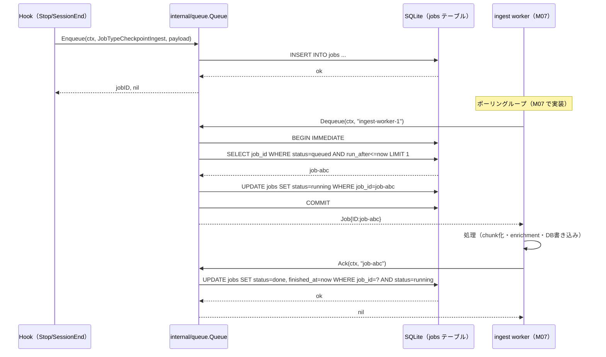
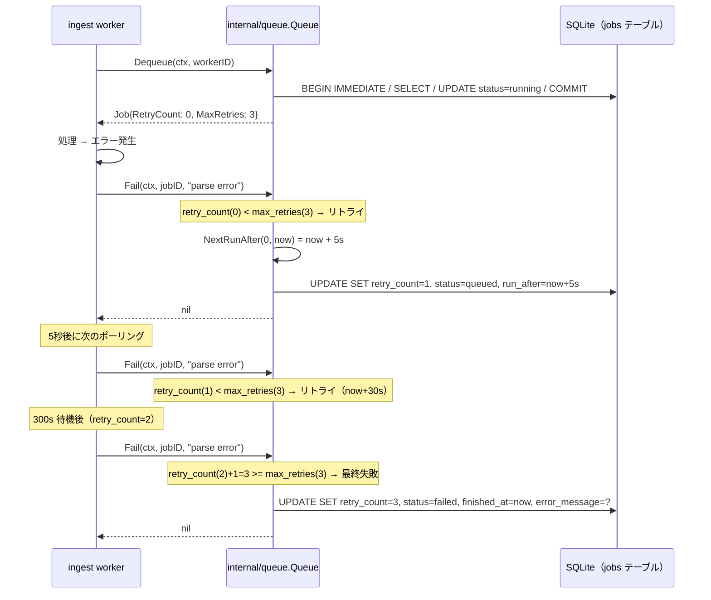
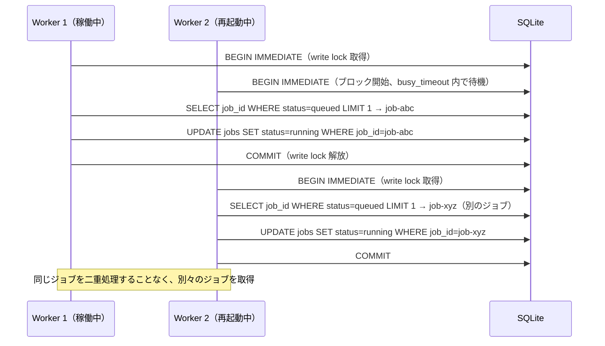

# M04: SQLite ベースジョブキュー 詳細計画

## 概要

memoria の非同期処理基盤として、SQLite をバックエンドとした永続的ジョブキューを実装する。
Enqueue / Dequeue / Ack / Fail の基本操作、Exponential Backoff によるリトライロジック、
BEGIN IMMEDIATE による排他制御を実装する。

M03 で確立した `internal/db` パッケージと `jobs` テーブルを活用し、
新たに `internal/queue` パッケージを追加する。
このパッケージは M05（Stop hook）・M06（SessionEnd hook）・M07（ingest worker）で直接利用される。

## スコープ

| 項目 | 含む | 含まない |
|------|------|---------|
| Enqueue | ジョブ作成・payload 保存 | 優先度キュー |
| Dequeue | 1件取得・worker への貸与 | バッチ Dequeue |
| Ack | ジョブ完了マーク（status = done） | 部分完了 |
| Fail | ジョブ失敗マーク・リトライスケジュール | Dead Letter Queue |
| Retry | Exponential Backoff（5s → 30s → 300s）、max 3 回 | 無制限リトライ |
| 排他制御 | SQLite BEGIN IMMEDIATE による楽観的ロック | 外部ロックマネージャ |
| Cleanup | 古い done/failed ジョブの削除（Purge） | 自動 vacuum |
| テスト | ユニット・並行実行・タイムアウトのテスト | E2E worker テスト（M07 スコープ） |

## M03 からのハンドオフ

以下が M04 開始時点で利用可能：

| 資産 | 場所 | 詳細 |
|------|------|------|
| `*db.DB` 構造体 | `internal/db/db.go` | Open/Close/Ping/SQL() メソッド |
| `jobs` テーブル DDL | `internal/db/migrations/0001_initial.sql` | 全カラム定義済み |
| Kong DI パターン | `cmd/memoria/main.go` | `kong.Bind(database)` |
| WAL mode | pragma 設定済み | 並行読み取り対応 |
| `busy_timeout = 5000` | pragma 設定済み | 5 秒待機で write 競合を吸収 |

`jobs` テーブルの定義（再掲、DDL 抜粋）：

- `job_id`: TEXT PRIMARY KEY
- `job_type`: TEXT NOT NULL（checkpoint_ingest / session_end_ingest / project_refresh / project_similarity_refresh）
- `payload_json`: TEXT NOT NULL DEFAULT '{}'
- `status`: TEXT NOT NULL DEFAULT 'queued'（queued / running / done / failed）
- `retry_count`: INTEGER NOT NULL DEFAULT 0
- `max_retries`: INTEGER NOT NULL DEFAULT 3
- `run_after`: TEXT NOT NULL DEFAULT now
- `started_at`, `finished_at`, `error_message`, `created_at`: 補助メタデータ
- インデックス: idx_jobs_status_run_after（status, run_after）

注: DDL には `locked_by` / `locked_at` カラムは存在しない。
排他制御は BEGIN IMMEDIATE トランザクションで実現する（後述）。

## アーキテクチャ

### パッケージ構成

```
internal/
├── db/
│   ├── db.go            # 既存（変更なし）
│   ├── migrate.go       # 既存（変更なし）
│   └── migrations/
│       └── 0001_initial.sql  # 既存（変更なし）
├── queue/
│   ├── queue.go         # Queue 構造体・Enqueue/Dequeue/Ack/Fail/Purge/Stats
│   ├── queue_test.go    # ユニットテスト（並行実行含む）
│   ├── job.go           # Job 構造体・JobType 定数・Status 定数
│   └── backoff.go       # BackoffDelays テーブル・NextRunAfter 計算
```

### 型定義（job.go）

```go
package queue

import "time"

// JobType はジョブの種別を表す。
type JobType string

const (
    JobTypeCheckpointIngest         JobType = "checkpoint_ingest"
    JobTypeSessionEndIngest         JobType = "session_end_ingest"
    JobTypeProjectRefresh           JobType = "project_refresh"
    JobTypeProjectSimilarityRefresh JobType = "project_similarity_refresh"
)

// Status はジョブの状態を表す。
type Status string

const (
    StatusQueued  Status = "queued"
    StatusRunning Status = "running"
    StatusDone    Status = "done"
    StatusFailed  Status = "failed"
)

// Job は jobs テーブルの1行を表す。
type Job struct {
    ID           string
    Type         JobType
    PayloadJSON  string
    Status       Status
    RetryCount   int
    MaxRetries   int
    RunAfter     time.Time
    StartedAt    *time.Time
    FinishedAt   *time.Time
    ErrorMessage *string
    CreatedAt    time.Time
}
```

### Queue 構造体（queue.go）

```go
package queue

import (
    "context"
    "database/sql"
    "time"
)

// Queue は SQLite バックエンドのジョブキューを表す。
type Queue struct {
    db *sql.DB
}

// New は *sql.DB から Queue を作成する。
func New(db *sql.DB) *Queue

// Enqueue は新しいジョブをキューに追加する。
// jobID は uuid.New().String() で生成する。
// payloadJSON が空文字列の場合は "{}" を使う。
func (q *Queue) Enqueue(ctx context.Context, jobType JobType, payloadJSON string) (jobID string, err error)

// EnqueueAt は run_after を指定してジョブを追加する（テスト・将来の予約実行用）。
func (q *Queue) EnqueueAt(ctx context.Context, jobType JobType, payloadJSON string, runAfter time.Time) (jobID string, err error)

// Dequeue は実行可能なジョブを1件取得する。
// BEGIN IMMEDIATE で write lock を取得して排他制御を行う。
// ジョブが存在しない場合は (nil, nil) を返す。
func (q *Queue) Dequeue(ctx context.Context, workerID string) (*Job, error)

// DequeueWithOptions はオプションを指定して Dequeue を行う。
// Dequeue は DequeueWithOptions(ctx, workerID, DequeueOptions{}) の shorthand。
func (q *Queue) DequeueWithOptions(ctx context.Context, workerID string, opts DequeueOptions) (*Job, error)

// Ack はジョブを完了としてマークする。
// 存在しない job_id や既に done のジョブでもエラーにならない（冪等）。
func (q *Queue) Ack(ctx context.Context, jobID string) error

// Fail はジョブを失敗としてマークする。
// retry_count < max_retries なら status='queued'、run_after=Backoff後の時刻に更新する。
// retry_count >= max_retries なら status='failed'、error_message を記録する。
func (q *Queue) Fail(ctx context.Context, jobID string, errMsg string) error

// Purge は完了・失敗ジョブのうち、olderThan より古いものを削除する。
func (q *Queue) Purge(ctx context.Context, olderThan time.Duration) (deleted int64, err error)

// Stats はキューの現在状態を返す（各 status のジョブ数）。
func (q *Queue) Stats(ctx context.Context) (map[Status]int, error)

// DequeueOptions は Dequeue の挙動を制御するオプション。
type DequeueOptions struct {
    // StaleTimeout: この時間を超えて running のままのジョブを queued に戻す。
    // 0 の場合は stale recovery を行わない（デフォルト）。
    StaleTimeout time.Duration
}
```

## SQL 設計

### Enqueue

Enqueue 時に発行するSQL（概要）:

- INSERT INTO jobs (job_id, job_type, payload_json, status, retry_count, max_retries, run_after, created_at)
- VALUES (?, ?, ?, 'queued', 0, 3, ?, strftime(...))

run_after には Go で生成した time.Now().UTC().Format(time.RFC3339) を渡す。

### Dequeue（BEGIN IMMEDIATE による排他制御）

Dequeue は3ステップのトランザクションで実行する:

1. BEGIN IMMEDIATE — write lock を最初から確保
2. SELECT job_id ... FROM jobs WHERE status = 'queued' AND run_after <= now ORDER BY run_after ASC LIMIT 1
3. UPDATE jobs SET status = 'running', started_at = now WHERE job_id = ?
4. COMMIT

BEGIN IMMEDIATE を使う理由:
- BEGIN（DEFERRED）は SELECT 時点では read lock しか取得しない
- 別プロセスが同じ行を SELECT した後に UPDATE しようとすると SQLITE_BUSY が発生する
- BEGIN IMMEDIATE は最初から write lock を取るため、この競合を防ぐ
- busy_timeout = 5000 が設定済みのため、短時間の競合は自動的に解消される

### Stale Recovery（DequeueWithOptions の前処理）

BEGIN IMMEDIATE の中で、running ジョブのうち started_at が StaleTimeout 以前のものを queued に戻す:

- UPDATE jobs SET status = 'queued', started_at = NULL WHERE status = 'running' AND started_at < now - StaleTimeout

### Ack

- UPDATE jobs SET status = 'done', finished_at = now WHERE job_id = ? AND status = 'running'

WHERE status = 'running' 条件により、二重 Ack は行を更新しないが、エラーにもならない（冪等）。

### Fail（リトライ判定付き）

Go 側で retry_count を先に取得し、明示的に分岐する方針を採る。
SQL の CASE 式は複雑でデバッグが困難なため、Go ロジックに集約する。

疑似コード（以下の全ステップを withImmediateTx 内で実行する）:
1. SELECT retry_count, max_retries FROM jobs WHERE job_id=?
2. newRetryCount := retryCount + 1  ← Go 側でリトライ判定
3. if newRetryCount >= maxRetries: UPDATE jobs SET status='failed', retry_count=?, finished_at=now, error_message=? WHERE job_id=? AND status='running'
4. else: UPDATE jobs SET status='queued', retry_count=?, run_after=NextRunAfter(retryCount), error_message=? WHERE job_id=? AND status='running'

SELECT → Go 判定 → UPDATE の3ステップは同一 withImmediateTx トランザクション内で完結する。
これにより、ステップ間で別プロセスがジョブ状態を変更することを防ぐ。

### Purge

- DELETE FROM jobs WHERE status IN ('done', 'failed') AND finished_at < now - olderThan

olderThan は Go の time.Duration を秒数に変換して渡す（例: 24h = -86400）。

### Stats

- SELECT status, COUNT(*) FROM jobs GROUP BY status

Go 側でデフォルト値（全 Status = 0）を初期化してから GROUP BY 結果をマージする。

## Retry ロジック（Exponential Backoff）

### 設計方針

SPEC §7.3 の指定に従い、固定 3 段階の Backoff テーブルを採用する。

```
retry_count=0 の失敗後 → run_after = now + 5s（1回目リトライ）
retry_count=1 の失敗後 → run_after = now + 30s（2回目リトライ）
retry_count=2 の失敗後 → run_after = now + 300s（3回目リトライ）
retry_count=3 の失敗後 → status = failed（max_retries=3 デフォルト）
```

### backoff.go の実装イメージ

```go
package queue

import "time"

// BackoffDelays は retry_count に対応する待機時間を定義する。
// SPEC 7.3: 5s -> 30s -> 300s
var BackoffDelays = []time.Duration{
    5 * time.Second,
    30 * time.Second,
    300 * time.Second,
}

// NextRunAfter は retry_count から次回実行可能時刻を計算する。
// retryCount が配列範囲を超えた場合は最大値を使う。
func NextRunAfter(retryCount int, now time.Time) time.Time {
    idx := retryCount
    if idx >= len(BackoffDelays) {
        idx = len(BackoffDelays) - 1
    }
    return now.Add(BackoffDelays[idx])
}
```


## 排他制御の詳細

### 問題の背景

memoriaでは、複数の Claude Code セッションが並行して Enqueue を行い、
1つの ingest worker（共有デーモン）が Dequeue を行う。
理論上は Dequeue が並行することはないが、worker 再起動時に
「旧プロセスと新プロセスが一時的に二重で Dequeue する」ケースが発生し得る。

### 採用する排他制御方式

BEGIN IMMEDIATE トランザクションを使用する。

SQLite の BEGIN IMMEDIATE は最初から write lock を取得するため、
複数プロセスが同時に Dequeue しようとした場合、1つだけが成功し、
残りは busy_timeout 内でリトライするか SQLITE_BUSY エラーを返す。

### locked_by カラム追加を見送った理由

ハンドオフ要件には locked_by / locked_at が示されているが、
M03 の DDL には実際には存在しない。
BEGIN IMMEDIATE による楽観的ロックで十分な排他制御が実現できるため、
DDL 変更（追加マイグレーション）は行わない。
worker の識別は worker_leases テーブル（M07 スコープ）で管理する。

### WAL モードとの関係

M03 で設定済みの PRAGMA journal_mode = WAL により、読み取りは write と並行できる。
Dequeue の BEGIN IMMEDIATE は他の writer をブロックするが、読み取り（Stats 等）はブロックしない。
busy_timeout = 5000 が設定済みのため、競合時は最大 5 秒待機する。


## シーケンス図

### 正常系: Enqueue → Dequeue → Ack



### エラー系: Fail → Retry → 最終失敗



### 並行 Dequeue（2プロセス競合）




## TDD 実装ステップ（Red → Green → Refactor）

### テストヘルパー設計

全 Step で共通利用するヘルパーを先に設計する。

```go
// queue_test.go

package queue_test

import (
    "database/sql"
    "path/filepath"
    "testing"

    "github.com/youyo/memoria/internal/db"
    "github.com/youyo/memoria/internal/queue"
)

// testQueue はテスト専用の Queue + rawDB アクセスを持つラッパー。
type testQueue struct {
    *queue.Queue
    rawDB *sql.DB
}

// newTestQueue は t.TempDir() に独立した DB を作成し、Queue を返す。
func newTestQueue(t *testing.T) *testQueue {
    t.Helper()
    dir := t.TempDir()
    database, err := db.Open(filepath.Join(dir, "test.db"))
    if err \!= nil {
        t.Fatalf("db.Open: %v", err)
    }
    t.Cleanup(func() { database.Close() })
    return &testQueue{
        Queue: queue.New(database.SQL()),
        rawDB: database.SQL(),
    }
}
```

---

### Step 1: job.go — 型定義

**Red:** JobType / Status 定数のテストを書く（文字列値の一致確認）。

**Green:** job.go に定数・Job 構造体を定義する。

**Refactor:** 不要（定数定義のみ）。

---

### Step 2: backoff.go — Backoff テーブル

**Red:**
```go
func TestNextRunAfter(t *testing.T) {
    now := time.Date(2026, 3, 28, 12, 0, 0, 0, time.UTC)
    tests := []struct {
        retryCount int
        wantDelay  time.Duration
    }{
        {0, 5 * time.Second},
        {1, 30 * time.Second},
        {2, 300 * time.Second},
        {3, 300 * time.Second},   // clamp to max
        {99, 300 * time.Second},  // clamp to max
    }
    for _, tt := range tests {
        got := queue.NextRunAfter(tt.retryCount, now)
        if got \!= now.Add(tt.wantDelay) {
            t.Errorf("NextRunAfter(%d) = %v, want %v", tt.retryCount, got, now.Add(tt.wantDelay))
        }
    }
}
```

**Green:** BackoffDelays slice と NextRunAfter を実装する。

**Refactor:** 不要。

---

### Step 3: queue.go — Enqueue

**Red:** 以下のテストを書く。

- TestEnqueue_Basic: jobID が空でないことを確認
- TestEnqueue_EmptyPayload: 空文字列が "{}" に正規化されること
- TestEnqueue_InvalidJobType: CHECK 制約違反でエラーになること
- TestEnqueue_UniqueIDs: 5回 Enqueue して全 jobID が異なること

**Green:** uuid.New().String() で jobID を生成し INSERT する。

**Refactor:** normalizePayload(s string) string ヘルパーを抽出する。

---

### Step 4: queue.go — Dequeue

**Red:** 以下のテストを書く。

- TestDequeue_Basic: job を Dequeue して status=running、StartedAt\!=nil を確認
- TestDequeue_EmptyQueue: 空のキューで (nil, nil) が返ること
- TestDequeue_OrderByRunAfter: 古い run_after のジョブが先に取得されること（EnqueueAt 使用）
- TestDequeue_FutureRunAfterSkipped: 未来の run_after のジョブは取得されないこと
- TestDequeue_RunningJobSkipped: running のジョブは再取得されないこと

**Green:** BEGIN IMMEDIATE トランザクションで SELECT → UPDATE を実装する。sql.ErrNoRows は (nil, nil) に変換する。

**Refactor:** withImmediateTx(ctx, db, func(tx *sql.Tx) error) ヘルパーを抽出する。

---

### Step 5: queue.go — Ack

**Red:** 以下のテストを書く。

- TestAck_Basic: Ack 後に status=done になること（Stats で確認）
- TestAck_Idempotent: 2回 Ack してもエラーにならないこと
- TestAck_NonExistentJob: 存在しない jobID でもエラーにならないこと

**Green:** UPDATE jobs SET status=done WHERE job_id=? AND status=running を実装する。

**Refactor:** 不要。

---

### Step 6: queue.go — Fail とリトライ

**Red:** 以下のテストを書く。

- TestFail_FirstFailure_Requeues: 1回目の失敗後に status=queued に戻ること
- TestFail_BackoffRunAfter: run_after が now+5s 付近になること（±1秒の許容）
- TestFail_MaxRetriesReached: 3回失敗後に status=failed になること（rawDB で run_after を過去に操作）
- TestFail_ErrorMessageRecorded: 最終失敗後に error_message が記録されること

**Green:** SELECT retry_count, max_retries → Go 側で分岐 → UPDATE の2段階で実装する。

**Refactor:** shouldRetry(retryCount, maxRetries int) bool ヘルパーを抽出してテストする。

---

### Step 7: queue.go — Purge と Stats

**Red:** 以下のテストを書く。

- TestPurge_RemovesOldDoneJobs: 25時間前の done ジョブが削除されること
- TestPurge_KeepsRecentJobs: 新しい done ジョブは削除されないこと
- TestPurge_ExactBoundary: ちょうど olderThan の境界にある done ジョブの挙動確認（finished_at = now - olderThan と完全一致する場合、削除されるか否かを明確に検証）
- TestStats_Initial: 空のキューで全 Status が 0 で返ること
- TestStats_Mixed: queued=1, running=1 の状態が正確に返ること

**Green:** Purge は finished_at の比較で削除。Stats は GROUP BY 後にデフォルト値とマージ。

**Refactor:** Purge の duration → SQLite modifier 変換ヘルパーを抽出する。

---

### Step 8: 並行実行テスト

**Red:**

TestDequeue_Concurrent_NoDoubleDequeue:
- 10件 Enqueue
- 5 goroutine で並行 Dequeue + Ack
- 同一 jobID が2回取得されないことを確認（sync.Mutex で dequeued map を保護）
- 最終的に全 10 件が done になること

**Green:** 既存実装（BEGIN IMMEDIATE）で green になるはず。

**Refactor:** go test -race で data race がないことを確認する。

---

### Step 9: DequeueWithOptions — Stale Recovery

**Red:** 以下のテストを書く。

- TestDequeueWithOptions_StaleRecovery: started_at を2分前に設定 → StaleTimeout=1分 で Dequeue するとそのジョブが取得されること
- TestDequeueWithOptions_NoStaleRecoveryByDefault: StaleTimeout=0 では stale recovery しないこと

**Green:** BEGIN IMMEDIATE 内で先に stale recovery の UPDATE を実行してから通常の SELECT を行う。Dequeue は DequeueWithOptions(ctx, workerID, DequeueOptions{}) の shorthand として実装する。

**Refactor:** Dequeue を DequeueWithOptions への委譲に統一する。

---


## アプローチ比較

### Dequeue 排他制御の方式比較

| 方式 | 開発速度 | 保守性 | 安全性 | 採用 |
|------|---------|-------|-------|------|
| BEGIN IMMEDIATE | ⭐⭐⭐⭐ | ⭐⭐⭐⭐ | ⭐⭐⭐⭐ | 採用 |
| locked_by カラム追加 | ⭐⭐ | ⭐⭐⭐ | ⭐⭐⭐ | 不採用（DDL 変更不要） |
| SELECT FOR UPDATE | ⭐⭐⭐ | ⭐⭐⭐ | ⭐⭐⭐⭐ | 不採用（SQLite 非サポート） |
| ファイルロック | ⭐⭐ | ⭐⭐ | ⭐⭐⭐ | 不採用（DB との二重管理） |

### Fail ロジックの実装方式比較

| 方式 | 開発速度 | テスタビリティ | 保守性 | 採用 |
|------|---------|-------------|-------|------|
| SQL CASE 式で全処理 | ⭐⭐ | ⭐⭐ | ⭐⭐ | 不採用（複雑でデバッグ困難） |
| Go 側で分岐 + 2 クエリ | ⭐⭐⭐⭐ | ⭐⭐⭐⭐ | ⭐⭐⭐⭐ | 採用 |
| ストアドプロシージャ相当 | ⭐ | ⭐⭐ | ⭐⭐ | 不採用（SQLite では困難） |

## リスク評価

| リスク | 影響度 | 確率 | 軽減策 |
|--------|--------|------|--------|
| BEGIN IMMEDIATE でタイムアウト多発 | 中 | 低 | memoriaは基本的に1 writer（ingest worker）。busy_timeout=5000 で吸収 |
| stale な running ジョブが蓄積 | 中 | 中 | M04 で StaleTimeout オプション提供。M07 で heartbeat と連携して自動 recovery |
| run_after タイムゾーン不一致 | 中 | 低 | 全タイムスタンプを UTC で統一。SQLite strftime の Z サフィックスと Go の time.RFC3339 で整合 |
| Fail の 2 クエリ間で状態変化 | 低 | 低 | UPDATE WHERE status=running 条件で安全。Fail 中に別プロセスが Ack することはない（1 worker 前提） |
| uuid 衝突 | 低 | 極低 | UUID v4 の衝突確率は天文学的に低い。PRIMARY KEY 制約で衝突時はエラー |
| Purge の datetime modifier 構文エラー | 低 | 低 | テストで動作確認。datetime 関数は SQLite の標準構文 |
| 並行テストでの data race | 中 | 低 | 各テストが独立した DB ファイルを使用。go test -race で継続的に確認 |

## 実装順序まとめ

| ステップ | ファイル | 内容 |
|---------|---------|------|
| 1 | internal/queue/job.go | 型定義（JobType / Status / Job 構造体） |
| 2 | internal/queue/backoff.go + テスト | BackoffDelays と NextRunAfter |
| 3 | internal/queue/queue.go + テスト | Queue 構造体 + Enqueue |
| 4 | 同上 | Dequeue（BEGIN IMMEDIATE） |
| 5 | 同上 | Ack |
| 6 | 同上 | Fail（リトライ + Backoff） |
| 7 | 同上 | Purge + Stats |
| 8 | 同上 | 並行実行テスト |
| 9 | 同上 | DequeueWithOptions（Stale Recovery） |

## 完了基準

- [ ] go test ./internal/queue/... が全て green
- [ ] go test -race ./internal/queue/... が data race なし
- [ ] go test ./... で既存テストが壊れていない
- [ ] Enqueue / Dequeue / Ack / Fail / Purge / Stats 全メソッドにテストがある
- [ ] Backoff テーブルのテストが green（retry_count=0,1,2,3,99 の全ケース）
- [ ] 並行実行テスト（TestDequeue_Concurrent_NoDoubleDequeue）が green
- [ ] Stale Recovery テストが green
- [ ] internal/queue/ パッケージが internal/db/ にのみ依存している（循環依存なし）
- [ ] internal/cli/ からは M04 では queue パッケージを import しない（M05 スコープ）

## M05 への引き継ぎ

M04 完了後、M05（Stop hook）では以下が利用可能：

| 資産 | 使い方 |
|------|--------|
| queue.New(database.SQL()) | hook コマンドの Run() 内で Queue を生成 |
| q.Enqueue(ctx, queue.JobTypeCheckpointIngest, payload) | Stop hook でチェックポイントを enqueue |
| queue.JobType* 定数 | 型安全な job_type 指定 |
| q.DequeueWithOptions(..., DequeueOptions{StaleTimeout: 60s}) | M07 の worker で stale recovery を有効化 |
| q.Stats(ctx) | worker status コマンドへの表示（M07 スコープ） |

## Changelog

| 日時 | 種別 | 内容 |
|------|------|------|
| 2026-03-28 | 作成 | M04 詳細計画初版 |
