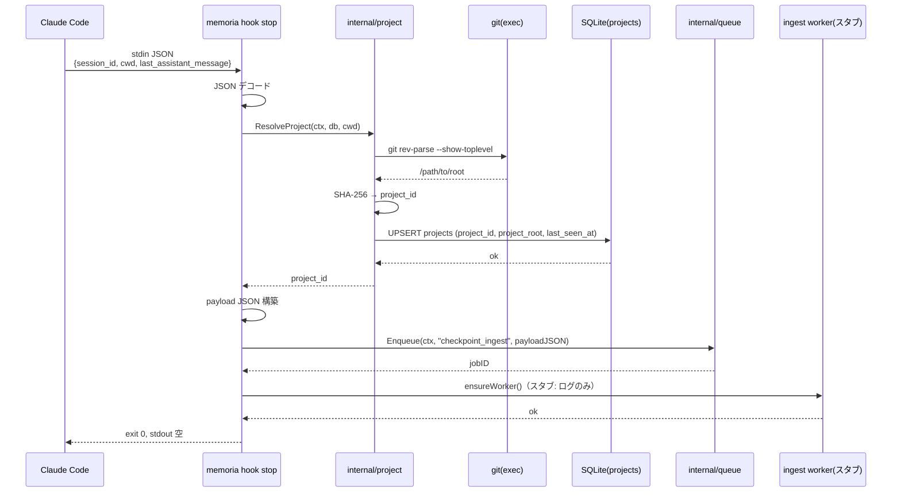
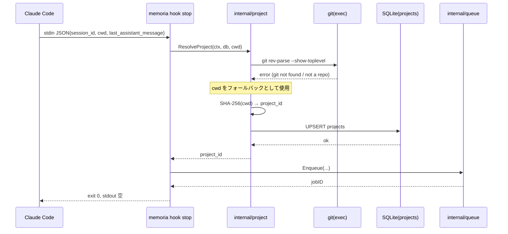
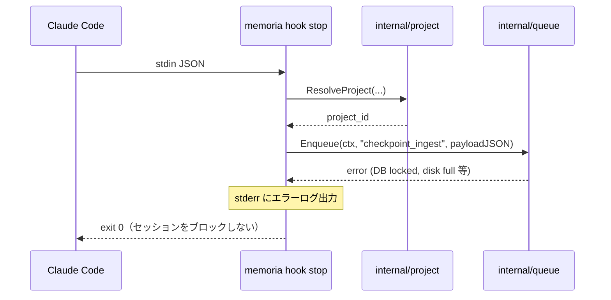

# M05: Stop hook + checkpoint enqueue 詳細計画

## 概要

`memoria hook stop` を実装する。Claude Code の Stop hook から stdin で受け取った
`last_assistant_message` を基に、`checkpoint_ingest` ジョブをキューに投入し、
ingest worker を非同期で起動する。1〜2 秒以内の完了が必須要件。

## スコープ

| 項目 | 含む | 含まない |
|------|------|---------|
| `memoria hook stop` コマンド実装 | stdin JSON パース、Project 解決、Enqueue | ingest worker 本体（M07） |
| Project ID 解決 | projects テーブル upsert、git root 検索 | fingerprint 生成（M13） |
| checkpoint_ingest payload 設計 | session_id/cwd/content/project_id | LLM enrichment（M08） |
| ensureWorker | ingest worker プロセス確認・起動 | embedding worker（M10） |
| タイムアウト制御 | context.WithTimeout（1.5 秒） | Stop hook によるブロッキング |
| テスト | unit / integration | E2E（実 Claude Code hook 実行） |

## M04 からのハンドオフ

| 資産 | 場所 | 利用方法 |
|------|------|---------|
| `*queue.Queue` + `Enqueue()` | `internal/queue/queue.go` | checkpoint_ingest を投入 |
| `JobTypeCheckpointIngest` 定数 | `internal/queue/job.go` | ジョブ種別 |
| `*db.DB` | `internal/db/db.go` | projects テーブルへのアクセス |
| `*config.Config` | `internal/config/config.go` | XDG パス・設定値 |
| Kong DI パターン | `cmd/memoria/main.go` | `Run(globals, db, queue, w)` |
| projects テーブル DDL | マイグレーション済み | project_id/project_root 等 |

`Run()` シグネチャ実績（M04 までの DI パターン）:

```go
func (c *HookStopCmd) Run(globals *Globals, database *db.DB, q *queue.Queue, w *io.Writer) error
```

## アーキテクチャ

### パッケージ構成

```
internal/
├── cli/
│   ├── hook.go              # HookStopCmd 実装（既存スタブを置き換え）
│   └── hook_stop_test.go    # Stop hook テスト（新規）
├── project/
│   ├── project.go           # Resolver: ResolveProject()
│   └── project_test.go      # Project 解決テスト（新規）
├── queue/                   # 既存（変更なし）
├── db/                      # 既存（変更なし）
└── config/                  # 既存（変更なし）
```

新規追加: `internal/project/` パッケージのみ。
`cli/hook.go` の `HookStopCmd.Run()` を "not implemented" スタブから実装に置き換える。

### stdin/stdout 仕様（HOOKS.ja.md 準拠）

**入力（stdin）:**

```json
{
  "session_id": "abc123",
  "cwd": "/Users/youyo/src/github.com/youyo/memoria",
  "last_assistant_message": "SQLite の WAL モードを有効化しました。..."
}
```

**出力（stdout）:**

なし（空）。HOOKS.ja.md §Stop に「出力なし」と明記されている。

**exit code:**

常に 0。enqueue 失敗時も 0 で継続し、stderr にログを記録する。

### Project ID 解決ロジック

SPEC.ja.md §10.1 に基づく:

1. `cwd` から `git rev-parse --show-toplevel` で git root を取得
2. git root が取得できない場合は `cwd` をフォールバックとして使用
3. root_path の SHA-256 ハッシュ（先頭 16 文字）を `project_id` として生成
4. `projects` テーブルに UPSERT（存在すれば `last_seen_at` を更新、なければ INSERT）
5. `project_id`（string）を返す

**project_id の生成式:**

```go
h := sha256.Sum256([]byte(rootPath))
projectID := hex.EncodeToString(h[:])[:16]
```

**projects テーブル UPSERT SQL:**

```sql
INSERT INTO projects (project_id, project_root, last_seen_at)
VALUES (?, ?, ?)
ON CONFLICT(project_id) DO UPDATE SET
    last_seen_at = excluded.last_seen_at
```

`repo_name` は `filepath.Base(rootPath)` から自動設定する。
fingerprint 系カラム（primary_language, fingerprint_json 等）は M13 で実装するため、
今は NULL のまま。

### checkpoint_ingest payload 設計

```json
{
  "session_id": "abc123",
  "project_id": "a1b2c3d4e5f6a7b8",
  "cwd": "/Users/youyo/src/github.com/youyo/memoria",
  "content": "SQLite の WAL モードを有効化しました。...",
  "captured_at": "2026-03-28T10:00:00Z"
}
```

| フィールド | 型 | 説明 |
|-----------|-----|------|
| `session_id` | string | Claude Code のセッション識別子 |
| `project_id` | string | SHA-256 由来の 16 文字 |
| `cwd` | string | hook 呼び出し時の作業ディレクトリ |
| `content` | string | `last_assistant_message` の全文 |
| `captured_at` | string (RFC3339) | enqueue 時刻 |

> **TODO(M08):** `content`（last_assistant_message）のサイズ上限を検討。現状は制限なしだが、巨大メッセージ（数MB）の場合に truncate を検討すべき。

### ensureWorker ロジック

M07 実装前の暫定方針:

1. `~/.local/state/memoria/run/ingest.pid` を確認
2. ファイルが存在し、かつ PID プロセスが生存していれば何もしない
3. 存在しない or プロセス死亡なら `memoria daemon ingest` をバックグラウンド起動
4. M07 完了後、この実装を正式な `ensureWorker()` に置き換える

**M05 では ensureWorker はスタブ（ログ出力のみ）とする。**
実際のプロセス起動は M07 で実装する。Stop hook 自体のコア機能（enqueue）が
このスタブに依存しないため、テスタビリティを損なわない。

### タイムアウト設計

HOOKS.ja.md の Stop タイムアウト仕様: **1〜2 秒**

```go
ctx, cancel := context.WithTimeout(context.Background(), 1500*time.Millisecond)
defer cancel()
```

処理ステップの時間配分:

| ステップ | 目標時間 |
|---------|---------|
| stdin JSON パース | <1ms |
| git root 取得（exec.Command） | <200ms |
| projects UPSERT | <50ms |
| Enqueue | <50ms |
| ensureWorker（スタブ） | <1ms |
| **合計** | **<350ms（余裕: 1150ms）** |

`git rev-parse` が 200ms を超える場合は `cwd` フォールバックを使用する。
context 伝播で全ステップを 1500ms のタイムアウト傘下に置く。

## シーケンス図

### 正常系



### エラー系（git root 取得失敗 → cwd フォールバック）



### エラー系（Enqueue 失敗 → 継続）



## TDD 実装ステップ（Red → Green → Refactor）

### Step 1: `internal/project` パッケージ骨格

**Red:**

```go
// internal/project/project_test.go
package project_test

import (
    "context"
    "testing"
    "database/sql"
    _ "modernc.org/sqlite"
)

func TestResolveProject_GitRoot(t *testing.T) {
    // t.TempDir() に git init した上で ResolveProject を呼ぶ
    // → git root が取得でき、project_id が 16 文字の hex であることを確認
}

func TestResolveProject_NotGitRepo(t *testing.T) {
    // git repo ではない tmpDir を cwd として渡す
    // → cwd フォールバックが使われ、project_id が返ること
}

func TestResolveProject_Upsert(t *testing.T) {
    // 同じ rootPath で2回 ResolveProject を呼ぶ
    // → 2回目は INSERT ではなく UPDATE（last_seen_at が更新）
    // → project_id は同じ値であること
}

func TestResolveProject_Timeout(t *testing.T) {
    // 既にキャンセル済みの context を渡す
    // → error が返ること（DB クエリは実行されない）
}
```

**Green:** `Resolver` 構造体と `ResolveProject(ctx, sqlDB, cwd)` を最小実装。
`exec.CommandContext` で `git rev-parse --show-toplevel` を呼び、
失敗時は `cwd` をフォールバック。`crypto/sha256` で project_id 生成。

**Refactor:** `gitRoot(ctx, cwd)` をプライベート関数に抽出。エラーログ統一。

### Step 2: `HookStopInput` 構造体 + JSON パース

**Red:**

```go
// internal/cli/hook_stop_test.go
func TestHookStopInput_Valid(t *testing.T) {
    input := `{"session_id":"s1","cwd":"/tmp","last_assistant_message":"hello"}`
    var got HookStopInput
    err := json.Unmarshal([]byte(input), &got)
    // assert no error, got.SessionID == "s1" 等
}

func TestHookStopInput_EmptyMessage(t *testing.T) {
    // last_assistant_message が空文字でも error なし
}

func TestHookStopInput_MissingField(t *testing.T) {
    // cwd が欠けた場合の扱い（空文字として扱う）
}
```

**Green:**

```go
type HookStopInput struct {
    SessionID            string `json:"session_id"`
    Cwd                  string `json:"cwd"`
    LastAssistantMessage string `json:"last_assistant_message"`
}
```

**Refactor:** 不要。

### Step 3: checkpoint_ingest payload 構造体

**Red:**

```go
func TestCheckpointPayload_JSON(t *testing.T) {
    p := CheckpointPayload{
        SessionID: "s1", ProjectID: "abcd1234", Cwd: "/tmp",
        Content: "hello", CapturedAt: time.Now(),
    }
    b, err := json.Marshal(p)
    // assert no error
    // assert contains "session_id", "project_id", "captured_at"
}
```

**Green:**

```go
type CheckpointPayload struct {
    SessionID  string    `json:"session_id"`
    ProjectID  string    `json:"project_id"`
    Cwd        string    `json:"cwd"`
    Content    string    `json:"content"`
    CapturedAt time.Time `json:"captured_at"`
}
```

**Refactor:** 不要。

### Step 4: `HookStopCmd.Run()` 統合

**Red:**

```go
// internal/cli/hook_stop_test.go
func TestHookStop_EnqueuesJob(t *testing.T) {
    // in-memory SQLite + queue.New() を用意
    // stdin に valid JSON を渡す
    // Run() 実行後、queue.Stats() で queued == 1 を確認
}

func TestHookStop_InvalidJSON(t *testing.T) {
    // stdin に invalid JSON → Run() は error を返さず exit 0
    // stderr に "failed to decode stdin" が出力される
}

func TestHookStop_EmptyStdin(t *testing.T) {
    // stdin が EOF → 何もせず exit 0
}

func TestHookStop_TimeoutContext(t *testing.T) {
    // context が 0ms タイムアウト → DB が遅くてもパニックしない
}
```

**Green:** `HookStopCmd.Run()` の本実装:

```go
func (c *HookStopCmd) Run(globals *Globals, database *db.DB, q *queue.Queue, w *io.Writer) error {
    ctx, cancel := context.WithTimeout(context.Background(), 1500*time.Millisecond)
    defer cancel()

    // 1. stdin デコード
    var input HookStopInput
    if err := json.NewDecoder(os.Stdin).Decode(&input); err \!= nil {
        fmt.Fprintf(os.Stderr, "memoria hook stop: failed to decode stdin: %v\n", err)
        return nil // exit 0
    }

    // 2. Project 解決
    resolver := project.NewResolver(database.SQL())
    projectID, err := resolver.Resolve(ctx, input.Cwd)
    if err \!= nil {
        fmt.Fprintf(os.Stderr, "memoria hook stop: failed to resolve project: %v\n", err)
        // フォールバック: cwd hash を使い続行
    }

    // 3. payload 構築 + enqueue
    payload := CheckpointPayload{
        SessionID:  input.SessionID,
        ProjectID:  projectID,
        Cwd:        input.Cwd,
        Content:    input.LastAssistantMessage,
        CapturedAt: time.Now().UTC(),
    }
    payloadJSON, _ := json.Marshal(payload)

    if _, err := q.Enqueue(ctx, queue.JobTypeCheckpointIngest, string(payloadJSON)); err \!= nil {
        fmt.Fprintf(os.Stderr, "memoria hook stop: failed to enqueue: %v\n", err)
        return nil // exit 0
    }

    // 4. ensureWorker（スタブ）
    ensureIngestWorker(ctx)

    return nil
}
```

**Refactor:** `ensureIngestWorker` を `internal/worker/ensure.go` として抽出準備（M07 への橋渡し）。

### Step 5: 統合テスト（実 SQLite）

**Red:**

```go
func TestHookStop_Integration(t *testing.T) {
    // tmpDir に SQLite DB を作成 + マイグレーション適用
    // stdin: valid JSON（実際の Hook 入力を模倣）
    // Run() 実行
    // DB の jobs テーブルを直接 SELECT して確認:
    //   - job_type == "checkpoint_ingest"
    //   - status == "queued"
    //   - payload_json に session_id, project_id, content が含まれる
}
```

**Green:** 上記 Run() 実装で通るはず。

**Refactor:** テストヘルパー `openTestDB(t)` を `internal/testutil/` に抽出（M06 以降でも再利用）。

## パッケージ詳細設計

### `internal/project/project.go`

```go
package project

import (
    "context"
    "crypto/sha256"
    "database/sql"
    "encoding/hex"
    "fmt"
    "os/exec"
    "path/filepath"
    "strings"
    "time"
)

// Resolver は cwd からプロジェクト情報を解決し、projects テーブルに記録する。
type Resolver struct {
    db *sql.DB
}

// NewResolver は *sql.DB から Resolver を作成する。
func NewResolver(db *sql.DB) *Resolver {
    return &Resolver{db: db}
}

// Resolve は cwd を受け取り、git root を優先してプロジェクトを解決する。
// projects テーブルに UPSERT し、project_id を返す。
// エラー時も project_id（cwd ベース）を返す（best effort）。
func (r *Resolver) Resolve(ctx context.Context, cwd string) (string, error) {
    rootPath := r.gitRoot(ctx, cwd)
    projectID := generateProjectID(rootPath)
    repoName := filepath.Base(rootPath)
    now := time.Now().UTC().Format(time.RFC3339)

    const upsertSQL = `
INSERT INTO projects (project_id, project_root, repo_name, last_seen_at)
VALUES (?, ?, ?, ?)
ON CONFLICT(project_id) DO UPDATE SET
    last_seen_at = excluded.last_seen_at`

    _, err := r.db.ExecContext(ctx, upsertSQL, projectID, rootPath, repoName, now)
    if err \!= nil {
        return projectID, fmt.Errorf("upsert project: %w", err)
    }
    return projectID, nil
}

// gitRoot は exec.CommandContext で git root を取得する。
// 失敗時は cwd をそのまま返す。
// 戻り値には filepath.EvalSymlinks() + filepath.Clean() を適用して
// symlink やパスの揺れを正規化する。cwd フォールバック時にも同様に正規化する。
func (r *Resolver) gitRoot(ctx context.Context, cwd string) string {
    cmd := exec.CommandContext(ctx, "git", "-C", cwd, "rev-parse", "--show-toplevel")
    out, err := cmd.Output()
    if err \!= nil {
        if resolved, err := filepath.EvalSymlinks(cwd); err == nil {
            return filepath.Clean(resolved)
        }
        return filepath.Clean(cwd)
    }
    raw := strings.TrimSpace(string(out))
    if resolved, err := filepath.EvalSymlinks(raw); err == nil {
        return filepath.Clean(resolved)
    }
    return filepath.Clean(raw)
}

// generateProjectID は rootPath の SHA-256 ハッシュ先頭 16 文字を返す。
func generateProjectID(rootPath string) string {
    h := sha256.Sum256([]byte(rootPath))
    return hex.EncodeToString(h[:])[:16]
}
```

### `internal/cli/hook.go`（HookStopCmd 部分）

型定義を `hook.go` 内に追加し、`hook_stop_test.go` で独立してテストする。

```go
// HookStopInput は Stop hook の stdin JSON 入力。
type HookStopInput struct {
    SessionID            string `json:"session_id"`
    Cwd                  string `json:"cwd"`
    LastAssistantMessage string `json:"last_assistant_message"`
}

// CheckpointPayload は checkpoint_ingest ジョブの payload。
type CheckpointPayload struct {
    SessionID  string    `json:"session_id"`
    ProjectID  string    `json:"project_id"`
    Cwd        string    `json:"cwd"`
    Content    string    `json:"content"`
    CapturedAt time.Time `json:"captured_at"`
}
```

### `internal/worker/ensure.go`（スタブ）

```go
package worker

import (
    "context"
    "fmt"
    "os"
)

// EnsureIngest は ingest worker が起動していることを確認する。
// M05 ではスタブ実装（ログ出力のみ）。M07 で本実装に置き換える。
func EnsureIngest(ctx context.Context) {
    fmt.Fprintln(os.Stderr, "memoria: ensureWorker: not implemented (M07)")
}
```

### `main.go` への追加 DI

`*queue.Queue` を Kong.Bind で全コマンドに注入する必要がある。

```go
// cmd/memoria/main.go への追加
q := queue.New(database.SQL())
kong.Bind(q),  // 追加
```

## テスト設計書

### 正常系テスト

| テスト名 | 入力 | 期待出力 |
|---------|-----|---------|
| `TestResolveProject_GitRoot` | git repo 内の cwd | git root ベースの project_id（16文字 hex）|
| `TestResolveProject_NotGitRepo` | 非 git ディレクトリ | cwd ベースの project_id |
| `TestResolveProject_Upsert` | 同 cwd を2回 | 同一 project_id、last_seen_at が更新 |
| `TestCheckpointPayload_JSON` | CheckpointPayload 構造体 | 正しい JSON フィールド |
| `TestHookStop_EnqueuesJob` | valid stdin JSON | DB に checkpoint_ingest ジョブ |
| `TestHookStop_Integration` | valid stdin JSON + 実 SQLite | jobs テーブルに1件 queued |

### 異常系テスト

| テスト名 | 入力 | 期待挙動 |
|---------|-----|---------|
| `TestHookStop_InvalidJSON` | `{invalid` | exit 0、stderr にエラーログ |
| `TestHookStop_EmptyStdin` | EOF | exit 0、何もしない |
| `TestHookStop_TimeoutContext` | 0ms タイムアウト context | パニックしない、exit 0 |
| `TestResolveProject_CancelledContext` | キャンセル済み context | error 返却 |

### エッジケースとタイムアウトテスト

| テスト名 | シナリオ |
|---------|---------|
| `TestHookStop_EnqueueFailure` | Enqueue が error → exit 0 継続（projects UPSERT が成功済みの状態で Enqueue が失敗するケースを検証） |
| `TestHookStop_LargeMessage` | 1MB の last_assistant_message | 正常に enqueue |
| `TestResolveProject_SymlinkPath` | symlink 経由の cwd | 解決して project_id 生成 |

## ファイル一覧

| ファイル | 変更種別 | 説明 |
|---------|---------|------|
| `internal/project/project.go` | 新規 | Resolver 実装 |
| `internal/project/project_test.go` | 新規 | Resolver テスト |
| `internal/cli/hook.go` | 変更 | HookStopCmd.Run() を本実装に置き換え + 型定義追加 |
| `internal/cli/hook_stop_test.go` | 新規 | Stop hook テスト |
| `internal/worker/ensure.go` | 新規 | EnsureIngest スタブ |
| `cmd/memoria/main.go` | 変更 | `queue.New(database.SQL())` と `kong.Bind(q)` 追加 |

推定ファイル数: 6（ロードマップの 6-8 の範囲内）

## リスク評価

| リスク | 影響度 | 確率 | 軽減策 |
|--------|--------|------|--------|
| `git rev-parse` が 1.5 秒超 | 高 | 低 | `exec.CommandContext` で 200ms タイムアウト設定。失敗時は cwd フォールバック |
| projects テーブルが M03 未実装 | 高 | 低 | M03 で DDL 定義済みのため問題なし。テストは `openTestDB(t)` でマイグレーション適用 |
| `*queue.Queue` が main.go に Bind されていない | 中 | 中 | main.go の変更を Step 4 の最初に実施 |
| last_assistant_message が非常に大きい | 低 | 中 | SQLite は TEXT 長制限なし（実用上問題なし） |
| ensureWorker スタブが M07 前に呼ばれる | 低 | 確実 | スタブは stderr ログのみ。hook は exit 0 で継続 |
| SQLite の UPSERT 構文 | 低 | 低 | `ON CONFLICT(project_id) DO UPDATE` は SQLite 3.24+ で利用可能。`modernc.org/sqlite` はバンドルしており問題なし |
| M08 向け session_id FK 整合性 | 中 | 中 | M08 ingest worker で chunks INSERT 時に sessions レコードの存在確認（または UPSERT）が必要（FK 制約: chunks.session_id → sessions.session_id）。M05 では payload に session_id を含めるだけで FK 制約には触れない。 |

## タイムアウト対策詳細

```
[0ms]     stdin デコード（JSON パース）
[~1ms]    gitRoot exec.CommandContext（最大 200ms で中断）
[~201ms]  UPSERT projects
[~251ms]  Enqueue（BEGIN IMMEDIATE → INSERT → COMMIT）
[~301ms]  ensureWorker スタブ（~0ms）
[~302ms]  return nil
```

全体 302ms < 1500ms タイムアウト。`git rev-parse` が 200ms を超えた場合でも
context キャンセルで中断し、cwd フォールバックを使うため hook が止まることはない。

HOOKS.ja.md の「hook は絶対に block しない」原則: enqueue/project 解決が失敗しても
`return nil`（exit 0）で hook を継続させる。エラーは全て stderr に記録する。

## 完了基準

- [ ] `go test ./internal/project/... ./internal/cli/... ./internal/worker/...` が全て green
- [ ] `memoria hook stop` が valid JSON を stdin で受け取り、exit 0 で終了する
- [ ] `memoria hook stop` の実行後、SQLite の `jobs` テーブルに `checkpoint_ingest` が1件 queued で追加される
- [ ] invalid JSON / empty stdin でも exit 0（セッションをブロックしない）
- [ ] git repo 内では git root、非 git ディレクトリでは cwd をプロジェクト root として使用する
- [ ] 同一 cwd を複数回渡しても `projects` テーブルに重複が発生しない
- [ ] `cmd/memoria/main.go` に `queue.New` と `kong.Bind(q)` が追加されている
- [ ] ロードマップ `plans/memoria-roadmap.md` の M05 チェックボックスが更新されている

## 実装順序まとめ

1. `cmd/memoria/main.go` に `*queue.Queue` の DI 追加（既存テストが壊れないことを確認）
2. `internal/project/project.go` + `project_test.go`（Red → Green → Refactor）
3. `internal/cli/hook.go` の型定義追加（`HookStopInput`, `CheckpointPayload`）
4. `internal/worker/ensure.go` スタブ作成
5. `internal/cli/hook.go` の `HookStopCmd.Run()` 本実装
6. `internal/cli/hook_stop_test.go` の統合テスト（実 SQLite）
7. `go test ./...` で全テスト green 確認
8. `plans/memoria-roadmap.md` の M05 チェックボックス更新
