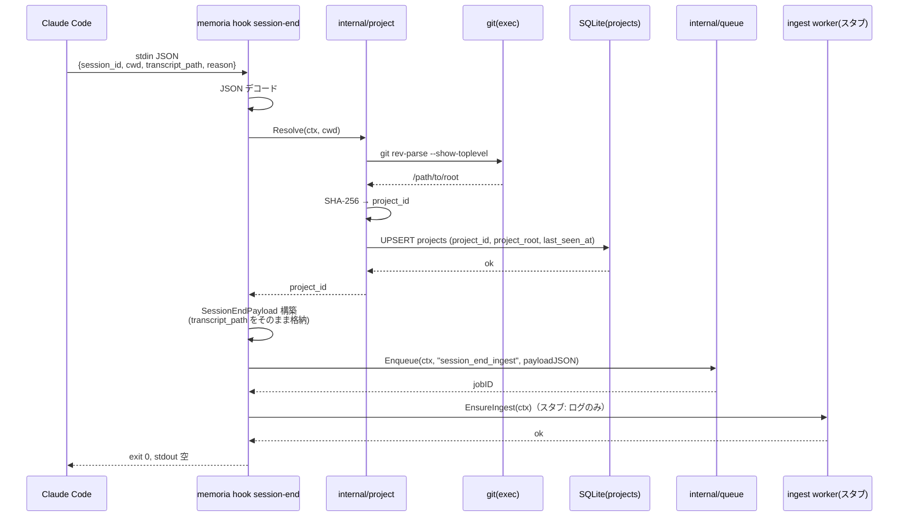
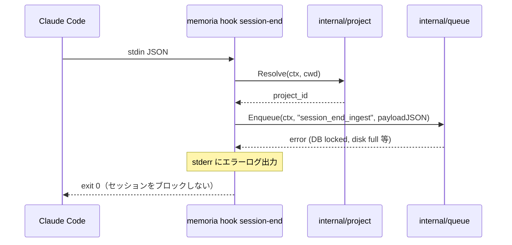
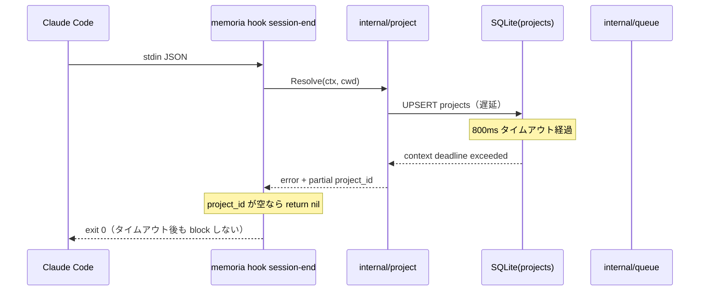

# M06: SessionEnd hook + transcript enqueue 詳細計画

## 概要

`memoria hook session-end` を実装する。Claude Code の SessionEnd hook から stdin で受け取った
`transcript_path` を基に、`session_end_ingest` ジョブをキューに投入し、
ingest worker を非同期で起動する。**1 秒未満**の完了が必須要件。

Stop hook（M05）よりも厳しいタイムアウト制約を持つ。処理の軽量化を徹底し、
transcript ファイルの読み込みは行わず、パスの enqueue のみに限定する。

## スコープ

| 項目 | 含む | 含まない |
|------|------|---------|
| `memoria hook session-end` コマンド実装 | stdin JSON パース、Project 解決、Enqueue | ingest worker 本体（M07/M08） |
| Project ID 解決 | `internal/project.Resolver` 再利用 | fingerprint 生成（M13） |
| session_end_ingest payload 設計 | session_id/cwd/transcript_path/project_id | transcript ファイル読み込み（M08） |
| ensureWorker | `worker.EnsureIngest` スタブ再利用 | embedding worker（M10） |
| タイムアウト制御 | context.WithTimeout（800ms） | SessionEnd によるブロッキング |
| テスト | unit / integration | E2E（実 Claude Code hook 実行） |

## M05 からのハンドオフ

| 資産 | 場所 | 利用方法 |
|------|------|---------|
| `internal/project.Resolver.Resolve()` | `internal/project/project.go` | project_id 解決に再利用（変更なし） |
| `worker.EnsureIngest()` スタブ | `internal/worker/ensure.go` | そのまま再利用（変更なし） |
| `*queue.Queue` + `Enqueue()` | `internal/queue/queue.go` | session_end_ingest を投入 |
| `JobTypeSessionEndIngest` 定数 | `internal/queue/job.go` | ジョブ種別（定義済み） |
| `*db.DB` | `internal/db/db.go` | projects テーブルへのアクセス |
| `HookStopCmd.RunWithReader()` パターン | `internal/cli/hook.go` | テスタビリティ設計の模倣 |
| `internal/testutil/db.go` | `internal/testutil/db.go` | `OpenTestDB(t)` をそのまま利用 |
| Kong DI パターン | `cmd/memoria/main.go` | `Run(globals, w, database, q)` |

## M05 との差分

### 共通パターン（変更なし）

- `stdin JSON デコード → Project ID 解決 → Enqueue → EnsureIngest → exit 0`
- `context.WithTimeout` による全処理制限
- エラー時 `return nil`（exit 0）+ stderr ログ
- `RunWithReader(reader io.Reader, sqlDB *sql.DB, q *queue.Queue)` パターン
- `testutil.OpenTestDB(t)` による統合テスト

### M06 固有の差分

| 観点 | M05 (Stop hook) | M06 (SessionEnd hook) |
|------|----------------|----------------------|
| タイムアウト | 1500ms | **800ms**（1秒未満目標） |
| stdin フィールド | session_id, cwd, last_assistant_message | session_id, cwd, **transcript_path**, **reason** |
| payload フィールド | content（メッセージ本文） | **transcript_path**（ファイルパス参照） |
| ジョブ種別 | `checkpoint_ingest` | `session_end_ingest` |
| stdout | 空 | 空（同じ） |
| transcript 読み込み | 不要 | **行わない**（M08 の ingest worker が担当） |
| 入力型名 | `HookStopInput` | `HookSessionEndInput`（新規） |
| payload 型名 | `CheckpointPayload` | `SessionEndPayload`（新規） |

### 共通化可能な部分

`internal/cli/hook.go` 内に既存の型・関数と同居させる。
`internal/project` と `internal/worker` は変更なしで再利用できる。
新規に追加するのは `HookSessionEndInput` 型、`SessionEndPayload` 型、
`HookSessionEndCmd.Run()` と `RunWithReader()` の実装のみ。

## アーキテクチャ

### パッケージ構成

```
internal/
├── cli/
│   ├── hook.go                   # HookSessionEndCmd 実装追加（既存ファイルに追記）
│   └── hook_session_end_test.go  # SessionEnd hook テスト（新規）
├── project/                      # 変更なし
├── queue/                        # 変更なし（JobTypeSessionEndIngest は定義済み）
├── db/                           # 変更なし
├── worker/                       # 変更なし
└── testutil/                     # 変更なし
```

変更対象ファイル: `internal/cli/hook.go`（追記のみ）
新規ファイル: `internal/cli/hook_session_end_test.go`

### stdin/stdout 仕様（HOOKS.ja.md 準拠）

**入力（stdin）:**

```json
{
  "session_id": "abc123",
  "cwd": "/Users/youyo/src/github.com/youyo/memoria",
  "transcript_path": "/Users/youyo/.claude/projects/-Users-youyo-src/abc123.jsonl",
  "reason": "exit"
}
```

| フィールド | 型 | 必須 | 説明 |
|-----------|-----|------|------|
| `session_id` | string | 必須 | Claude Code のセッション識別子 |
| `cwd` | string | 必須 | hook 呼び出し時の作業ディレクトリ |
| `transcript_path` | string | 必須 | JSONL 形式のトランスクリプトファイルパス |
| `reason` | string | 任意 | セッション終了理由（`exit`, `clear`, `crash` 等）|

**出力（stdout）:**

なし（空）。HOOKS.ja.md §SessionEnd に「出力なし」と明記されている。

**exit code:**

常に 0。enqueue 失敗時も 0 で継続し、stderr にエラーを記録する。

### session_end_ingest payload 設計

transcript ファイルの内容はこの時点では読み込まない。
ファイルパスのみを payload に含め、実際の読み込み・パースは M08 の ingest worker が担当する。

```json
{
  "session_id": "abc123",
  "project_id": "a1b2c3d4e5f6a7b8",
  "cwd": "/Users/youyo/src/github.com/youyo/memoria",
  "transcript_path": "/Users/youyo/.claude/projects/-Users-youyo-src/abc123.jsonl",
  "reason": "exit",
  "enqueued_at": "2026-03-28T10:00:00Z"
}
```

| フィールド | 型 | 説明 |
|-----------|-----|------|
| `session_id` | string | Claude Code のセッション識別子 |
| `project_id` | string | SHA-256 由来の 16 文字 |
| `cwd` | string | hook 呼び出し時の作業ディレクトリ |
| `transcript_path` | string | JSONL トランスクリプトのファイルパス |
| `reason` | string | セッション終了理由（空文字の場合あり） |
| `enqueued_at` | string (RFC3339) | enqueue 時刻 |

**transcript 読み込みを行わない理由:**

- SessionEnd タイムアウトは 1 秒未満が目標
- transcript ファイルは数 MB になる可能性がある
- ファイル I/O は ingest worker 側で行い、hook の責務を軽量に保つ
- hook 失敗時の影響を最小化する（ファイルパスさえ保存できれば再試行可能）

### タイムアウト設計

HOOKS.ja.md の SessionEnd タイムアウト仕様: **1 秒未満を目標**

```go
ctx, cancel := context.WithTimeout(context.Background(), 800*time.Millisecond)
defer cancel()
```

処理ステップの時間配分:

| ステップ | 目標時間 |
|---------|---------|
| stdin JSON パース | <1ms |
| git root 取得（exec.Command） | <200ms（フォールバックあり） |
| projects UPSERT | <50ms |
| Enqueue | <50ms |
| ensureWorker（スタブ） | <1ms |
| **合計** | **<302ms（余裕: 498ms）** |

Stop hook（M05）と同じ処理フローだが、タイムアウトを 800ms に短縮。
`git rev-parse` には別途 200ms の上限をかけ、超過時は cwd フォールバックを使用する。

## シーケンス図

### 正常系



### エラー系（Enqueue 失敗 → 継続）



### エラー系（タイムアウト超過 → 継続）



## TDD 実装ステップ（Red → Green → Refactor）

### Step 1: `HookSessionEndInput` 構造体 + JSON パース

**Red:**

```go
// internal/cli/hook_session_end_test.go
package cli_test

import (
    "encoding/json"
    "testing"
)

func TestHookSessionEndInput_Valid(t *testing.T) {
    input := `{
        "session_id": "s1",
        "cwd": "/tmp",
        "transcript_path": "/tmp/abc.jsonl",
        "reason": "exit"
    }`
    var got HookSessionEndInput
    err := json.Unmarshal([]byte(input), &got)
    if err \!= nil {
        t.Fatalf("unexpected error: %v", err)
    }
    if got.SessionID \!= "s1" {
        t.Errorf("SessionID = %q, want %q", got.SessionID, "s1")
    }
    if got.TranscriptPath \!= "/tmp/abc.jsonl" {
        t.Errorf("TranscriptPath = %q, want %q", got.TranscriptPath, "/tmp/abc.jsonl")
    }
    if got.Reason \!= "exit" {
        t.Errorf("Reason = %q, want %q", got.Reason, "exit")
    }
}

func TestHookSessionEndInput_MissingReason(t *testing.T) {
    // reason フィールドなし → 空文字として扱う（エラーなし）
    input := `{"session_id":"s1","cwd":"/tmp","transcript_path":"/tmp/abc.jsonl"}`
    var got HookSessionEndInput
    if err := json.Unmarshal([]byte(input), &got); err \!= nil {
        t.Fatalf("unexpected error: %v", err)
    }
    if got.Reason \!= "" {
        t.Errorf("Reason = %q, want empty", got.Reason)
    }
}

func TestHookSessionEndInput_EmptyTranscriptPath(t *testing.T) {
    // transcript_path が空でも JSON パース自体は成功
    input := `{"session_id":"s1","cwd":"/tmp","transcript_path":""}`
    var got HookSessionEndInput
    if err := json.Unmarshal([]byte(input), &got); err \!= nil {
        t.Fatalf("unexpected error: %v", err)
    }
}
```

**Green:**

```go
// internal/cli/hook.go に追加
type HookSessionEndInput struct {
    SessionID      string `json:"session_id"`
    Cwd            string `json:"cwd"`
    TranscriptPath string `json:"transcript_path"`
    Reason         string `json:"reason"`
}
```

**Refactor:** 不要。

### Step 2: `SessionEndPayload` 構造体

**Red:**

```go
func TestSessionEndPayload_JSON(t *testing.T) {
    p := SessionEndPayload{
        SessionID:      "s1",
        ProjectID:      "abcd1234ef567890",
        Cwd:            "/tmp",
        TranscriptPath: "/tmp/abc.jsonl",
        Reason:         "exit",
        EnqueuedAt:     time.Date(2026, 3, 28, 10, 0, 0, 0, time.UTC),
    }
    b, err := json.Marshal(p)
    if err \!= nil {
        t.Fatalf("unexpected error: %v", err)
    }
    s := string(b)
    for _, want := range []string{
        `"session_id"`, `"project_id"`, `"transcript_path"`,
        `"reason"`, `"enqueued_at"`,
    } {
        if \!strings.Contains(s, want) {
            t.Errorf("payload JSON missing %q: %s", want, s)
        }
    }
    // transcript 内容（本文）は含まれないことを確認
    if strings.Contains(s, "content") {
        t.Errorf("payload JSON should NOT contain 'content' field")
    }
}
```

**Green:**

```go
type SessionEndPayload struct {
    SessionID      string    `json:"session_id"`
    ProjectID      string    `json:"project_id"`
    Cwd            string    `json:"cwd"`
    TranscriptPath string    `json:"transcript_path"`
    Reason         string    `json:"reason"`
    EnqueuedAt     time.Time `json:"enqueued_at"`
}
```

**Refactor:** 不要。

### Step 3: `HookSessionEndCmd.Run()` + `RunWithReader()` 統合

**Red:**

```go
func TestHookSessionEnd_EnqueuesJob(t *testing.T) {
    sqlDB := testutil.OpenTestDB(t)
    q := queue.New(sqlDB)

    input := `{
        "session_id": "sess1",
        "cwd": "/tmp",
        "transcript_path": "/tmp/sess1.jsonl",
        "reason": "exit"
    }`
    cmd := &HookSessionEndCmd{}
    var buf bytes.Buffer
    w := io.Writer(&buf)
    err := cmd.RunWithReader(
        &Globals{},
        &w,
        strings.NewReader(input),
        sqlDB,
        q,
    )
    if err \!= nil {
        t.Fatalf("unexpected error: %v", err)
    }

    // jobs テーブルに session_end_ingest が 1 件追加されていること
    var count int
    if err := sqlDB.QueryRow(
        `SELECT COUNT(*) FROM jobs WHERE job_type = 'session_end_ingest' AND status = 'queued'`,
    ).Scan(&count); err \!= nil {
        t.Fatalf("query error: %v", err)
    }
    if count \!= 1 {
        t.Errorf("queued job count = %d, want 1", count)
    }
}

func TestHookSessionEnd_InvalidJSON(t *testing.T) {
    sqlDB := testutil.OpenTestDB(t)
    q := queue.New(sqlDB)
    cmd := &HookSessionEndCmd{}
    var buf bytes.Buffer
    w := io.Writer(&buf)
    // invalid JSON でも exit 0（エラーを返さない）
    err := cmd.RunWithReader(&Globals{}, &w, strings.NewReader("{invalid"), sqlDB, q)
    if err \!= nil {
        t.Errorf("expected nil, got %v", err)
    }
}

func TestHookSessionEnd_EmptyStdin(t *testing.T) {
    sqlDB := testutil.OpenTestDB(t)
    q := queue.New(sqlDB)
    cmd := &HookSessionEndCmd{}
    var buf bytes.Buffer
    w := io.Writer(&buf)
    // EOF でも exit 0
    err := cmd.RunWithReader(&Globals{}, &w, strings.NewReader(""), sqlDB, q)
    if err \!= nil {
        t.Errorf("expected nil, got %v", err)
    }
}

func TestHookSessionEnd_TimeoutContext(t *testing.T) {
    // 0ms タイムアウトでもパニックしない（コマンドは正常に 0 で返る）
    sqlDB := testutil.OpenTestDB(t)
    q := queue.New(sqlDB)
    cmd := &HookSessionEndCmd{}
    var buf bytes.Buffer
    w := io.Writer(&buf)
    input := `{"session_id":"s1","cwd":"/tmp","transcript_path":"/tmp/s1.jsonl"}`
    // 外部から ctx を渡す設計ではないため、内部の timeout が 0ms では動作しない。
    // 代わりに DB を閉じた状態で実行し、即エラーになることを検証。
    sqlDB.Close()
    err := cmd.RunWithReader(&Globals{}, &w, strings.NewReader(input), sqlDB, q)
    if err \!= nil {
        t.Errorf("expected nil (exit 0), got %v", err)
    }
}
```

**Green:**

```go
// HookSessionEndCmd は session-end hook コマンド。
type HookSessionEndCmd struct{}

// Run は session-end hook を実行する（os.Stdin から読み取る）。
func (c *HookSessionEndCmd) Run(globals *Globals, w *io.Writer, database *db.DB, q *queue.Queue) error {
    return c.RunWithReader(globals, w, os.Stdin, database.SQL(), q)
}

// RunWithReader はテスト可能な実装。reader から stdin を読み取る。
func (c *HookSessionEndCmd) RunWithReader(globals *Globals, w *io.Writer, reader io.Reader, sqlDB *sql.DB, q *queue.Queue) error {
    ctx, cancel := context.WithTimeout(context.Background(), 800*time.Millisecond)
    defer cancel()

    // 1. stdin デコード
    var input HookSessionEndInput
    if err := json.NewDecoder(reader).Decode(&input); err \!= nil {
        fmt.Fprintf(os.Stderr, "memoria hook session-end: failed to decode stdin: %v\n", err)
        return nil // exit 0
    }

    // 2. Project 解決
    resolver := project.NewResolver(sqlDB)
    projectID, err := resolver.Resolve(ctx, input.Cwd)
    if err \!= nil {
        fmt.Fprintf(os.Stderr, "memoria hook session-end: failed to resolve project: %v\n", err)
        if projectID == "" {
            return nil // exit 0
        }
    }

    // 3. payload 構築 + enqueue
    payload := SessionEndPayload{
        SessionID:      input.SessionID,
        ProjectID:      projectID,
        Cwd:            input.Cwd,
        TranscriptPath: input.TranscriptPath,
        Reason:         input.Reason,
        EnqueuedAt:     time.Now().UTC(),
    }
    payloadJSON, err := json.Marshal(payload)
    if err \!= nil {
        fmt.Fprintf(os.Stderr, "memoria hook session-end: failed to marshal payload: %v\n", err)
        return nil // exit 0
    }

    if _, err := q.Enqueue(ctx, queue.JobTypeSessionEndIngest, string(payloadJSON)); err \!= nil {
        fmt.Fprintf(os.Stderr, "memoria hook session-end: failed to enqueue: %v\n", err)
        return nil // exit 0
    }

    // 4. ensureWorker（M07 まではスタブ）
    worker.EnsureIngest(ctx)

    return nil
}
```

**Refactor:**
- `HookSessionEndCmd` の `Run` / `RunWithReader` と `HookStopCmd` の同構造を見て、
  共通パターンが見えたら Step 4 で検討する。
- `project.NewResolver(sqlDB).Resolve(ctx, cwd)` + エラーハンドリングは共通化できるが、
  過度な抽象化は避ける。M06 のスコープでは共通関数化は不要。

### Step 4: 統合テスト（実 SQLite + payload 内容検証）

**Red:**

```go
func TestHookSessionEnd_Integration_PayloadContents(t *testing.T) {
    sqlDB := testutil.OpenTestDB(t)
    q := queue.New(sqlDB)

    input := `{
        "session_id": "sess-integration",
        "cwd": "/tmp",
        "transcript_path": "/tmp/transcripts/sess-integration.jsonl",
        "reason": "exit"
    }`
    cmd := &HookSessionEndCmd{}
    var buf bytes.Buffer
    w := io.Writer(&buf)
    if err := cmd.RunWithReader(&Globals{}, &w, strings.NewReader(input), sqlDB, q); err \!= nil {
        t.Fatalf("unexpected error: %v", err)
    }

    // DB から payload_json を取得して内容を検証
    var payloadJSON string
    err := sqlDB.QueryRow(
        `SELECT payload_json FROM jobs WHERE job_type = 'session_end_ingest' LIMIT 1`,
    ).Scan(&payloadJSON)
    if err \!= nil {
        t.Fatalf("query error: %v", err)
    }

    var payload SessionEndPayload
    if err := json.Unmarshal([]byte(payloadJSON), &payload); err \!= nil {
        t.Fatalf("unmarshal error: %v", err)
    }

    if payload.SessionID \!= "sess-integration" {
        t.Errorf("SessionID = %q, want %q", payload.SessionID, "sess-integration")
    }
    if payload.TranscriptPath \!= "/tmp/transcripts/sess-integration.jsonl" {
        t.Errorf("TranscriptPath = %q, want %q",
            payload.TranscriptPath, "/tmp/transcripts/sess-integration.jsonl")
    }
    if payload.Reason \!= "exit" {
        t.Errorf("Reason = %q, want %q", payload.Reason, "exit")
    }
    if payload.ProjectID == "" {
        t.Errorf("ProjectID should not be empty")
    }
    if len(payload.ProjectID) \!= 16 {
        t.Errorf("ProjectID length = %d, want 16", len(payload.ProjectID))
    }
    if payload.EnqueuedAt.IsZero() {
        t.Errorf("EnqueuedAt should not be zero")
    }
}

func TestHookSessionEnd_Integration_ProjectUpserted(t *testing.T) {
    sqlDB := testutil.OpenTestDB(t)
    q := queue.New(sqlDB)

    input := `{"session_id":"s1","cwd":"/tmp","transcript_path":"/tmp/s1.jsonl"}`
    cmd := &HookSessionEndCmd{}
    var buf bytes.Buffer
    w := io.Writer(&buf)
    if err := cmd.RunWithReader(&Globals{}, &w, strings.NewReader(input), sqlDB, q); err \!= nil {
        t.Fatalf("unexpected error: %v", err)
    }

    // projects テーブルに1件 UPSERT されていること
    var count int
    if err := sqlDB.QueryRow(`SELECT COUNT(*) FROM projects`).Scan(&count); err \!= nil {
        t.Fatalf("query error: %v", err)
    }
    if count < 1 {
        t.Errorf("projects count = %d, want >= 1", count)
    }
}
```

**Green:** Step 3 の実装で通るはず。

**Refactor:** テストヘルパーとして `assertJobQueued(t, sqlDB, jobType)` を抽出することを検討
（M07 以降でも再利用できる場合のみ）。

## パッケージ詳細設計

### `internal/cli/hook.go`（追記部分）

既存の `hook.go` に以下を追記する（`HookSessionEndCmd` の `Run` スタブを置き換え）。

```go
// HookSessionEndInput は SessionEnd hook の stdin JSON 入力。
type HookSessionEndInput struct {
    SessionID      string `json:"session_id"`
    Cwd            string `json:"cwd"`
    TranscriptPath string `json:"transcript_path"`
    Reason         string `json:"reason"`
}

// SessionEndPayload は session_end_ingest ジョブの payload。
type SessionEndPayload struct {
    SessionID      string    `json:"session_id"`
    ProjectID      string    `json:"project_id"`
    Cwd            string    `json:"cwd"`
    TranscriptPath string    `json:"transcript_path"`
    Reason         string    `json:"reason"`
    EnqueuedAt     time.Time `json:"enqueued_at"`
}

// HookSessionEndCmd は session-end hook コマンド。
type HookSessionEndCmd struct{}

// Run は session-end hook を実行する（os.Stdin から読み取る）。
func (c *HookSessionEndCmd) Run(globals *Globals, w *io.Writer, database *db.DB, q *queue.Queue) error {
    return c.RunWithReader(globals, w, os.Stdin, database.SQL(), q)
}

// RunWithReader はテスト可能な実装。reader から stdin を読み取る。
func (c *HookSessionEndCmd) RunWithReader(globals *Globals, w *io.Writer, reader io.Reader, sqlDB *sql.DB, q *queue.Queue) error {
    ctx, cancel := context.WithTimeout(context.Background(), 800*time.Millisecond)
    defer cancel()

    var input HookSessionEndInput
    if err := json.NewDecoder(reader).Decode(&input); err \!= nil {
        fmt.Fprintf(os.Stderr, "memoria hook session-end: failed to decode stdin: %v\n", err)
        return nil
    }

    resolver := project.NewResolver(sqlDB)
    projectID, err := resolver.Resolve(ctx, input.Cwd)
    if err \!= nil {
        fmt.Fprintf(os.Stderr, "memoria hook session-end: failed to resolve project: %v\n", err)
        if projectID == "" {
            return nil
        }
    }

    payload := SessionEndPayload{
        SessionID:      input.SessionID,
        ProjectID:      projectID,
        Cwd:            input.Cwd,
        TranscriptPath: input.TranscriptPath,
        Reason:         input.Reason,
        EnqueuedAt:     time.Now().UTC(),
    }
    payloadJSON, err := json.Marshal(payload)
    if err \!= nil {
        fmt.Fprintf(os.Stderr, "memoria hook session-end: failed to marshal payload: %v\n", err)
        return nil
    }

    if _, err := q.Enqueue(ctx, queue.JobTypeSessionEndIngest, string(payloadJSON)); err \!= nil {
        fmt.Fprintf(os.Stderr, "memoria hook session-end: failed to enqueue: %v\n", err)
        return nil
    }

    worker.EnsureIngest(ctx)
    return nil
}
```

### `cmd/memoria/main.go`（変更不要）

M05 の実装で `*queue.Queue` の Kong.Bind は追加済み。
`HookSessionEndCmd.Run` シグネチャが `Run(globals *Globals, w *io.Writer, database *db.DB, q *queue.Queue)` であれば
Kong が自動的に DI を解決するため、`main.go` の変更は不要。

ただし M05 実装時に `Run(globals *Globals, w *io.Writer)` のままになっている場合は、
`database *db.DB` と `q *queue.Queue` を追加する。

## テスト設計書

### 正常系テスト

| テスト名 | 入力 | 期待出力 |
|---------|-----|---------|
| `TestHookSessionEndInput_Valid` | valid stdin JSON（全フィールドあり） | 全フィールドが正しくパース |
| `TestHookSessionEndInput_MissingReason` | reason フィールドなし | reason が空文字、エラーなし |
| `TestSessionEndPayload_JSON` | SessionEndPayload 構造体 | 正しい JSON フィールド（content フィールドなし） |
| `TestHookSessionEnd_EnqueuesJob` | valid stdin JSON + in-memory SQLite | DB に session_end_ingest ジョブ 1 件 queued |
| `TestHookSessionEnd_Integration_PayloadContents` | valid stdin JSON + 実 SQLite | payload の全フィールド検証 |
| `TestHookSessionEnd_Integration_ProjectUpserted` | valid stdin JSON + 実 SQLite | projects テーブルに 1 件以上 |

### 異常系テスト

| テスト名 | 入力 | 期待挙動 |
|---------|-----|---------|
| `TestHookSessionEnd_InvalidJSON` | `{invalid` | exit 0（エラーを返さない）、stderr にログ |
| `TestHookSessionEnd_EmptyStdin` | EOF（空） | exit 0、何もしない |
| `TestHookSessionEnd_TimeoutContext` | DB クローズ状態 | パニックしない、exit 0 |

### エッジケース

| テスト名 | シナリオ |
|---------|---------|
| `TestHookSessionEnd_EmptyTranscriptPath` | transcript_path が空文字 → enqueue は実行（M08 で対処） |
| `TestHookSessionEnd_LargeTranscriptPath` | 非常に長いパス（4096文字）→ 正常に enqueue |
| `TestHookSessionEnd_EnqueueFailure` | Enqueue が error → exit 0 継続 |
| `TestHookSessionEndInput_EmptyTranscriptPath` | transcript_path = "" の JSON パース → エラーなし |

## ファイル一覧

| ファイル | 変更種別 | 説明 |
|---------|---------|------|
| `internal/cli/hook.go` | 変更（追記） | `HookSessionEndInput`, `SessionEndPayload` 型定義追加 + `HookSessionEndCmd.Run/RunWithReader()` 本実装 |
| `internal/cli/hook_session_end_test.go` | 新規 | SessionEnd hook テスト |

推定変更ファイル数: 2（ロードマップの 3-5 の範囲内）

追加変更なし: `internal/project/`, `internal/worker/`, `internal/queue/`, `internal/testutil/`

## リスク評価

| リスク | 影響度 | 確率 | 軽減策 |
|--------|--------|------|--------|
| SessionEnd が Claude Code でクラッシュ時に呼ばれない | 中 | 高（設計上の既知事項） | SPEC.ja.md §6.5「SessionEnd 非保証」。Stop hook（M05）が先に checkpoint を保存するため許容 |
| `transcript_path` が存在しないパスを指す | 中 | 中 | hook では path の存在確認を行わない。M08 の ingest worker が読み込み時にエラーハンドリング |
| `transcript_path` が空文字で送られる | 低 | 低 | enqueue 自体は行う。M08 で空パスの job は skip |
| 800ms タイムアウトが厳しすぎる | 中 | 低 | git rev-parse は 200ms 上限。DB は通常 <50ms。余裕 498ms |
| `HookSessionEndCmd.Run()` のシグネチャが Kong DI と不一致 | 高 | 低 | M05 の `HookStopCmd.Run()` シグネチャ `(globals, w, database, q)` を模倣 |
| M05 が `main.go` に DB/Queue の DI を追加していない | 高 | 低 | M05 完了基準に含まれているため、M06 着手時には解決済みのはず。着手前に確認 |
| transcript ファイルが削除されてから worker が処理するまでの競合 | 低 | 中 | M08 の ingest worker がファイル不在を graceful にハンドル（M06 のスコープ外） |
| `reason` フィールドが Claude Code の将来バージョンで変更 | 低 | 低 | JSON の unknown フィールドは Go の `json.Unmarshal` が無視するため問題なし |

## タイムアウト対策詳細

```
[0ms]     stdin デコード（JSON パース）
[~1ms]    gitRoot exec.CommandContext（最大 200ms で中断、cwd フォールバックあり）
[~201ms]  UPSERT projects（通常 <50ms）
[~251ms]  Enqueue（BEGIN IMMEDIATE → INSERT → COMMIT、通常 <50ms）
[~301ms]  EnsureIngest スタブ（~0ms）
[~302ms]  return nil
```

全体 302ms < 800ms タイムアウト。最悪ケース（git 200ms + DB 50ms + Enqueue 50ms）でも 302ms 以内。

HOOKS.ja.md の「hook は絶対に block しない」原則: enqueue や project 解決が失敗しても
`return nil`（exit 0）で hook を継続させる。エラーは全て stderr に記録する。

タイムアウト発生時の動作:
- `context.DeadlineExceeded` は全ての `ExecContext` / `ExecContext` に伝播
- 部分的に完了している場合（project 解決済み + enqueue 未着手）でも exit 0
- タイムアウトによる transcript 未 enqueue は許容（SessionEnd は非保証設計）

## 完了基準

- [ ] `go test ./internal/cli/...` が全て green
- [ ] `memoria hook session-end` が valid JSON を stdin で受け取り、exit 0 で終了する
- [ ] `memoria hook session-end` の実行後、SQLite の `jobs` テーブルに `session_end_ingest` が 1 件 queued で追加される
- [ ] invalid JSON / empty stdin でも exit 0（セッションをブロックしない）
- [ ] payload の `transcript_path` にトランスクリプトファイルパスが格納されている（内容は含まない）
- [ ] `reason` フィールドが payload に正しく含まれている
- [ ] ロードマップ `plans/memoria-roadmap.md` の M06 チェックボックスが更新されている

## 実装順序まとめ

1. M05 の main.go DI が完了していることを確認（`database *db.DB`, `q *queue.Queue` が Bind 済み）
2. `internal/cli/hook_session_end_test.go` に `HookSessionEndInput` / `SessionEndPayload` の型テストを書く（Red）
3. `internal/cli/hook.go` に `HookSessionEndInput` / `SessionEndPayload` 型定義を追加（Green）
4. `hook_session_end_test.go` に `RunWithReader()` の統合テストを追加（Red）
5. `hook.go` の `HookSessionEndCmd.Run()` スタブを `RunWithReader()` 委譲に置き換え、`RunWithReader()` を本実装（Green）
6. `go test ./internal/cli/...` で全テスト green を確認（Refactor 判断）
7. `go test ./...` で既存テストへの影響がないことを確認
8. `plans/memoria-roadmap.md` の M06 チェックボックスを更新

## Changelog

| 日時 | 内容 |
|------|------|
| 2026-03-28 | M06 詳細計画作成 |
