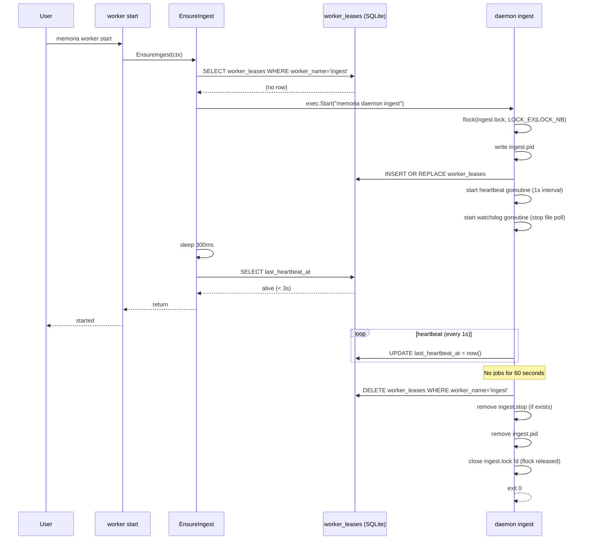
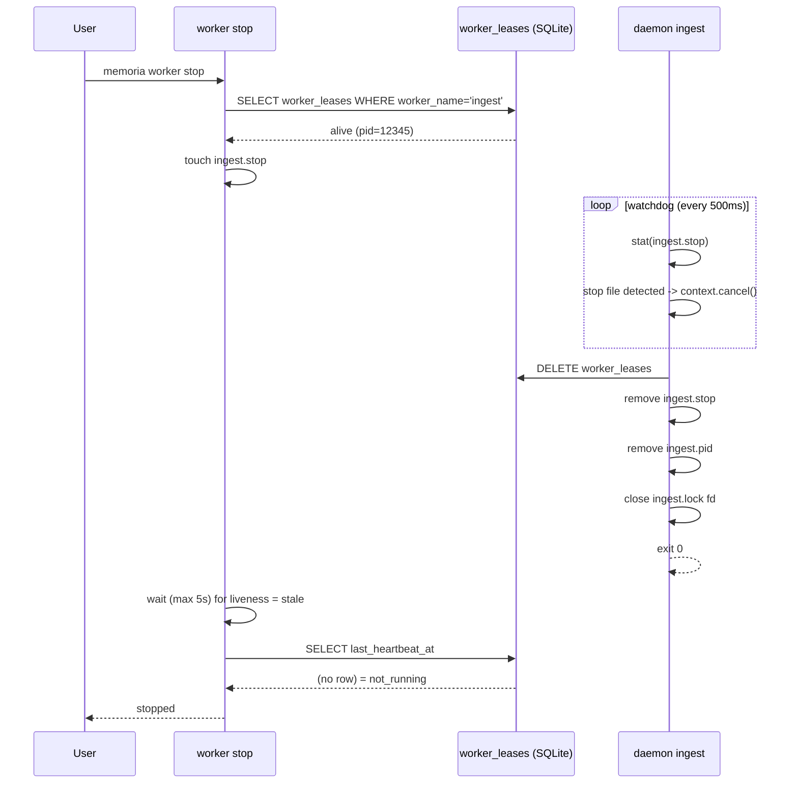
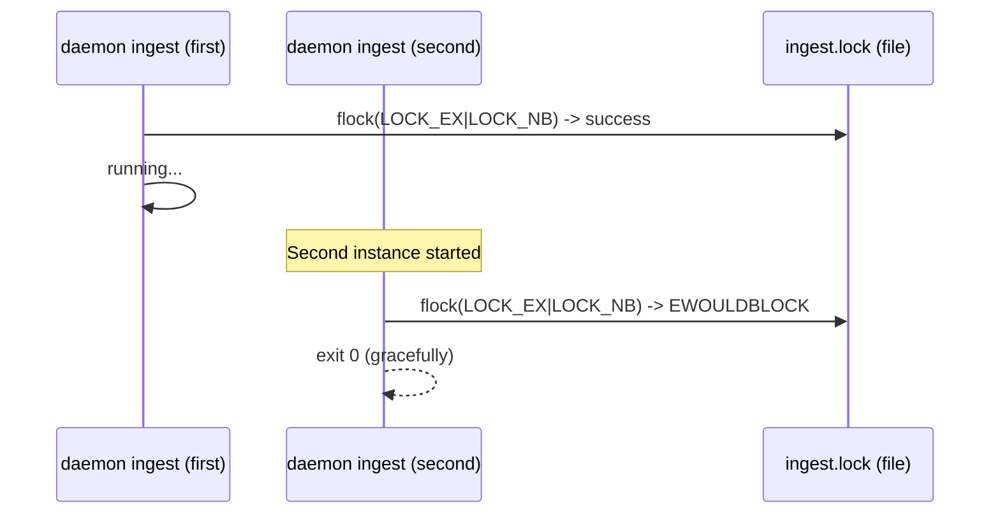
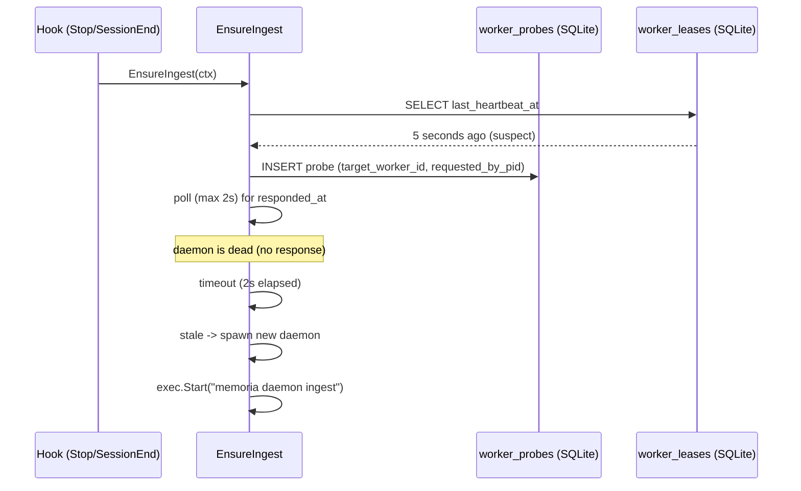

# M07: Ingest Worker Lifecycle 実装計画

## メタ情報

| 項目 | 値 |
|------|---|
| マイルストーン | M07: ingest-worker-lifecycle |
| 依存 | M04 (job-queue), M06 (session-end-hook) |
| 推定ファイル数 | 9-12 |
| 作成日 | 2026-03-28 |
| ステータス | 計画中 |

## 概要

ingest worker のライフサイクル管理を実装する。具体的には以下を含む。

- `memoria daemon ingest` — 内部デーモンコマンド（self-spawn で起動）
- `memoria worker start/stop/status` — ユーザー向け管理コマンド
- File lock（ingest.lock）による二重起動防止
- PID ファイル（ingest.pid）によるプロセス管理
- `worker_leases` テーブルを使った heartbeat
- 60 秒 idle timeout による自動終了
- stop ファイル（ingest.stop）による graceful stop
- `EnsureIngest` スタブの本実装

## M06 からのハンドオフ

| パッケージ | 提供するもの |
|-----------|-----------|
| `internal/queue/` | Enqueue/Dequeue/Ack/Fail + BEGIN IMMEDIATE 排他制御 |
| `internal/project/` | Project ID 解決 |
| `internal/worker/ensure.go` | EnsureIngest スタブ（本実装に置換） |
| `internal/db/` | Open/Close + 自動マイグレーション |
| `internal/config/` | RunDir(), LogDir(), DBFile() |
| `internal/cli/worker.go` | WorkerStartCmd/StopCmd/StatusCmd の骨格（not implemented） |
| `internal/db/migrations/0001_initial.sql` | worker_leases, worker_probes テーブル定義済み |

## ファイル構成

```
internal/
  worker/
    ensure.go          [変更] EnsureIngest スタブ → 本実装
    daemon.go          [新規] IngestDaemon 構造体 + Run メソッド
    daemon_test.go     [新規] IngestDaemon のテスト
    heartbeat.go       [新規] Heartbeat ループ
    heartbeat_test.go  [新規] Heartbeat のテスト
    lease.go           [新規] worker_leases CRUD
    lease_test.go      [新規] lease のテスト
    process.go         [新規] PID ファイル + ファイルロック操作
    process_test.go    [新規] process のテスト
  cli/
    worker.go          [変更] worker start/stop/status 実装
    worker_test.go     [新規] worker コマンドのテスト
    daemon.go          [新規] DaemonCmd 構造体（daemon ingest サブコマンド）
    daemon_test.go     [新規] DaemonCmd のテスト
  cli/root.go          [変更] CLI 構造体に DaemonCmd を追加
```

## 設計詳細

### パスの確認

既存の `internal/config/paths.go` で定義済みのパス：

| 用途 | パス |
|------|------|
| RunDir | `~/.local/state/memoria/run/` |
| LogDir | `~/.local/state/memoria/logs/` |

M07 で使用する実行時ファイル（RunDir 配下）:

| ファイル | 役割 |
|---------|------|
| `ingest.lock` | File lock（flock syscall） |
| `ingest.pid` | PID ファイル |
| `ingest.stop` | Graceful stop シグナルファイル |

### worker_leases テーブル（既存スキーマ）

```sql
CREATE TABLE IF NOT EXISTS worker_leases (
    worker_name         TEXT PRIMARY KEY,
    worker_id           TEXT NOT NULL,   -- UUID
    pid                 INTEGER NOT NULL,
    started_at          TEXT NOT NULL,
    last_heartbeat_at   TEXT NOT NULL,
    last_progress_at    TEXT,
    current_job_id      TEXT REFERENCES jobs(job_id)
);
```

worker_name は `"ingest"` 固定。

### Liveness 判定基準（WORKERS.ja.md 準拠）

| 状態 | 条件 |
|------|------|
| alive | last_heartbeat_at が 3 秒以内 |
| suspect | last_heartbeat_at が 3〜10 秒 |
| stale | last_heartbeat_at が 10 秒超 |

suspect 時は `worker_probes` テーブルを介した stronger check を行う（詳細は後述）。

### daemon ingest のメインループ

```
[起動]
  1. RunDir / LogDir を MkdirAll で作成
  2. ingest.lock に flock (LOCK_EX | LOCK_NB) → 取得失敗時は既存プロセスが alive と判定して exit 0
  3. ingest.pid に os.Getpid() を書き込む
  4. worker_leases に INSERT OR REPLACE（worker_id=UUID、pid=os.Getpid()）
  5. heartbeat goroutine を起動（1 秒間隔で last_heartbeat_at を更新）
  6. ingest.stop の有無を 500ms 間隔で stat() ポーリングする watchdog goroutine を起動
  7. メインループ:
     - Dequeue（StaleTimeout=2min）
     - ジョブがあれば処理（M08 実装）、なければ idleTimer をリセット
     - idleTimer が 60 秒（config.Worker.IngestIdleTimeout）を超えたら graceful stop

[停止]
  8. context キャンセル → heartbeat goroutine と watchdog goroutine が終了
  9. worker_leases を DELETE
  10. 未応答 probe（responded_at=NULL）を worker_probes から DELETE
  11. ingest.stop を削除（存在する場合）
  12. ingest.pid を削除
  13. ingest.lock を unlock（flock 解放は fd クローズで自動）
```

### worker start の動作

```
1. EnsureIngest() を呼ぶ
2. liveness 確認（check() で状態を取得）
3. alive なら "already running" を出力して正常終了
4. start 済みなら "started" を出力
```

実際の起動処理は EnsureIngest 内部で行う。

### EnsureIngest の本実装

```
1. worker_leases を読み取り liveness を判定
2. alive (3秒以内) → 即リターン
3. suspect (3〜10秒) → worker_probes に probe を INSERT して応答を待つ（ctx の残り時間または 2 秒の短い方）
   - 応答あり → alive 扱いでリターン
   - 応答なし → stale 扱いに fallthrough
   - 注記: SessionEnd hook (800ms) のように残り時間が極めて短い場合は probe をスキップして stale 扱い（即 spawn）にすることも検討
4. stale / 未登録 → 非同期で daemon spawn
5. spawn: os/exec で `memoria daemon ingest` をバックグラウンド実行
   - stdout/stderr は ingest.log にリダイレクト
   - SysProcAttr で親プロセスから切り離す（Setsid: true）
6. spawn 後 300ms wait して liveness を再確認（起動確認）
```

### worker stop の動作

```
1. ingest.stop ファイルを RunDir に作成
2. 最大 5 秒待機して liveness が stale になるのを確認
3. 5 秒経過後もまだ alive なら PID ファイルから pid を読み取って SIGTERM を送信
   - SIGTERM 送信後、最大 3 秒待機でプロセス終了を確認
   - 3 秒以内に終了しなければ SIGKILL を送信
4. "stopped" または "was not running" を出力
```

### worker status の動作

```
1. worker_leases を読み取り liveness を判定
2. PID ファイルの存在確認
3. 結果を JSON または text で出力：
   {
     "status": "alive|suspect|stale|not_running",
     "worker_id": "...",
     "pid": 12345,
     "last_heartbeat_at": "2026-03-28T12:34:56Z",
     "uptime_seconds": 300
   }
```

### worker_probes による強い liveness 確認

suspect 状態（heartbeat が 3〜10 秒遅延）の場合の probe フロー:

```
checker process:
  1. worker_probes に INSERT (probe_id=UUID, worker_name="ingest",
     target_worker_id=<lease の worker_id>, requested_by_pid=os.Getpid())

daemon (suspect 中もループ継続):
  2. heartbeat ループ内で自分宛の未応答 probe を検出したら responded_at を UPDATE

checker process:
  3. responded_at が更新されたら alive 判定 → リターン
  4. 2 秒待っても応答がなければ stale 判定 → spawn
```

### idle timeout の仕組み

```go
idleTimer := time.NewTimer(idleTimeout)
for {
    job, err := q.Dequeue(ctx, workerID)
    if job \!= nil {
        idleTimer.Reset(idleTimeout) // ジョブ処理でリセット
        processJob(job)              // M08 実装予定
    } else {
        // ジョブなし: idleTimer を進める
        select {
        case <-idleTimer.C:
            // idle timeout → graceful stop
            cancelFn()
            return
        case <-time.After(500ms):
            // 次のポーリングへ
        }
    }
}
```

### daemon コマンドの spawn 設計

`worker start` / `EnsureIngest` が daemon を spawn する際:

```go
cmd := exec.Command(os.Args[0], "daemon", "ingest")
cmd.SysProcAttr = &syscall.SysProcAttr{Setsid: true}  // 親から切り離し
logFile, _ := os.OpenFile(logPath, os.O_APPEND|os.O_CREATE|os.O_WRONLY, 0644)
cmd.Stdout = logFile
cmd.Stderr = logFile
cmd.Start()  // Wait() しない（detached daemon）
```

`memoria daemon ingest` は内部コマンドであり、ユーザーが直接呼ぶ想定ではない。CLI 構造体には登録するが help には含めない（`hidden:""`）。

## シーケンス図

### 正常系: worker start → idle timeout による自動停止



### 正常系: worker stop



### エラーケース: 二重起動防止



### エラーケース: suspect → probe → stale 判定



## TDD 設計

### Red → Green → Refactor の実装順序

#### Step 1: process.go のテスト (Red)

```go
// internal/worker/process_test.go
func TestWritePID(t *testing.T)     // PID ファイルへの書き込み・読み取り
func TestRemovePID(t *testing.T)    // PID ファイルの削除
func TestAcquireLock(t *testing.T)  // ファイルロック取得
func TestDoubleAcquireLock(t *testing.T) // 二重ロック -> エラー
```

#### Step 2: lease.go のテスト (Red)

```go
// internal/worker/lease_test.go
func TestUpsertLease(t *testing.T)   // INSERT OR REPLACE
func TestDeleteLease(t *testing.T)   // DELETE
func TestCheckLiveness(t *testing.T) // alive/suspect/stale/not_running 判定
func TestUpdateHeartbeat(t *testing.T) // last_heartbeat_at の更新
```

#### Step 3: heartbeat.go のテスト (Red)

```go
// internal/worker/heartbeat_test.go
func TestHeartbeatUpdatesDB(t *testing.T)  // 1 秒後に last_heartbeat_at が更新される
func TestHeartbeatStopsOnCancel(t *testing.T) // context cancel で停止
```

#### Step 4: daemon.go のテスト (Red)

```go
// internal/worker/daemon_test.go
func TestDaemonRunIdleTimeout(t *testing.T)  // 60 秒で自動停止（タイムアウトを短縮）
func TestDaemonRunStopFile(t *testing.T)     // stop ファイルで停止
func TestDaemonCleansUpOnExit(t *testing.T)  // PID ファイル・lease が削除される
```

#### Step 5: ensure.go の本実装テスト (Red)

```go
// internal/worker/ensure_test.go
func TestEnsureIngestAlreadyRunning(t *testing.T) // alive なら spawn しない
func TestEnsureIngestNotRunning(t *testing.T)     // not_running なら spawn
func TestEnsureIngestStale(t *testing.T)          // stale なら spawn
```

#### Step 6: CLI テスト (Red)

```go
// internal/cli/worker_test.go
func TestWorkerStatus(t *testing.T)     // status コマンドの出力
func TestWorkerStartAlreadyRunning(t *testing.T)
func TestWorkerStop(t *testing.T)
```

#### Step 7: DaemonCmd テスト (Red)

```go
// internal/cli/daemon_test.go
func TestDaemonIngestCmd(t *testing.T)  // Kong 経由で DaemonCmd が実行できる
```

### テスト設計書

#### 正常系テスト

| テスト | 入力 | 期待出力 |
|--------|------|---------|
| PID ファイル書き込み | tmpdir + os.Getpid() | ファイルに pid 文字列が書かれる |
| ファイルロック排他 | 同一ファイルに 2 つの goroutine | 2 つ目は EWOULDBLOCK エラー |
| Liveness = alive | last_heartbeat_at = now-1s | status=alive |
| Liveness = suspect | last_heartbeat_at = now-5s | status=suspect |
| Liveness = stale | last_heartbeat_at = now-15s | status=stale |
| Liveness = not_running | no row in worker_leases | status=not_running |
| idle timeout | IngestIdleTimeout=1s、ジョブなし | 1 秒後に daemon 停止 |
| stop ファイル | ingest.stop を作成 | graceful stop |

#### 異常系テスト

| テスト | 条件 | 期待動作 |
|--------|------|---------|
| DB 書き込み失敗 | heartbeat 時に DB エラー | ログ出力して継続（panic しない） |
| stop ファイル削除失敗 | 権限なし | ログ出力して exit |
| PID ファイル読み取り失敗 | ファイル破損 | エラーログ + SIGTERM スキップ |
| EnsureIngest: spawn 失敗 | exec が失敗 | エラーログ + リターン（hook は exit 0） |

#### エッジケース

| テスト | 条件 | 期待動作 |
|--------|------|---------|
| 並列 EnsureIngest（複数 hook 同時） | 10 goroutine が同時に EnsureIngest | 1 プロセスのみ spawn、重複なし |
| worker_leases 競合 | 2 プロセスが同時に INSERT | FK 制約は緩い（TEXT PRIMARY KEY 上書き）のでどちらかが勝つ |
| 親プロセスの PID 再利用 | 古い ingest.pid の pid が別プロセスに再割り当て | flock で検証、pid プロセスが memoria でなければ起動判定を stale にフォールバック |

## アプローチ比較

### spawn 方式の選択

| アプローチ | 説明 | メリット | デメリット |
|-----------|------|---------|-----------|
| A: self-spawn (os.Args[0]) | memoria バイナリ自身を exec | シンプル、追加ファイル不要 | バイナリパス変更に弱い |
| B: systemd/launchd | OS サービスとして登録 | OS 管理、自動起動 | セットアップが複雑 |
| C: goroutine in-process | 同プロセス内で goroutine | 最シンプル | hook プロセスと運命を共にする |

推奨: A (self-spawn) — WORKERS.ja.md の「`memoria daemon ingest` で self-spawn」と一致する。hook プロセスから独立して長期動作できる。

### ファイルロック実装

| アプローチ | 説明 | メリット | デメリット |
|-----------|------|---------|-----------|
| A: flock syscall (golang.org/x/sys/unix) | POSIX flock | プロセス死亡で自動解放 | macOS/Linux 限定 |
| B: lockfile (PID ファイルのみ) | pid ファイルで代用 | シンプル | プロセス死亡後の stale ファイル問題 |
| C: github.com/gofrs/flock | クロスプラットフォーム flock | macOS 対応 | 依存追加 |

推奨: C (gofrs/flock) — macOS（darwin）で動作必須。クロスプラットフォーム対応で将来の拡張性を確保。軽量ライブラリで依存追加コストが低い。

### heartbeat 間隔

| 間隔 | 特徴 |
|------|------|
| 500ms | alive 判定 3 秒に対して十分な余裕 |
| 1s | シンプル、DB 負荷が低い |
| 3s | alive 判定と同間隔で判定ギリギリ |

推奨: 1 秒間隔 — alive 判定（3 秒）に対して 3 倍の余裕。SQLite WAL モードでの write 負荷は無視できるレベル。

## 評価マトリクス

| 評価軸 | アプローチA (self-spawn + gofrs/flock + 1s heartbeat) |
|--------|------------------------------------------------------|
| 開発速度 | 4/5: シンプルな実装 |
| 保守性 | 4/5: 明確な責務分離 |
| 信頼性 | 4/5: flock でゾンビプロセス防止 |
| テスタビリティ | 4/5: インターフェース注入でモック可能 |
| パフォーマンス | 4/5: 1s heartbeat は低負荷 |

## 実装計画（フェーズ）

### Phase 1: 基盤（2-3 時間）

1. `go get github.com/gofrs/flock` で依存追加
2. `internal/worker/process.go` — PID ファイル + flock
3. `internal/worker/process_test.go` — TDD で実装
4. `internal/worker/lease.go` — worker_leases CRUD
5. `internal/worker/lease_test.go`

### Phase 2: daemon コア（2-3 時間）

6. `internal/worker/heartbeat.go` — heartbeat goroutine
7. `internal/worker/heartbeat_test.go`
8. `internal/worker/daemon.go` — IngestDaemon + Run
9. `internal/worker/daemon_test.go`

### Phase 3: CLI 統合（2-3 時間）

10. `internal/cli/daemon.go` — DaemonCmd (daemon ingest)
11. `internal/cli/root.go` — CLI 構造体に DaemonCmd を追加
12. `internal/worker/ensure.go` — EnsureIngest 本実装
13. `internal/cli/worker.go` — worker start/stop/status 実装
14. `internal/cli/worker_test.go`

### Phase 4: 統合テスト・動作確認（1-2 時間）

15. `go test ./...` で全テスト通過確認
16. `make build` でビルド確認
17. 手動動作確認:
    - `memoria worker start` -> `memoria worker status` -> alive 確認
    - `memoria worker stop` -> status が not_running に変わる確認
    - idle timeout（60 秒待機または短縮設定で確認）
    - macOS で `memoria daemon ingest` を起動し、`Setsid: true` での detach 動作（親プロセス終了後も daemon が継続稼働すること）を確認

## リスク評価

| リスク | 影響度 | 発生確率 | 対策 |
|--------|--------|---------|------|
| gofrs/flock が GOPROXY=direct で取得できない | 高 | 中 | GOPROXY=direct ワークアラウンドを Makefile で適用済みなので問題なし。取得失敗時は golang.org/x/sys/unix/flock を直接呼ぶ実装に切り替え |
| macOS での flock の動作差異 | 中 | 低 | darwin + linux 両方でテスト。gofrs/flock はこれを吸収 |
| SQLite の WAL モードでの heartbeat write 競合 | 中 | 低 | PRAGMA busy_timeout = 5000 が設定済みのため実質的に問題なし |
| hook (Stop/SessionEnd) と EnsureIngest の競合 | 中 | 中 | flock + liveness チェックで二重起動を防止。複数 hook が同時に EnsureIngest を呼んでも spawn は 1 回のみ |
| daemon ingest のログ出力先 | 低 | 低 | LogDir()/ingest.log にリダイレクト。RunDir/LogDir 作成は daemon 起動時に MkdirAll で確保 |
| idle timeout 中にジョブが来る | 低 | 高 | idle timer を Dequeue 成功時にリセットするため問題なし |
| プロセス再起動時の stale PID ファイル | 中 | 低 | flock が自動解放されるため、ロック取得で生存確認が可能 |
| worker_probes テーブルの probe 残留 | 低 | 低 | daemon 側は起動中に未応答 probe をすべて処理。stop 時に responded_at=NULL の probe を DELETE で清掃 |

## 技術的検証項目

実装前に確認が必要な項目:

1. `github.com/gofrs/flock` の macOS でのビヘイビア確認
   - ロック解放のタイミング（fd クローズ vs プロセス終了）
2. `Setsid: true` による daemon detach が macOS の `os/exec` で正常動作するか
3. SQLite WAL モードで複数プロセスが同時 writer になる場合の busy_timeout 動作

## 変更ファイル一覧（サマリー）

| ファイル | 変更種別 | 概要 |
|---------|---------|------|
| `internal/worker/ensure.go` | 変更 | EnsureIngest スタブ -> 本実装 |
| `internal/worker/daemon.go` | 新規 | IngestDaemon 構造体 + メインループ |
| `internal/worker/daemon_test.go` | 新規 | daemon のテスト |
| `internal/worker/heartbeat.go` | 新規 | heartbeat goroutine |
| `internal/worker/heartbeat_test.go` | 新規 | heartbeat のテスト |
| `internal/worker/lease.go` | 新規 | worker_leases CRUD + liveness 判定 |
| `internal/worker/lease_test.go` | 新規 | lease のテスト |
| `internal/worker/process.go` | 新規 | PID ファイル + flock |
| `internal/worker/process_test.go` | 新規 | process のテスト |
| `internal/cli/daemon.go` | 新規 | DaemonCmd (daemon ingest サブコマンド) |
| `internal/cli/daemon_test.go` | 新規 | DaemonCmd のテスト |
| `internal/cli/worker.go` | 変更 | worker start/stop/status 実装 |
| `internal/cli/worker_test.go` | 新規 | worker コマンドのテスト |
| `internal/cli/root.go` | 変更 | CLI 構造体に DaemonCmd を追加 |
| `go.mod` / `go.sum` | 変更 | github.com/gofrs/flock の依存追加 |

## M08 へのハンドオフ

M08 (ingest-worker-loop) が受け取るもの:

- `internal/worker/daemon.go` の `IngestDaemon` 構造体（`Run` メソッド）
  - `processJob(*queue.Job) error` をスタブとして提供（M07 では "not implemented" ログのみ）
  - M08 が `processJob` の本実装を担当
- `worker_leases.current_job_id` の更新タイミング（processJob の前後で lease を更新）
- `worker_leases.last_progress_at` の更新（processJob 成功時）

## Changelog

| 日時 | 内容 |
|------|------|
| 2026-03-28 | M07 詳細計画初版作成 |
