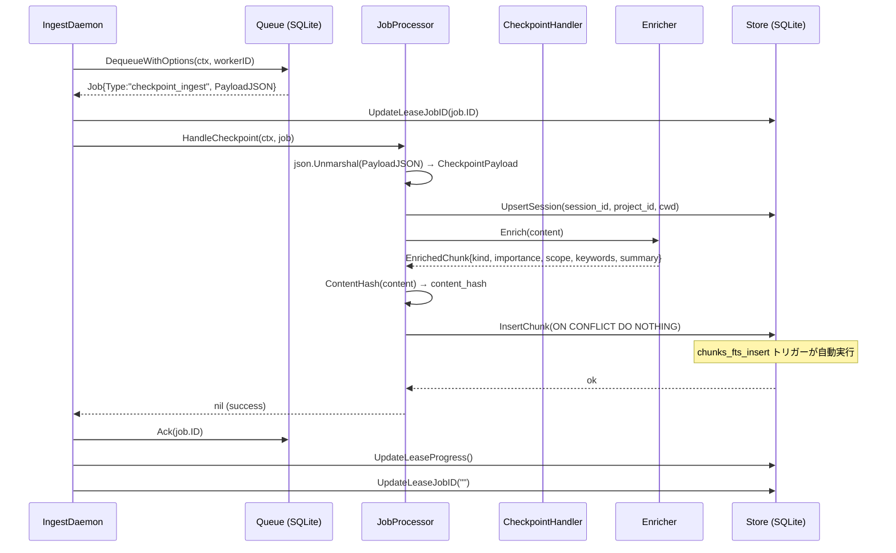
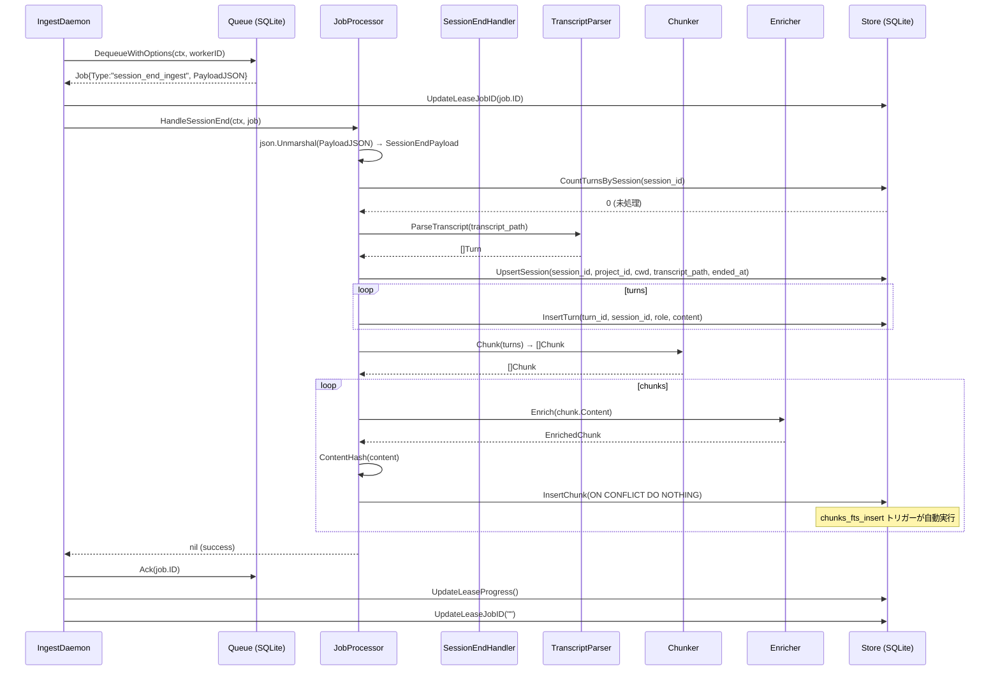
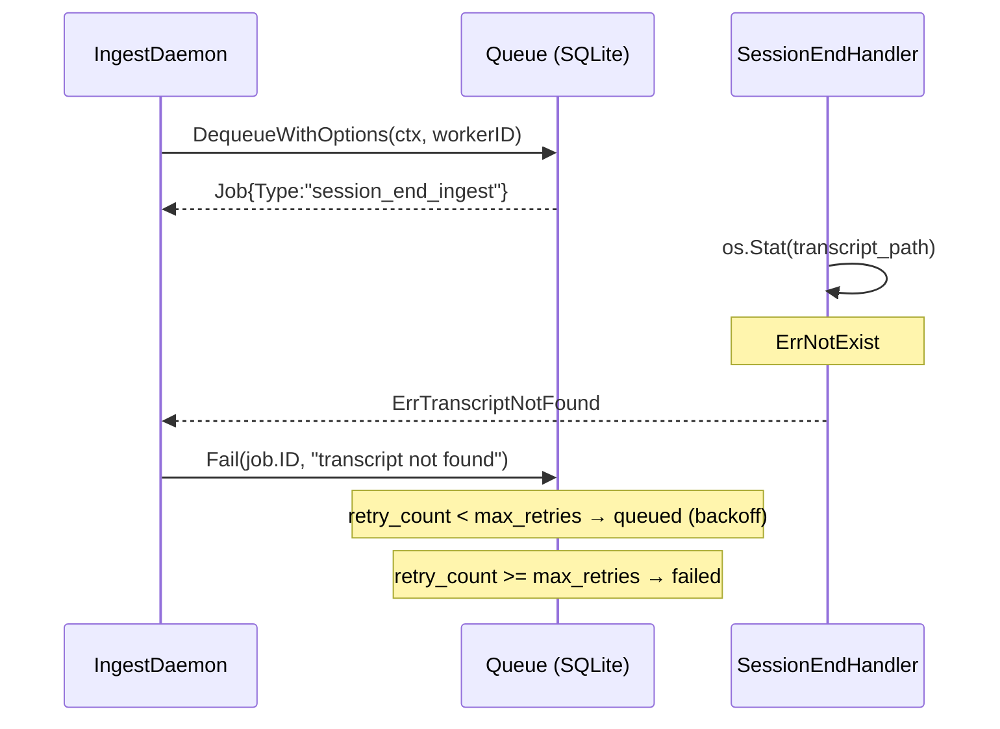
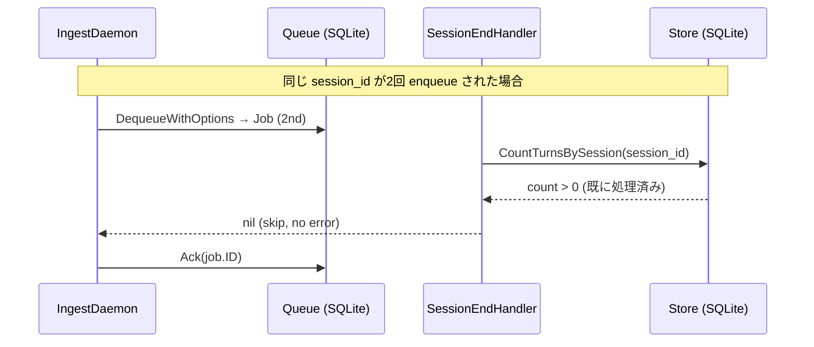

# M08: Ingest Worker Loop 実装計画

## メタ情報

| 項目 | 値 |
|------|---|
| マイルストーン | M08: ingest-worker-loop |
| 依存 | M07 (ingest-worker-lifecycle) |
| 推定ファイル数 | 10-14 |
| 作成日 | 2026-03-28 |
| ステータス | 計画中 |

## 概要

M07 で `processJob` スタブとして残した ingest worker のジョブ処理本体を実装する。
`checkpoint_ingest` と `session_end_ingest` の 2 種類のジョブを処理し、
Claude Code の transcript やアシスタントメッセージを chunks テーブルに永続化する。

具体的な実装範囲：

- `processJob` の本実装（JobType によるディスパッチ）
- checkpoint_ingest ハンドラ（content → chunk 化 → enrichment → DB 書き込み）
- session_end_ingest ハンドラ（transcript ファイルパース → turns → chunk 化 → enrichment → DB 書き込み）
- Transcript パーサー（Claude Code JSONL 形式）
- Chunking ロジック（ターンペア + 長文分割）
- 重複排除（SHA-256 content_hash）
- ヒューリスティック enrichment（kind / importance / scope / keywords / summary 推定）
- sessions / turns テーブルへの書き込み
- chunks テーブル + FTS5 自動同期（既存トリガー経由）

## M07 からのハンドオフ

| 提供物 | ファイル / 箇所 |
|--------|---------------|
| `IngestDaemon.processJob(ctx, job)` スタブ | `internal/worker/daemon.go:209` |
| `queue.Job.PayloadJSON` | `internal/queue/job.go` |
| `queue.Ack / Fail` | `internal/queue/queue.go` |
| `worker_leases.current_job_id` 更新タイミング | M08 が processJob 前後で lease を更新 |
| `worker_leases.last_progress_at` | processJob 成功時に更新 |
| `CheckpointPayload` 構造体 | `internal/cli/hook.go:52-58` |
| `SessionEndPayload` 構造体 | `internal/cli/hook.go:123-132` |
| chunks / sessions / turns スキーマ | `internal/db/migrations/0001_initial.sql` |
| FTS5 自動同期トリガー | chunks_fts_insert/delete/update トリガー定義済み |

## ファイル構成

```
internal/
  worker/
    daemon.go           [変更] processJob スタブ → 本実装（ディスパッチ）
    processor.go        [新規] JobProcessor インターフェース + ディスパッチロジック
    processor_test.go   [新規] processor のテスト
    checkpoint.go       [新規] checkpoint_ingest ハンドラ
    checkpoint_test.go  [新規] checkpoint ハンドラのテスト
    session_end.go      [新規] session_end_ingest ハンドラ
    session_end_test.go [新規] session_end ハンドラのテスト
  ingest/
    transcript.go       [新規] Claude Code transcript パーサー（JSONL）
    transcript_test.go  [新規] transcript パーサーのテスト
    chunker.go          [新規] Chunking ロジック（ターンペア + 長文分割）
    chunker_test.go     [新規] chunker のテスト
    enricher.go         [新規] ヒューリスティック enrichment
    enricher_test.go    [新規] enricher のテスト
    store.go            [新規] DB 書き込み（sessions / turns / chunks）
    store_test.go       [新規] store のテスト
```

## 設計詳細

### processJob の実装（daemon.go 変更）

```go
func (d *IngestDaemon) processJob(ctx context.Context, job *queue.Job) {
    // 1. current_job_id を lease に記録
    if err := UpdateLeaseJobID(ctx, d.db, WorkerNameIngest, job.ID); err \!= nil {
        d.logf("update lease job_id: %v\n", err)
    }

    var err error
    switch job.Type {
    case queue.JobTypeCheckpointIngest:
        err = d.processor.HandleCheckpoint(ctx, job)
    case queue.JobTypeSessionEndIngest:
        err = d.processor.HandleSessionEnd(ctx, job)
    default:
        d.logf("unknown job type: %s\n", job.Type)
        err = d.q.Ack(ctx, job.ID)
        return
    }

    if err \!= nil {
        d.logf("processJob failed: job_id=%s err=%v\n", job.ID, err)
        if failErr := d.q.Fail(ctx, job.ID, err.Error()); failErr \!= nil {
            d.logf("fail job: %v\n", failErr)
        }
    } else {
        if ackErr := d.q.Ack(ctx, job.ID); ackErr \!= nil {
            d.logf("ack job: %v\n", ackErr)
        }
        // last_progress_at を更新
        UpdateLeaseProgress(ctx, d.db, WorkerNameIngest) //nolint:errcheck
    }

    // current_job_id をクリア
    UpdateLeaseJobID(ctx, d.db, WorkerNameIngest, "") //nolint:errcheck
}
```

### JobProcessor インターフェース（processor.go）

```go
package worker

import (
    "context"
    "github.com/youyo/memoria/internal/queue"
)

// JobProcessor はジョブ種別ごとのハンドラを定義するインターフェース。
// テスト時はモックに差し替え可能。
type JobProcessor interface {
    HandleCheckpoint(ctx context.Context, job *queue.Job) error
    HandleSessionEnd(ctx context.Context, job *queue.Job) error
}
```

### checkpoint_ingest ハンドラ（checkpoint.go）

```
1. payload JSON デコード → CheckpointPayload
2. sessions テーブルに UPSERT（session_id が存在しなければ INSERT）
3. content を chunk 化（単一コンテンツを 1 chunk として処理）
4. ヒューリスティック enrichment（kind / importance / scope / keywords / summary）
5. content_hash（SHA-256）で重複チェック
6. chunks テーブルに INSERT（重複なら SKIP、ON CONFLICT DO NOTHING）
7. FTS5 は chunks_fts_insert トリガーが自動同期
```

checkpoint はアシスタントの最終メッセージ 1 件を処理する。transcript パーサーは不要。

### session_end_ingest ハンドラ（session_end.go）

```
1. payload JSON デコード → SessionEndPayload
2. transcript_path のファイルが存在するか確認
3. transcript パーサーで []Turn に変換
4. sessions テーブルに UPSERT（ended_at も更新）
5. turns テーブルに INSERT（session_id + role + content + created_at）
   - turn_id は UUID で生成
   - 既存 turn は ON CONFLICT DO NOTHING（重複排除）
6. chunker で turns → []Chunk に変換（ターンペア単位）
7. 各 chunk に enrichment を適用
8. content_hash で重複チェック → INSERT（ON CONFLICT DO NOTHING）
9. FTS5 は chunks_fts_insert トリガーが自動同期
```

### Transcript パーサー設計（transcript.go）

Claude Code の transcript は JSONL 形式。1行1 JSON オブジェクト。

**形式調査結果（HOOKS.ja.md + SPEC.ja.md より）**:
- Claude Code は `~/.claude/projects/<project_hash>/YYYYMMDD_HHMMSS.jsonl` 形式でトランスクリプトを保存
- 各行の主要フィールド:

```jsonc
// user ターン
{"type":"user","message":{"role":"user","content":"..."},"timestamp":"2026-03-28T12:34:56.789Z","uuid":"..."}
// assistant ターン
{"type":"assistant","message":{"role":"assistant","content":"..."},"timestamp":"...","uuid":"..."}
// tool use はネストされることがある
{"type":"assistant","message":{"role":"assistant","content":[{"type":"tool_use","id":"...","name":"...","input":{}},...]},...}
```

**パーサー設計**:

```go
// internal/ingest/transcript.go

// RawTurn は transcript JSONL の1行を表す。
type RawTurn struct {
    Type      string          `json:"type"`      // "user" | "assistant"
    Message   json.RawMessage `json:"message"`
    Timestamp string          `json:"timestamp"`
    UUID      string          `json:"uuid"`
}

// Turn は正規化されたターン。
type Turn struct {
    Role      string    // "user" | "assistant" | "tool"
    Content   string    // プレーンテキスト（tool call は簡略化）
    CreatedAt time.Time
}

// ParseTranscript は transcript ファイルを []Turn に変換する。
// - ファイルが存在しない場合は ErrTranscriptNotFound
// - JSONL パースエラーの行はスキップしてログに記録（best-effort）
func ParseTranscript(path string) ([]Turn, error)
```

**Content 正規化方針**:
- `string` content → そのまま使用
- `[]ContentPart` → テキスト部分を抽出して結合
- `tool_use` タイプの部分 → `[Tool: <name>(<input_summary>)]` に圧縮（ノイズ削減）
- `tool_result` → スキップ（tool log は enrichment 対象外）
- 空 content の行はスキップ

### Chunking 戦略（chunker.go）

#### 基本方針

user + assistant のペアを 1 chunk の基本単位とする（SPEC.ja.md §13.1 準拠）。

```
[user, assistant] → 1 chunk
[user, assistant, user, assistant] → 2 chunks（ペア分割）
```

#### ロジック

```go
// ChunkInput は chunk 化の入力。
type ChunkInput struct {
    Turns     []Turn
    SessionID string
    ProjectID string
}

// Chunk は chunk 化の出力（enrichment 前）。
type Chunk struct {
    Content      string
    TurnStartIdx int // turns スライス内のインデックス
    TurnEndIdx   int
}

// Chunk は以下のルールで生成する:
// 1. user ターンが来たら新しい chunk の開始点とする
// 2. 次の assistant ターンで chunk を閉じる
// 3. tool ターンは直前の user/assistant ペアに包含させる（分割しない）
// 4. 最後の user ターンに対応する assistant がない場合は user のみで chunk を作る
// 5. chunk の content = "User: <user_content>\n\nAssistant: <assistant_content>"
// 6. content が MaxChunkBytes（16 KiB）を超える場合は ParagraphSplit で分割
const MaxChunkBytes = 16 * 1024
```

#### 長文分割

assistant のレスポンスが MaxChunkBytes を超える場合：
1. まず `\n\n`（段落区切り）で分割を試みる
2. 段落でも超える場合は `\n`（改行）で分割
3. それでも超える場合は最大長でハードカット

#### checkpoint の場合

checkpoint は単一コンテンツなので Chunking は行わず、content をそのまま 1 chunk として使用する。ただし MaxChunkBytes を超える場合は同様の分割ロジックを適用する。

### 重複排除（content_hash）

```go
// ContentHash は content の SHA-256 ハッシュを hex 文字列で返す。
func ContentHash(content string) string {
    h := sha256.Sum256([]byte(content))
    return hex.EncodeToString(h[:])
}
```

chunks テーブルには `UNIQUE INDEX idx_chunks_content_hash` が定義済み。

INSERT 時は `ON CONFLICT(content_hash) DO NOTHING` を使用して冪等性を保つ。
これにより session_end が重複して enqueue されても安全に処理できる。

### ヒューリスティック enrichment（enricher.go）

生成的 LLM 呼び出しは行わず、キーワードマッチと統計的ヒューリスティックで推定する。
（ロードマップの Architecture Decisions #1 準拠）

#### kind 推定

各 kind に対してキーワードパターンを定義する。複数パターンにマッチした場合は最初のものを採用。

| kind | マッチパターン（content の小文字化テキストに対して） |
|------|-------------------------------|
| decision | `decided`, `決定`, `採用`, `chose`, `選択`, `we will`, `にする`, `方針` |
| constraint | `must not`, `禁止`, `してはいけない`, `制約`, `cannot`, `prohibited`, `制限` |
| todo | `todo`, `TODO`, `やること`, `残作業`, `あとで`, `later`, `fix later` |
| failure | `failed`, `失敗`, `エラー`, `error`, `バグ`, `bug`, `crash`, `不具合` |
| preference | `prefer`, `好み`, `したい`, `使いたい`, `気に入って`, `like to` |
| pattern | `pattern`, `パターン`, `再利用`, `template`, `テンプレート`, `abstraction` |
| fact | （上記にマッチしない場合のデフォルト） |

#### importance 推定（0.0 〜 1.0）

複数のシグナルを加算してスコアリングする。

| シグナル | 加算値 |
|---------|-------|
| kind == decision または constraint | +0.3 |
| kind == failure | +0.2 |
| kind == todo | +0.1 |
| 感嘆符 `\!` または `！` が含まれる | +0.1 |
| `重要`, `critical`, `important`, `必須` を含む | +0.2 |
| `FIXME`, `HACK`, `XXX` を含む | +0.15 |
| content 長 > 500 文字 | +0.05 |
| 上記なし | 0.3（base score） |

最大 1.0 でクランプ。base score は 0.3 から開始する（0 を避けてデフォルト重要度を持たせる）。

#### scope 推定

| 条件 | scope |
|------|-------|
| `global`, `汎用`, `どこでも使える`, `general purpose`, `universally` を含む | global |
| `similar`, `同様`, `プロジェクト間`, `cross-project`, `transferable` を含む | similarity_shareable |
| 上記にマッチしない | project（デフォルト） |

#### keywords 抽出

シンプルな TF-IDF ライクなヒューリスティック（外部依存なし）:

1. content をスペース + 句読点 + 記号でトークン化
2. ストップワード（a, the, is, が, を, の, に, etc.）を除去
3. 長さ 3 文字以上のトークンを抽出
4. 出現回数でソートして上位 10 件を採用
5. JSON 配列 `["kw1","kw2",...]` として keywords_json に格納

#### summary 生成

LLM を使わず、content の最初の 100 文字（日本語換算）を summary とする。

```
summary = content の先頭 100 文字 + "..." (100文字超の場合)
```

将来的に LLM enrichment に差し替え可能なようにインターフェースで抽象化する。

### sessions / turns テーブルへの書き込み（store.go）

#### sessions UPSERT

```sql
INSERT INTO sessions (session_id, project_id, cwd, transcript_path, started_at)
VALUES (?, ?, ?, ?, ?)
ON CONFLICT(session_id) DO UPDATE SET
    project_id = excluded.project_id,
    cwd = excluded.cwd,
    transcript_path = COALESCE(excluded.transcript_path, transcript_path),
    ended_at = COALESCE(?, ended_at)
```

checkpoint_ingest は `transcript_path = NULL`、`ended_at = NULL` で UPSERT。
session_end_ingest は `transcript_path` と `ended_at` を設定。

#### turns INSERT（重複排除）

turns テーブルには `turn_id` (UUID) が PRIMARY KEY で、UNIQUE 制約はない。
ただし同一 session_end が複数回 enqueue された場合の重複を防ぐため、
`session_id + role + content + created_at` の組み合わせで UNIQUE INDEX を貼る方式では複雑なため、
**M08 では session_end ハンドラ冒頭で turns テーブルに当該 session_id の既存レコードがあれば早期リターン**する方針をとる。

```go
// 既に turns が存在すれば重複処理をスキップ
count, err := CountTurnsBySession(ctx, db, sessionID)
if count > 0 {
    logf("session %s already ingested, skipping turns\n", sessionID)
    return nil
}
```

これにより冪等性を確保しつつ、スキーマ変更を不要にする。

#### chunks INSERT（重複排除）

```sql
INSERT INTO chunks (
    chunk_id, session_id, project_id,
    turn_start_id, turn_end_id,
    content, summary, kind, importance, scope,
    project_transferability, keywords_json, applies_to_json,
    content_hash, created_at
) VALUES (?, ?, ?, ?, ?, ?, ?, ?, ?, ?, ?, ?, ?, ?, ?)
ON CONFLICT(content_hash) DO NOTHING
```

`ON CONFLICT(content_hash) DO NOTHING` により冪等性を保証。
FTS5 は `chunks_fts_insert` トリガーが自動同期（スキーマ定義済み）。

### worker_leases の更新

processJob の前後で以下の 2 カラムを更新する:

| カラム | 更新タイミング | 値 |
|--------|-------------|---|
| `current_job_id` | processJob 開始前 | job.ID |
| `current_job_id` | processJob 完了後 | NULL |
| `last_progress_at` | Ack 成功後 | now() |

これにより `memoria worker status` がジョブ処理中の状態を表示できる。

## シーケンス図

### 正常系: checkpoint_ingest 処理



### 正常系: session_end_ingest 処理



### エラーケース: transcript ファイルが存在しない



### エラーケース: 重複 session_end_ingest（冪等性）



## TDD 設計

### Red → Green → Refactor の実装順序

#### Step 1: ingest/transcript.go のテスト (Red)

```go
// internal/ingest/transcript_test.go

// 正常系
func TestParseTranscriptEmpty(t *testing.T)      // 空ファイル → []Turn{}
func TestParseTranscriptUserOnly(t *testing.T)   // user ターンのみ
func TestParseTranscriptPair(t *testing.T)       // user + assistant ペア
func TestParseTranscriptToolUse(t *testing.T)    // tool_use を含む content の正規化
func TestParseTranscriptMultiContent(t *testing.T) // content が []ContentPart の場合

// 異常系
func TestParseTranscriptNotFound(t *testing.T)   // ErrTranscriptNotFound
func TestParseTranscriptInvalidJSON(t *testing.T) // 無効な行はスキップして継続
```

#### Step 2: ingest/chunker.go のテスト (Red)

```go
// internal/ingest/chunker_test.go

func TestChunkSinglePair(t *testing.T)           // user + assistant → 1 chunk
func TestChunkMultiplePairs(t *testing.T)        // 3 ペア → 3 chunks
func TestChunkOrphanUser(t *testing.T)           // 末尾の user のみ → 1 chunk
func TestChunkLongContent(t *testing.T)          // MaxChunkBytes 超 → 分割
func TestChunkToolTurn(t *testing.T)             // tool ターンは直前ペアに包含
func TestChunkEmpty(t *testing.T)                // 空 turns → []Chunk{}
```

#### Step 3: ingest/enricher.go のテスト (Red)

```go
// internal/ingest/enricher_test.go

// kind 推定
func TestEnrichKindDecision(t *testing.T)        // "decided to use" → decision
func TestEnrichKindConstraint(t *testing.T)      // "must not" → constraint
func TestEnrichKindTodo(t *testing.T)            // "TODO:" → todo
func TestEnrichKindFailure(t *testing.T)         // "failed with error" → failure
func TestEnrichKindFact(t *testing.T)            // マッチなし → fact (default)

// importance 推定
func TestEnrichImportanceDecision(t *testing.T)  // decision → >= 0.3
func TestEnrichImportanceCritical(t *testing.T)  // "critical" 含む → 高スコア
func TestEnrichImportanceBase(t *testing.T)      // 何もない → 0.3

// scope 推定
func TestEnrichScopeGlobal(t *testing.T)         // "global" 含む → global
func TestEnrichScopeSimilarity(t *testing.T)     // "similar" 含む → similarity_shareable
func TestEnrichScopeDefault(t *testing.T)        // マッチなし → project

// keywords
func TestEnrichKeywords(t *testing.T)            // 上位 10 件が抽出される
func TestEnrichKeywordsStopWords(t *testing.T)   // ストップワードが除去される

// summary
func TestEnrichSummaryShort(t *testing.T)        // 100 文字以下 → そのまま
func TestEnrichSummaryLong(t *testing.T)         // 100 文字超 → 切り詰め + "..."
```

#### Step 4: ingest/store.go のテスト (Red)

```go
// internal/ingest/store_test.go

func TestUpsertSession(t *testing.T)             // 新規 INSERT
func TestUpsertSessionUpdate(t *testing.T)       // 既存 session の UPDATE
func TestInsertTurn(t *testing.T)                // turn INSERT
func TestCountTurnsBySession(t *testing.T)       // count 確認
func TestInsertChunk(t *testing.T)               // chunk INSERT
func TestInsertChunkDuplicate(t *testing.T)      // ON CONFLICT DO NOTHING
func TestInsertChunkFTSSync(t *testing.T)        // FTS5 トリガーが自動同期
```

#### Step 5: worker/checkpoint.go のテスト (Red)

```go
// internal/worker/checkpoint_test.go

func TestHandleCheckpointSuccess(t *testing.T)   // 正常系
func TestHandleCheckpointInvalidJSON(t *testing.T) // payload デコードエラー
func TestHandleCheckpointDuplicate(t *testing.T) // 同一 content → スキップ（no error）
```

#### Step 6: worker/session_end.go のテスト (Red)

```go
// internal/worker/session_end_test.go

func TestHandleSessionEndSuccess(t *testing.T)   // 正常系（transcript あり）
func TestHandleSessionEndAlreadyIngested(t *testing.T) // 2 回目は skip
func TestHandleSessionEndNoTranscript(t *testing.T) // transcript なし → error（retry）
func TestHandleSessionEndEmptyTranscript(t *testing.T) // turns = 0 → Ack (no chunks)
```

#### Step 7: worker/processor.go + daemon.go 統合テスト (Red)

```go
// internal/worker/processor_test.go

func TestProcessJobCheckpoint(t *testing.T)      // checkpoint_ingest → Ack
func TestProcessJobSessionEnd(t *testing.T)      // session_end_ingest → Ack
func TestProcessJobUnknown(t *testing.T)         // unknown type → Ack (skip)
func TestProcessJobFailure(t *testing.T)         // handler error → Fail
func TestProcessJobLeaseUpdated(t *testing.T)    // current_job_id / last_progress_at が更新される
```

### テスト設計書

#### 正常系テスト

| テスト | 入力 | 期待出力 |
|--------|------|---------|
| transcript パース（ペア） | 2行 JSONL（user+assistant） | []Turn{role:user, role:assistant} |
| transcript パース（tool） | tool_use を含む行 | content が "[Tool: name(...)]" に圧縮 |
| chunk 化（2ペア） | 4 ターン | 2 chunks |
| content_hash 重複 | 同一 content で 2 回 InsertChunk | 2 回目は SKIP、エラーなし |
| enrichment（decision） | "decided to use Go" | kind=decision, importance>=0.3 |
| importance（critical） | "critical: must not use X" | importance >= 0.8 |
| scope（global） | "this is globally applicable" | scope=global |
| FTS 同期 | chunk INSERT 後に FTS 検索 | content がヒット |
| session UPSERT | 同一 session_id で 2 回 | 2 回目は UPDATE（ended_at が更新） |

#### 異常系テスト

| テスト | 条件 | 期待動作 |
|--------|------|---------|
| transcript not found | ファイルが存在しない | ErrTranscriptNotFound → Fail（retry） |
| payload JSON 破損 | 無効な JSON | json.Unmarshal エラー → Fail（retry 上限後 failed） |
| DB 書き込みエラー | SQLite busy | エラー返却 → Fail（retry） |
| content_hash 重複 | ON CONFLICT | DO NOTHING → Ack（エラーなし） |
| transcript 1行が無効 JSON | 1 行だけ破損 | その行をスキップして残りを処理 |

#### エッジケース

| テスト | 条件 | 期待動作 |
|--------|------|---------|
| 巨大 transcript | 1000 ターン | MaxChunkBytes 超の chunk を適切に分割 |
| 空 transcript | 0 ターン | chunks = 0、Ack（エラーなし） |
| 絵文字・マルチバイト | 日本語 + emoji content | UTF-8 safe な切り詰め（rune 単位） |
| session_end 重複 enqueue | 同一 session_id が 2 回 | 2 回目は CountTurns > 0 でスキップ |
| checkpoint が大量 | 10 KB のアシスタントメッセージ | MaxChunkBytes で分割 |

## アプローチ比較

### Transcript パーサーのアプローチ

| アプローチ | 説明 | メリット | デメリット |
|-----------|------|---------|-----------|
| A: JSONL 逐行パース（bufio.Scanner） | 1行ずつ json.Unmarshal | メモリ効率、大ファイル対応 | エラーの局所化が必要 |
| B: ファイル全体読み込み | ioutil.ReadAll → 行分割 | シンプル | 大ファイルでメモリ使用量増 |
| C: 外部ライブラリ使用 | jsonl ライブラリ | 既存実装活用 | 依存追加 |

推奨: A — bufio.Scanner による逐行処理。transcript は大きくなりうるため、メモリ効率を優先。エラーのある行はスキップして best-effort で処理する。

### Enrichment のアプローチ

| アプローチ | 説明 | メリット | デメリット |
|-----------|------|---------|-----------|
| A: キーワードマッチ（本計画） | regexp + 辞書 | 外部依存なし、高速、決定論的 | 精度に限界あり |
| B: 生成型 LLM API 呼び出し | OpenAI/Anthropic API | 高精度 | 外部 API 依存、コスト、遅延 |
| C: ローカル LLM（Ollama等） | ローカル生成 | API 不要 | セットアップ複雑、低速 |

推奨: A — ロードマップの Architecture Decisions #1「LLM enrichment はヒューリスティックベース」に準拠。M08 の目標は基本的な動作確認。精度向上は将来のマイルストーンで対応可能な設計にしておく（`Enricher` インターフェース化）。

### Chunking のアプローチ

| アプローチ | 説明 | メリット | デメリット |
|-----------|------|---------|-----------|
| A: ターンペア単位（本計画） | user+assistant = 1 chunk | 会話の意味的単位を保持 | ターン数に比例 |
| B: セッション単位 | session = 1 chunk | シンプル | 粒度が粗すぎて検索に不向き |
| C: 固定長 token | N tokens = 1 chunk | embedding に最適化 | 会話の文脈を分断する可能性 |

推奨: A — SPEC.ja.md §13.1「基本は user + assistant のペア」に準拠。M11 で embedding 統合後に検索品質を評価して調整可能。

### 評価マトリクス

| 評価軸 | 本計画のアプローチ |
|--------|-----------------|
| 開発速度 | 4/5: ヒューリスティックで外部依存なし |
| 保守性 | 4/5: インターフェース化で将来置換可能 |
| パフォーマンス | 4/5: bufio.Scanner + バッチ INSERT |
| テスタビリティ | 5/5: 各コンポーネントが独立してテスト可能 |
| 精度（enrichment） | 3/5: ヒューリスティックの限界あり |

## 実装計画（フェーズ）

### Phase 1: ingest パッケージ基盤（2-3 時間）

1. `internal/ingest/` ディレクトリ作成
2. `transcript.go` + `transcript_test.go` — JSONL パーサー（TDD）
3. `chunker.go` + `chunker_test.go` — ターンペア chunking（TDD）
4. `enricher.go` + `enricher_test.go` — ヒューリスティック enrichment（TDD）
5. `store.go` + `store_test.go` — DB 書き込みレイヤー（TDD）

### Phase 2: worker ハンドラ（1-2 時間）

6. `internal/worker/processor.go` — JobProcessor インターフェース
7. `internal/worker/checkpoint.go` + `checkpoint_test.go` — checkpoint ハンドラ（TDD）
8. `internal/worker/session_end.go` + `session_end_test.go` — session_end ハンドラ（TDD）

### Phase 3: daemon.go 統合（1 時間）

9. `internal/worker/daemon.go` — processJob スタブを本実装に差し替え
10. `internal/worker/processor_test.go` — 統合テスト
11. `internal/worker/lease.go` — `UpdateLeaseJobID` / `UpdateLeaseProgress` を追加

### Phase 4: 統合テスト・動作確認（1-2 時間）

12. `go test ./...` で全テスト通過確認
13. `make build` でビルド確認
14. 手動動作確認シナリオ:
    - `memoria worker start` → worker 起動確認
    - `memoria hook stop` を stdin から実行（checkpoint_ingest enqueue）
    - worker ログで processJob が呼ばれたことを確認
    - `sqlite3 ~/.local/share/memoria/memoria.db "SELECT * FROM chunks"` で chunk 保存確認
    - FTS 検索: `SELECT * FROM chunks_fts WHERE chunks_fts MATCH 'keyword'`
    - 重複 checkpoint を 2 回 enqueue → 2 回目は DO NOTHING で chunks が増えないこと確認

## リスク評価

| リスク | 影響度 | 発生確率 | 対策 |
|--------|--------|---------|------|
| Claude Code transcript の JSONL 形式が想定と異なる | 高 | 中 | パーサーを best-effort にしてエラー行をスキップ。実際のトランスクリプトで動作確認必須 |
| transcript content が `[]ContentPart` の複雑な構造 | 中 | 高 | 型アサーションを段階的に実施。string → []ContentPart の順で試みる |
| MaxChunkBytes の適切な値が不明 | 中 | 低 | 16 KiB で開始。embedding worker（M09）実装後に embedding モデルの token 制限に合わせて調整 |
| ヒューリスティック enrichment の精度が低い | 中 | 高 | M08 の段階では精度より動作確認を優先。M12（retrieval）でユーザーが体感できる段階で見直す |
| content_hash 衝突（SHA-256 の実質的衝突） | 低 | 極低 | 実用上問題なし（SHA-256 衝突確率は無視できる水準） |
| session_end の重複 enqueue での CountTurns 競合 | 中 | 低 | BEGIN IMMEDIATE でのトランザクション制御、または queue の dequeue が排他的なため同時処理は起きない |
| turns テーブルの INDEX 不足（CountTurnsBySession） | 低 | 低 | `idx_turns_session` が既に定義済み（0001_initial.sql:58） |
| 日本語 content の rune 境界での切り詰め | 中 | 中 | summary 切り詰めは `[]rune` 変換後に len 制限して再 string 変換 |
| transcript ファイルが削除済みの場合 | 中 | 中 | ErrTranscriptNotFound として Fail(retry)。retry 上限後は failed に遷移。ユーザーへの通知は M15 の `doctor` コマンドで対応 |

## 技術的検証項目

実装前に確認が必要な項目:

1. **Claude Code transcript の実際の JSONL 形式**
   - `~/.claude/projects/` 配下に実際のファイルが存在するか確認
   - `type` フィールドの値の種類（"user", "assistant", "tool", その他）
   - `content` が string の場合と `[]ContentPart` の場合の区別

2. **FTS5 トリガーの動作確認**
   - `ON CONFLICT DO NOTHING` で INSERT がスキップされた場合、トリガーは発火しない（正しい動作）
   - SQLite の `chunks_fts` への挿入が chunks の `rowid` と一致することを確認

3. **turns テーブルの `created_at` 精度**
   - transcript の `timestamp` フィールドが ISO 8601 形式かどうか確認
   - パース失敗時は `time.Now().UTC()` にフォールバック

## M09 へのハンドオフ

M09 (embedding-worker) が受け取るもの:
- `internal/ingest/store.go` に `InsertChunk` が実装済み
- chunk_embeddings テーブルスキーマは 0001_initial.sql で定義済み
- `Enricher` インターフェースが定義済み（M09 以降で LLM enricher に差し替え可能）

M11 (ingest-with-embedding) が受け取るもの:
- `JobProcessor` インターフェースの `HandleCheckpoint` / `HandleSessionEnd` に embedding 呼び出しを追加するだけで統合可能

## 変更ファイル一覧（サマリー）

| ファイル | 変更種別 | 概要 |
|---------|---------|------|
| `internal/worker/daemon.go` | 変更 | processJob スタブ → JobProcessor ディスパッチ本実装 |
| `internal/worker/processor.go` | 新規 | JobProcessor インターフェース |
| `internal/worker/processor_test.go` | 新規 | processor 統合テスト |
| `internal/worker/checkpoint.go` | 新規 | checkpoint_ingest ハンドラ |
| `internal/worker/checkpoint_test.go` | 新規 | checkpoint ハンドラのテスト |
| `internal/worker/session_end.go` | 新規 | session_end_ingest ハンドラ |
| `internal/worker/session_end_test.go` | 新規 | session_end ハンドラのテスト |
| `internal/worker/lease.go` | 変更 | UpdateLeaseJobID / UpdateLeaseProgress 追加 |
| `internal/ingest/transcript.go` | 新規 | Claude Code transcript JSONL パーサー |
| `internal/ingest/transcript_test.go` | 新規 | transcript パーサーのテスト |
| `internal/ingest/chunker.go` | 新規 | Chunking ロジック |
| `internal/ingest/chunker_test.go` | 新規 | chunker のテスト |
| `internal/ingest/enricher.go` | 新規 | ヒューリスティック enrichment |
| `internal/ingest/enricher_test.go` | 新規 | enricher のテスト |
| `internal/ingest/store.go` | 新規 | sessions / turns / chunks DB 書き込み |
| `internal/ingest/store_test.go` | 新規 | store のテスト |

## Changelog

| 日時 | 内容 |
|------|------|
| 2026-03-28 | M08 詳細計画初版作成 |
