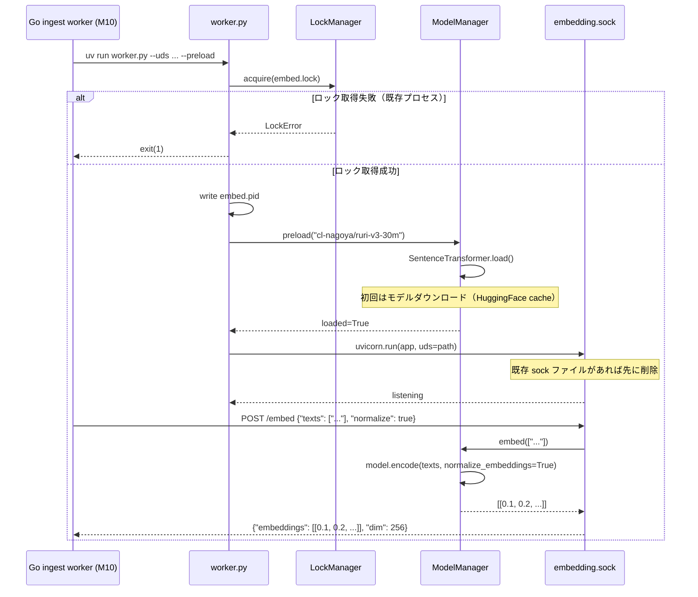
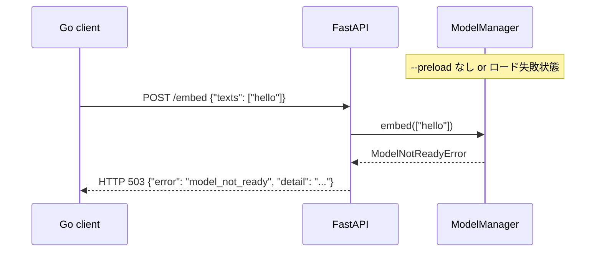
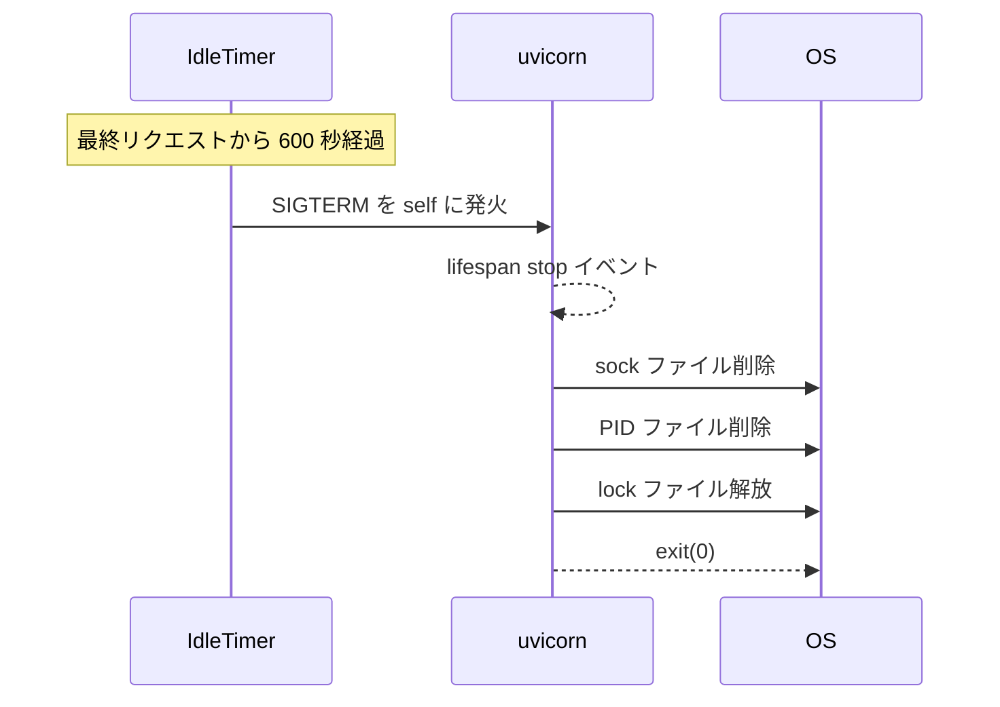

# M09: Python embedding worker 詳細計画

## 概要

FastAPI + Ruri v3（sentence-transformers）による embedding worker を Python で実装する。
UDS（Unix Domain Socket）経由で `/health` と `/embed` の2エンドポイントを公開し、
idle timeout 600秒とバッチ embedding に対応する。

## スコープ

| 項目 | 含む | 含まない |
|------|------|---------|
| Python プロジェクト構成 | pyproject.toml, uv 管理 | conda / pip 直接管理 |
| FastAPI + UDS | ASGI サーバー（uvicorn）、UDS バインド | TCP バインド |
| `/health` エンドポイント | モデルロード状態の確認 | 詳細メトリクス |
| `/embed` エンドポイント | テキスト → ベクトル変換、バッチ対応 | ストリーミングレスポンス |
| Ruri v3 モデル | cl-nagoya/ruri-v3-30m ロード・推論 | ファインチューニング・モデル差し替え |
| idle timeout | 600秒で自動終了 | 動的な timeout 変更 |
| PID ファイル / lock ファイル | embed.pid, embed.lock | heartbeat（Go 側の M10 担当） |
| エラーハンドリング | モデル未ロード、空入力、例外 | 部分的な batch 失敗のリカバリ |
| テスト | pytest + httpx による単体・統合テスト | 負荷テスト |

## ハンドオフ状態（M08 完了後の前提）

- ingest worker が chunk を `chunks` テーブルに書き込み済み
- `chunk_embeddings` テーブルが DDL で定義済み（M03）
- `config.toml` の `EmbeddingConfig.Model = "cl-nagoya/ruri-v3-30m"` 確定
- `config.SocketPath()` = `~/.local/state/memoria/run/embedding.sock`
- Python 3.13 + uv がツールチェーンとして設定済み（mise.toml 確認済み）

## アーキテクチャ

### ディレクトリ構成

```
python/
├── pyproject.toml         # uv プロジェクト定義
├── worker.py              # エントリポイント（argparse + uvicorn 起動）
├── app/
│   ├── __init__.py
│   ├── main.py            # FastAPI アプリ本体
│   ├── model.py           # ModelManager（Ruri v3 ロード・推論）
│   ├── schemas.py         # Pydantic リクエスト/レスポンスモデル
│   └── lifecycle.py       # idle timeout / PID / lock 管理
└── tests/
    ├── __init__.py
    ├── conftest.py         # 共通 fixture
    ├── test_model.py       # ModelManager 単体テスト
    ├── test_health.py      # /health エンドポイントテスト
    ├── test_embed.py       # /embed エンドポイントテスト
    ├── test_lifecycle.py   # idle timeout / PID テスト
    └── test_worker.py      # エントリポイント引数テスト
```

### 起動コマンド（WORKERS.ja.md 準拠）

```bash
uv run python/worker.py   --uds ~/.local/state/memoria/run/embedding.sock   --preload
```

- `--preload`: 起動時にモデルをロードし、初回リクエストのレイテンシを排除する
- `--uds`: UDS パスを指定。`SocketPath()` の値を Go 側から渡す

### コンポーネント間の依存関係

```
worker.py
  └── argparse でオプション解析
  └── lifecycle.LockManager（多重起動防止）
  └── lifecycle.PidFileManager
  └── model.ModelManager.preload()（--preload 時）
  └── uvicorn.run(app, uds=args.uds)
        └── app/main.py（FastAPI）
              ├── GET /health → model.ModelManager.status()
              └── POST /embed → model.ModelManager.embed(texts)
```

## シーケンス図

### 正常系: 起動 + /embed



### エラーケース: モデル未ロード



### idle timeout によるプロセス終了



## pyproject.toml 設計

```toml
[project]
name = "memoria-embedding-worker"
version = "0.1.0"
description = "Embedding worker for memoria using Ruri v3"
requires-python = ">=3.11"
dependencies = [
    "fastapi>=0.115.0",
    "uvicorn[standard]>=0.30.0",
    "sentence-transformers>=3.0.0",
    "torch>=2.0.0",
    "pydantic>=2.0.0",
]

[build-system]
requires = ["hatchling"]
build-backend = "hatchling.build"

[tool.uv]
dev-dependencies = [
    "pytest>=8.0.0",
    "pytest-asyncio>=0.23.0",
    "httpx>=0.27.0",
    "ruff>=0.4.0",
]

[tool.pytest.ini_options]
asyncio_mode = "auto"
```

### Apple Silicon (macOS) 対応

- `torch` は MPS バックエンド対応。CPU でも動作するため MPS は任意最適化
- `sentence-transformers` は torch 依存。`torch>=2.0.0` で MPS 安定動作
- モデルダウンロード先: `~/.cache/huggingface/hub/`（HuggingFace 標準キャッシュ）
- device 選択順: `mps` (Apple Silicon) → `cuda` (GPU) → `cpu` (フォールバック)

## エンドポイント設計

### GET /health

**用途**: embedding worker の生存確認（WORKERS.ja.md §embedding worker 生存確認）

**レスポンス（200 OK）: モデルロード済み**
```json
{
  "status": "ok",
  "model": "cl-nagoya/ruri-v3-30m",
  "model_loaded": true,
  "dim": 256,
  "uptime_seconds": 42.5
}
```

**レスポンス（503 Service Unavailable）: モデル未ロード**
```json
{
  "status": "loading",
  "model": "cl-nagoya/ruri-v3-30m",
  "model_loaded": false,
  "dim": null,
  "uptime_seconds": 3.1
}
```

**ステータスコード規則:**
- `200`: モデルロード済み、リクエスト受付可能
- `503`: モデルロード中またはロード失敗

### POST /embed

**用途**: テキスト → embedding ベクトルの変換

**リクエスト:**
```json
{
  "texts": ["決定: SQLite をローカルストアとして採用", "..."],
  "normalize": true
}
```

- `texts`: 1〜64 件（バッチ上限）
- `normalize`: L2 正規化フラグ（デフォルト `true`、コサイン類似度用）

**レスポンス（200 OK）:**
```json
{
  "embeddings": [[0.1, -0.2, ...], [0.3, 0.1, ...]],
  "dim": 256,
  "model": "cl-nagoya/ruri-v3-30m",
  "count": 2
}
```

**エラーレスポンス:**

| HTTP | error フィールド | 条件 |
|------|----------------|------|
| 422 | `validation_error` | texts が空配列、または 64 件超 |
| 503 | `model_not_ready` | モデルロード未完了 |
| 500 | `embed_failed` | encode 時に例外発生 |

## Ruri v3 モデル設計（model.py）

### ModelManager クラス

```python
class ModelManager:
    def __init__(self, model_name: str):
        self._model_name = model_name
        self._model: SentenceTransformer | None = None
        self._loaded = False
        self._dim: int | None = None
        self._load_error: str | None = None
        self._lock = threading.Lock()

    def preload(self) -> None:
        """同期的にモデルをロードする。起動時の --preload オプションで呼ばれる。"""

    async def embed_async(self, texts: list[str], normalize: bool = True) -> list[list[float]]:
        """スレッドプール経由で embed() を非同期実行する。asyncio ブロッキングを防ぐ。"""

    def embed(self, texts: list[str], normalize: bool = True) -> list[list[float]]:
        """テキストリストを embedding ベクトルに変換する（同期）。"""

    def status(self) -> dict:
        """health エンドポイント向けのステータス情報を返す。"""
```

### Ruri v3 encode 設定

```python
# Ruri v3 は query/passage の prefix 不要（v3 仕様）
embeddings = model.encode(
    texts,
    normalize_embeddings=normalize,
    batch_size=32,
    show_progress_bar=False,
)
# 戻り値: numpy ndarray (N, 256)
# JSON 直列化のため list[list[float]] に変換
return embeddings.tolist()
```

**Ruri v3-30m の仕様:**
- モデルID: `cl-nagoya/ruri-v3-30m`
- 出力次元: 256
- 最大トークン長: 512
- タスクプレフィックス: 不要

### asyncio ブロッキング対策

`model.encode()` は CPU/GPU バウンドな同期処理であるため、FastAPI の async ハンドラからは `run_in_executor` でスレッドプールにオフロードする。

```python
import asyncio
from functools import partial

async def embed_async(self, texts: list[str], normalize: bool = True) -> list[list[float]]:
    loop = asyncio.get_event_loop()
    fn = partial(self.embed, texts, normalize)
    return await loop.run_in_executor(None, fn)
```

## idle timeout 設計（lifecycle.py）

### IdleTimer

- 最終リクエスト時刻をスレッドセーフに記録
- FastAPI middleware でリクエストごとに `last_request_at` を更新
- バックグラウンドスレッドが 10 秒おきに経過時間をチェック
- 600 秒超過で `os.kill(os.getpid(), signal.SIGTERM)` を発火

```python
class IdleTimer:
    def __init__(self, timeout_seconds: int = 600):
        self._timeout = timeout_seconds
        self._last_request_at = time.monotonic()
        self._lock = threading.Lock()

    def touch(self) -> None:
        """リクエスト受信時に呼ぶ。"""
        with self._lock:
            self._last_request_at = time.monotonic()

    def is_timed_out(self) -> bool:
        with self._lock:
            return time.monotonic() - self._last_request_at > self._timeout

    def start(self) -> None:
        """バックグラウンドスレッドを起動する。daemon=True で本体終了時に自動終了。"""
        t = threading.Thread(target=self._check_loop, daemon=True)
        t.start()

    def _check_loop(self) -> None:
        """10秒おきにタイムアウトをチェックし、超過時に SIGTERM を発火。"""
        while True:
            time.sleep(10)
            if self.is_timed_out():
                import signal
                os.kill(os.getpid(), signal.SIGTERM)
                break
```

### LockManager（多重起動防止）

- `embed.lock` ファイルへの exclusive flock
- Python の `fcntl.flock()` を使用（macOS / Linux 共通）
- プロセス終了時にロックを自動解放（ファイルクローズで解放）

### SIGTERM ハンドラによるクリーンアップ

uvicorn の lifespan stop イベントと SIGTERM ハンドラで以下を行う:

1. sock ファイルを削除（`os.unlink(sock_path)`）
2. PID ファイルを削除
3. lock ファイルを解放（ファイルクローズ）

既存の sock ファイル対応: 起動時に `sock_path` が存在していれば先に `os.unlink()` する（前回の異常終了対策）。

## TDD 実装ステップ（Red → Green → Refactor）

### Step 1: Pydantic スキーマ（schemas.py）

**Red:**
```python
# tests/test_schemas.py
def test_embed_request_valid():
    req = EmbedRequest(texts=["hello", "world"], normalize=True)
    assert len(req.texts) == 2

def test_embed_request_empty_texts():
    with pytest.raises(ValidationError):
        EmbedRequest(texts=[], normalize=True)

def test_embed_request_too_many_texts():
    with pytest.raises(ValidationError):
        EmbedRequest(texts=["x"] * 65, normalize=True)

def test_embed_response():
    resp = EmbedResponse(
        embeddings=[[0.1, 0.2]],
        dim=2,
        model="cl-nagoya/ruri-v3-30m",
        count=1,
    )
    assert resp.count == 1

def test_health_response_ok():
    resp = HealthResponse(
        status="ok",
        model="cl-nagoya/ruri-v3-30m",
        model_loaded=True,
        dim=256,
        uptime_seconds=10.0,
    )
    assert resp.status == "ok"
```

**Green:** `EmbedRequest`（validator: 1 ≤ len(texts) ≤ 64）、`EmbedResponse`、`HealthResponse` を実装。

**Refactor:** バリデーションエラーメッセージを整備。

### Step 2: ModelManager（model.py）- モック使用

**Red:**
```python
# tests/test_model.py
def test_model_manager_initial_state():
    mgr = ModelManager("cl-nagoya/ruri-v3-30m")
    assert not mgr._loaded
    assert mgr._dim is None

def test_preload_success(mock_sentence_transformer):
    mgr = ModelManager("cl-nagoya/ruri-v3-30m")
    mgr.preload()
    assert mgr._loaded
    assert mgr._dim == 256

def test_preload_failure():
    with patch("app.model.SentenceTransformer", side_effect=OSError("no model")):
        mgr = ModelManager("cl-nagoya/ruri-v3-30m")
        with pytest.raises(RuntimeError, match="model load failed"):
            mgr.preload()

def test_embed_not_loaded():
    mgr = ModelManager("cl-nagoya/ruri-v3-30m")
    with pytest.raises(ModelNotReadyError):
        mgr.embed(["hello"])

def test_embed_returns_vectors(mock_sentence_transformer):
    mgr = ModelManager("cl-nagoya/ruri-v3-30m")
    mgr.preload()
    result = mgr.embed(["hello", "world"])
    assert len(result) == 2
    assert len(result[0]) == 256

def test_status_loaded(mock_sentence_transformer):
    mgr = ModelManager("cl-nagoya/ruri-v3-30m")
    mgr.preload()
    s = mgr.status()
    assert s["model_loaded"] is True
    assert s["dim"] == 256

def test_status_not_loaded():
    mgr = ModelManager("cl-nagoya/ruri-v3-30m")
    s = mgr.status()
    assert s["model_loaded"] is False
    assert s["dim"] is None
```

**conftest.py の共通 fixture:**
```python
import pytest
import numpy as np
from unittest.mock import MagicMock, patch

@pytest.fixture
def mock_sentence_transformer():
    mock_model = MagicMock()
    mock_model.encode.return_value = np.random.rand(2, 256).astype("float32")
    mock_model.get_sentence_embedding_dimension.return_value = 256
    with patch("app.model.SentenceTransformer", return_value=mock_model):
        yield mock_model
```

**Green:** `ModelManager` を実装。`ModelNotReadyError` 例外クラスを定義。

**Refactor:** スレッドセーフな `_loaded` チェック（`threading.Lock`）を追加。

### Step 3: /health エンドポイント（test_health.py）

**Red:**
```python
# tests/test_health.py
import pytest
from httpx import AsyncClient, ASGITransport
from app.main import create_app

@pytest.mark.asyncio
async def test_health_model_not_loaded():
    app = create_app(model_name="cl-nagoya/ruri-v3-30m", preload=False)
    async with AsyncClient(transport=ASGITransport(app=app), base_url="http://test") as client:
        response = await client.get("/health")
    assert response.status_code == 503
    data = response.json()
    assert data["model_loaded"] is False
    assert data["status"] == "loading"

@pytest.mark.asyncio
async def test_health_model_loaded(mock_sentence_transformer):
    app = create_app(model_name="cl-nagoya/ruri-v3-30m", preload=True)
    async with AsyncClient(transport=ASGITransport(app=app), base_url="http://test") as client:
        response = await client.get("/health")
    assert response.status_code == 200
    data = response.json()
    assert data["model_loaded"] is True
    assert data["dim"] == 256
    assert data["status"] == "ok"
```

**Green:** `create_app()` ファクトリと `/health` ルートを実装。`ModelManager` をアプリ state に保持。

**Refactor:** lifespan イベントで preload 処理を分離。`create_app` 引数で `idle_timeout` も受け取る。

### Step 4: /embed エンドポイント（test_embed.py）

**Red:**
```python
# tests/test_embed.py
@pytest.mark.asyncio
async def test_embed_success(mock_sentence_transformer):
    app = create_app(model_name="cl-nagoya/ruri-v3-30m", preload=True)
    async with AsyncClient(transport=ASGITransport(app=app), base_url="http://test") as client:
        response = await client.post("/embed", json={
            "texts": ["決定: SQLite を採用"],
            "normalize": True,
        })
    assert response.status_code == 200
    data = response.json()
    assert data["count"] == 1
    assert len(data["embeddings"]) == 1
    assert len(data["embeddings"][0]) == 256
    assert data["dim"] == 256

@pytest.mark.asyncio
async def test_embed_batch(mock_sentence_transformer):
    import numpy as np
    mock_sentence_transformer.encode.return_value = np.random.rand(10, 256).astype("float32")
    texts = [f"text_{i}" for i in range(10)]
    app = create_app(model_name="cl-nagoya/ruri-v3-30m", preload=True)
    async with AsyncClient(transport=ASGITransport(app=app), base_url="http://test") as client:
        response = await client.post("/embed", json={"texts": texts})
    assert response.status_code == 200
    assert response.json()["count"] == 10

@pytest.mark.asyncio
async def test_embed_model_not_ready():
    app = create_app(model_name="cl-nagoya/ruri-v3-30m", preload=False)
    async with AsyncClient(transport=ASGITransport(app=app), base_url="http://test") as client:
        response = await client.post("/embed", json={"texts": ["hello"]})
    assert response.status_code == 503
    assert response.json()["error"] == "model_not_ready"

@pytest.mark.asyncio
async def test_embed_empty_texts():
    app = create_app(model_name="cl-nagoya/ruri-v3-30m", preload=False)
    async with AsyncClient(transport=ASGITransport(app=app), base_url="http://test") as client:
        response = await client.post("/embed", json={"texts": []})
    assert response.status_code == 422

@pytest.mark.asyncio
async def test_embed_too_many_texts():
    app = create_app(model_name="cl-nagoya/ruri-v3-30m", preload=False)
    async with AsyncClient(transport=ASGITransport(app=app), base_url="http://test") as client:
        response = await client.post("/embed", json={"texts": ["x"] * 65})
    assert response.status_code == 422

@pytest.mark.asyncio
async def test_embed_normalize_false(mock_sentence_transformer):
    app = create_app(model_name="cl-nagoya/ruri-v3-30m", preload=True)
    async with AsyncClient(transport=ASGITransport(app=app), base_url="http://test") as client:
        response = await client.post("/embed", json={"texts": ["hello"], "normalize": False})
    assert response.status_code == 200
    call_kwargs = mock_sentence_transformer.encode.call_args.kwargs
    assert call_kwargs.get("normalize_embeddings") is False
```

**Green:** `/embed` POST ルートを実装。モデル未ロード時は HTTP 503。

**Refactor:** encode の numpy → list 変換を `model.py` に閉じ込める。

### Step 5: lifecycle テスト（test_lifecycle.py）

**Red:**
```python
# tests/test_lifecycle.py
import os, time
from app.lifecycle import IdleTimer, PidFileManager

def test_idle_timer_no_timeout():
    timer = IdleTimer(timeout_seconds=600)
    timer.touch()
    assert not timer.is_timed_out()

def test_idle_timer_timeout():
    timer = IdleTimer(timeout_seconds=1)
    timer._last_request_at = time.monotonic() - 2
    assert timer.is_timed_out()

def test_pid_file_write_and_cleanup(tmp_path):
    pid_file = tmp_path / "embed.pid"
    mgr = PidFileManager(str(pid_file))
    mgr.write()
    assert pid_file.exists()
    assert pid_file.read_text().strip() == str(os.getpid())
    mgr.cleanup()
    assert not pid_file.exists()

def test_pid_file_cleanup_noop_if_not_exists(tmp_path):
    pid_file = tmp_path / "nonexistent.pid"
    mgr = PidFileManager(str(pid_file))
    mgr.cleanup()  # エラーなし

def test_lock_manager_acquires(tmp_path):
    from app.lifecycle import LockManager
    lock_file = tmp_path / "embed.lock"
    mgr = LockManager(str(lock_file))
    mgr.acquire()
    mgr.release()
```

**Green:** `IdleTimer`、`PidFileManager`、`LockManager` を実装。

**Refactor:** `cleanup()` を `atexit` と SIGTERM ハンドラ両方に接続するユーティリティを追加。

### Step 6: worker.py エントリポイント（test_worker.py）

**Red:**
```python
# tests/test_worker.py
import sys
sys.path.insert(0, ".")
from worker import parse_args

def test_parse_args_uds():
    args = parse_args(["--uds", "/tmp/test.sock"])
    assert args.uds == "/tmp/test.sock"
    assert args.preload is False

def test_parse_args_preload():
    args = parse_args(["--uds", "/tmp/test.sock", "--preload"])
    assert args.preload is True

def test_parse_args_model():
    args = parse_args(["--uds", "/tmp/test.sock", "--model", "cl-nagoya/ruri-v3-30m"])
    assert args.model == "cl-nagoya/ruri-v3-30m"

def test_parse_args_timeout():
    args = parse_args(["--uds", "/tmp/test.sock", "--idle-timeout", "300"])
    assert args.idle_timeout == 300

def test_parse_args_defaults():
    args = parse_args(["--uds", "/tmp/test.sock"])
    assert args.model == "cl-nagoya/ruri-v3-30m"
    assert args.idle_timeout == 600
```

**Green:** `argparse` でオプション解析を実装。

**Refactor:** `main()` 関数に整理し `if __name__ == "__main__"` に配置。

## ファイル別実装ガイド

### app/main.py の骨格

```python
from contextlib import asynccontextmanager
from fastapi import FastAPI, Request
from fastapi.responses import JSONResponse
from app.model import ModelManager, ModelNotReadyError
from app.lifecycle import IdleTimer
from app.schemas import EmbedRequest, EmbedResponse

def create_app(
    model_name: str = "cl-nagoya/ruri-v3-30m",
    preload: bool = False,
    idle_timeout: int = 600,
) -> FastAPI:

    model_mgr = ModelManager(model_name)
    idle_timer = IdleTimer(idle_timeout)

    @asynccontextmanager
    async def lifespan(app: FastAPI):
        if preload:
            model_mgr.preload()
        idle_timer.start()
        yield

    app = FastAPI(lifespan=lifespan)
    app.state.model = model_mgr
    app.state.idle_timer = idle_timer

    @app.middleware("http")
    async def touch_idle_timer(request: Request, call_next):
        idle_timer.touch()
        return await call_next(request)

    @app.get("/health")
    async def health():
        s = model_mgr.status()
        code = 200 if s["model_loaded"] else 503
        return JSONResponse(s, status_code=code)

    @app.post("/embed")
    async def embed(req: EmbedRequest):
        try:
            vecs = await model_mgr.embed_async(req.texts, req.normalize)
        except ModelNotReadyError:
            return JSONResponse({"error": "model_not_ready"}, status_code=503)
        except Exception as e:
            return JSONResponse({"error": "embed_failed", "detail": str(e)}, status_code=500)
        return EmbedResponse(
            embeddings=vecs,
            dim=model_mgr._dim,
            model=model_name,
            count=len(vecs),
        )

    return app
```

### worker.py の骨格

```python
import argparse, os, signal, uvicorn
from app.main import create_app
from app.lifecycle import LockManager, PidFileManager

def parse_args(argv=None):
    parser = argparse.ArgumentParser(description="memoria embedding worker")
    parser.add_argument("--uds", required=True)
    parser.add_argument("--model", default="cl-nagoya/ruri-v3-30m")
    parser.add_argument("--preload", action="store_true")
    parser.add_argument("--idle-timeout", type=int, default=600)
    return parser.parse_args(argv)

def main():
    args = parse_args()
    run_dir = os.path.expanduser("~/.local/state/memoria/run")
    lock = LockManager(os.path.join(run_dir, "embed.lock"))
    pid_mgr = PidFileManager(os.path.join(run_dir, "embed.pid"))

    lock.acquire()
    pid_mgr.write()

    if os.path.exists(args.uds):
        os.unlink(args.uds)

    def _on_sigterm(signum, frame):
        pid_mgr.cleanup()
        lock.release()
        if os.path.exists(args.uds):
            os.unlink(args.uds)
        raise SystemExit(0)

    signal.signal(signal.SIGTERM, _on_sigterm)

    app = create_app(
        model_name=args.model,
        preload=args.preload,
        idle_timeout=args.idle_timeout,
    )
    uvicorn.run(app, uds=args.uds, log_level="info")

if __name__ == "__main__":
    main()
```

## Makefile 統合（既存 Makefile への追加）

```makefile
.PHONY: python-install python-test python-lint

python-install:
	cd python && uv sync --all-extras

python-test:
	cd python && uv run pytest tests/ -v

python-lint:
	cd python && uv run ruff check app/ tests/
```

## テスト実行方法

```bash
# 依存インストール
cd python && uv sync --all-extras

# 全テスト
cd python && uv run pytest tests/ -v

# カバレッジ付き
cd python && uv run pytest tests/ --cov=app --cov-report=term-missing

# 特定テスト
cd python && uv run pytest tests/test_embed.py -v
```

## 統合確認手順（M10 前の単体確認）

1. UDS での手動起動:
```bash
mkdir -p ~/.local/state/memoria/run
cd python && uv run worker.py \
  --uds ~/.local/state/memoria/run/embedding.sock \
  --preload
```

2. curl で疎通確認（別ターミナルで）:
```bash
# health チェック
curl --unix-socket ~/.local/state/memoria/run/embedding.sock \
  http://localhost/health | jq

# embed テスト
curl --unix-socket ~/.local/state/memoria/run/embedding.sock \
  -X POST -H "Content-Type: application/json" \
  -d '{"texts": ["SQLite を採用した"], "normalize": true}' \
  http://localhost/embed | jq '.dim'
```

3. idle timeout 確認:
```bash
cd python && uv run worker.py --uds /tmp/test.sock --idle-timeout 10
# 10 秒後に exit(0) されることを確認
```

## リスク評価

| リスク | 影響度 | 確率 | 軽減策 |
|--------|--------|------|--------|
| Ruri v3 初回ダウンロードに時間がかかる（~120MB） | 中 | 高（必然） | `--preload` を使い起動完了後に health=ok。HuggingFace cache 活用で2回目以降は高速 |
| Apple Silicon (MPS) で torch 互換問題 | 中 | 低 | `mps → cuda → cpu` のフォールバック順序で `ModelManager` 実装 |
| UDS 残留ファイルによる起動失敗 | 高 | 中 | 起動時に既存 sock ファイルを検出・削除してから bind |
| 多重起動による lock 競合 | 高 | 低 | `embed.lock` の exclusive flock で確実に1プロセス制限 |
| encode 中の asyncio ブロッキング | 中 | 高 | `run_in_executor` でスレッドプールにオフロード |
| torch / sentence-transformers バージョン非互換 | 中 | 低 | pyproject.toml でバージョン下限を固定。uv.lock で再現性保証 |
| モデルロード中の /embed リクエスト | 中 | 低 | `ModelNotReadyError` → HTTP 503。Go 側（M10）はリトライロジックで対処 |
| pytest-asyncio の設定漏れ | 低 | 中 | `asyncio_mode = "auto"` を pyproject.toml に設定 |
| macOS の fcntl.flock 挙動差異 | 低 | 低 | macOS / Linux で同一 API。テストは tmp_path で隔離 |

## 完了基準

- [ ] `cd python && uv run pytest tests/ -v` が全て green
- [ ] `uv run worker.py --uds /tmp/test.sock --preload` で起動し、curl で `/health` が `200` を返す
- [ ] `POST /embed` に1件・複数件のテキストを送り、正しい次元（256）の embedding が返る
- [ ] `texts=[]` は 422 を返す
- [ ] `texts` が 65 件は 422 を返す
- [ ] モデル未ロード状態の `/embed` が 503 を返す
- [ ] `--idle-timeout 10` で 10 秒後に自動終了する
- [ ] 既存 sock ファイルがある状態で起動しても正常動作する
- [ ] `embed.lock` が存在する状態で二重起動しようとすると exit(1) する
- [ ] macOS (Apple Silicon) と Linux の両方で動作する
- [ ] `uv.lock` が生成されており、再現可能なビルドになっている

## 実装順序まとめ

1. `python/pyproject.toml` + `uv sync --all-extras`（依存ライブラリ解決）
2. `python/app/schemas.py` + `tests/test_schemas.py`（TDD Step 1）
3. `python/app/model.py` + `tests/test_model.py`（TDD Step 2）
4. `python/app/main.py` `/health` + `tests/test_health.py`（TDD Step 3）
5. `python/app/main.py` `/embed` + `tests/test_embed.py`（TDD Step 4）
6. `python/app/lifecycle.py` + `tests/test_lifecycle.py`（TDD Step 5）
7. `python/worker.py` + `tests/test_worker.py`（TDD Step 6）
8. 手動統合確認（curl + UDS）
9. Makefile 統合
