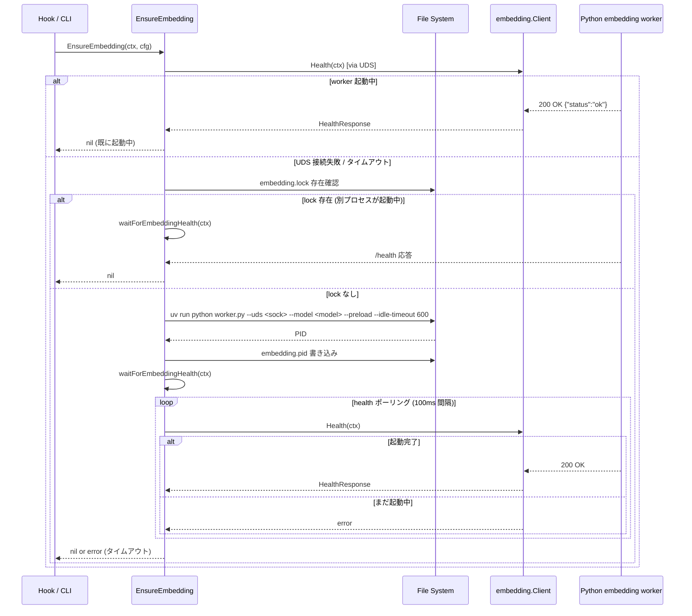
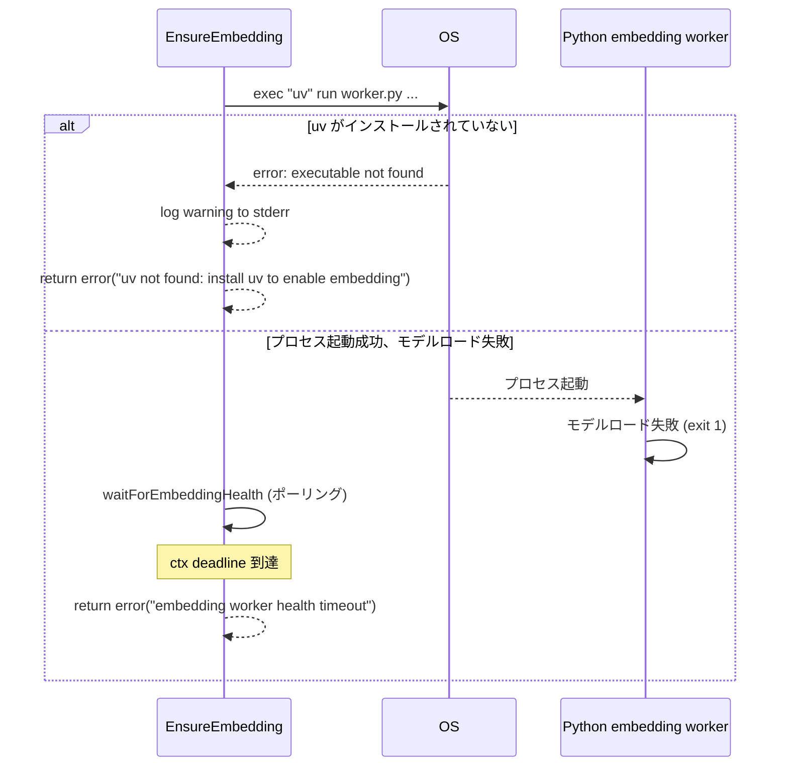
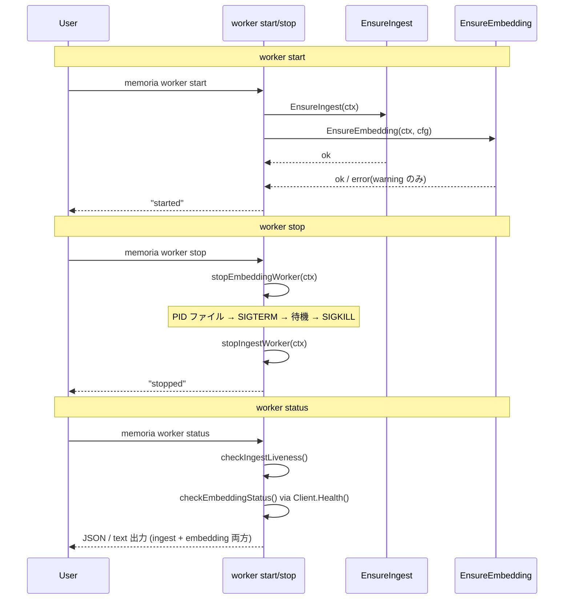

# M10: Go ↔ Python UDS 通信統合 (`embedding-integration`)

## 概要

M09 で完成した Python embedding worker (FastAPI + Ruri v3 + UDS) を Go 側から利用するための統合レイヤーを実装する。
Go 側 embedding client の作成、embedding worker の起動保証 (EnsureEmbedding)、`worker start/stop/status` コマンドへの embedding 対応追加が主なスコープ。

## 依存関係

| 依存 | 状態 | 詳細 |
|------|------|------|
| M07 ingest-worker-lifecycle | 完了前提 | EnsureIngest パターン、FileLock、PID 管理 |
| M09 embedding-worker | 完了前提 | FastAPI + UDS worker。`/health` / `/embed` エンドポイント |

## スコープ

| 項目 | 含む | 含まない |
|------|------|---------|
| Go embedding client | Health(), Embed() の実装 | embed 結果の DB 保存（M11 スコープ） |
| EnsureEmbedding | uv run で spawn + health ポーリング | Claude Code plugin 統合 |
| worker start 拡張 | embedding worker を合わせて起動 | restart の完全実装 |
| worker stop 拡張 | embedding worker を合わせて停止 | /stop API 追加 |
| worker status 拡張 | embedding worker の状態表示追加 | prometheus metrics |

## アーキテクチャ

### パッケージ構成

```
internal/
├── embedding/
│   ├── client.go        # UDS HTTP client（Health / Embed）
│   └── client_test.go   # client のユニットテスト（モックサーバー使用）
├── worker/
│   ├── ensure.go        # 既存。EnsureIngest 実装済み
│   ├── ensure_embedding.go  # EnsureEmbedding の新規追加
│   └── ensure_embedding_test.go
internal/cli/
├── worker.go            # WorkerStartCmd / WorkerStopCmd / WorkerStatusCmd に embedding 対応追加
└── worker_test.go       # 既存テストを壊さない形で拡張
```

### embedding client の型定義

```go
// internal/embedding/client.go

// Client は embedding worker への UDS HTTP クライアント。
type Client struct {
    socketPath string
    httpClient *http.Client
}

// HealthResponse は /health エンドポイントのレスポンス。
type HealthResponse struct {
    Status     string `json:"status"`
    Model      string `json:"model"`
    Dimensions int    `json:"dimensions"`
    Device     string `json:"device"`
}

// EmbedRequest は /embed エンドポイントへのリクエスト。
type EmbedRequest struct {
    Texts []string `json:"texts"`
}

// EmbedResponse は /embed エンドポイントのレスポンス。
type EmbedResponse struct {
    Embeddings [][]float32 `json:"embeddings"`
    Model      string      `json:"model"`
    Dimensions int         `json:"dimensions"`
}

// New は UDS パスを指定して Client を生成する。
func New(socketPath string) *Client

// Health は /health エンドポイントを呼び出す。
// worker が応答しない場合は error を返す。
func (c *Client) Health(ctx context.Context) (*HealthResponse, error)

// Embed は texts を embedding し、[][]float32 を返す。
func (c *Client) Embed(ctx context.Context, texts []string) ([][]float32, error)
```

### EnsureEmbedding の設計

```go
// internal/worker/ensure_embedding.go

// spawnEmbeddingWorkerFn は spawn 処理のテスト差し替えポイント。
var spawnEmbeddingWorkerFn = spawnEmbeddingWorker

// EnsureEmbedding は embedding worker が起動していることを確認する。
// 起動していなければ uv run で spawn し、health ポーリングで起動を待つ。
func EnsureEmbedding(ctx context.Context, cfg *config.Config) error

// spawnEmbeddingWorker は embedding worker を uv run で spawn する。
func spawnEmbeddingWorker(cfg *config.Config) error

// waitForEmbeddingHealth は embedding worker の /health が返るまでポーリングする。
// タイムアウト or context キャンセルで error を返す。
func waitForEmbeddingHealth(ctx context.Context, socketPath string) error
```

### worker status 拡張

既存の `WorkerStatusOutput` に embedding フィールドを追加:

```go
type WorkerStatusOutput struct {
    // 既存フィールド（ingest worker）
    Status          string `json:"status"`
    WorkerID        string `json:"worker_id,omitempty"`
    PID             int    `json:"pid,omitempty"`
    LastHeartbeatAt string `json:"last_heartbeat_at,omitempty"`
    UptimeSeconds   int64  `json:"uptime_seconds,omitempty"`

    // M10 追加フィールド
    Embedding EmbeddingWorkerStatus `json:"embedding"`
}

type EmbeddingWorkerStatus struct {
    Status     string `json:"status"` // "running" | "not_running" | "unknown"
    Model      string `json:"model,omitempty"`
    Dimensions int    `json:"dimensions,omitempty"`
    Device     string `json:"device,omitempty"`
    PID        int    `json:"pid,omitempty"`
}
```

## シーケンス図

### 正常系: EnsureEmbedding フロー



### エラー系: uv not found / モデルロード失敗



### worker start / stop での embedding 対応



## TDD 実装ステップ（Red → Green → Refactor）

### Step 1: embedding client — Health() と Embed() の基本実装

**Red: テスト先行**

```go
// internal/embedding/client_test.go

// TestHealth_Success は /health が 200 を返すケースをテストする。
func TestHealth_Success(t *testing.T) {
    srv := newMockEmbeddingServer(t)
    defer srv.Close()
    client := embedding.New(srv.SocketPath())
    resp, err := client.Health(context.Background())
    if err \!= nil {
        t.Fatalf("unexpected error: %v", err)
    }
    if resp.Status \!= "ok" {
        t.Errorf("expected status 'ok', got %q", resp.Status)
    }
    if resp.Dimensions \!= 256 {
        t.Errorf("expected 256 dimensions, got %d", resp.Dimensions)
    }
}

// TestHealth_WorkerNotRunning は UDS が存在しない場合のエラーをテストする。
func TestHealth_WorkerNotRunning(t *testing.T) {
    client := embedding.New("/nonexistent/path.sock")
    _, err := client.Health(context.Background())
    if err == nil {
        t.Fatal("expected error, got nil")
    }
}

// TestHealth_ContextTimeout は context タイムアウトを尊重することをテストする。
func TestHealth_ContextTimeout(t *testing.T) {
    srv := newSlowMockEmbeddingServer(t, 200*time.Millisecond)
    defer srv.Close()
    ctx, cancel := context.WithTimeout(context.Background(), 50*time.Millisecond)
    defer cancel()
    client := embedding.New(srv.SocketPath())
    _, err := client.Health(ctx)
    if err == nil {
        t.Fatal("expected timeout error, got nil")
    }
}

// TestEmbed_Success は /embed が正常に embeddings を返すケースをテストする。
func TestEmbed_Success(t *testing.T) {
    srv := newMockEmbeddingServer(t)
    defer srv.Close()
    client := embedding.New(srv.SocketPath())
    vecs, err := client.Embed(context.Background(), []string{"hello", "world"})
    if err \!= nil {
        t.Fatalf("unexpected error: %v", err)
    }
    if len(vecs) \!= 2 {
        t.Errorf("expected 2 vectors, got %d", len(vecs))
    }
    if len(vecs[0]) \!= 256 {
        t.Errorf("expected 256 dimensions, got %d", len(vecs[0]))
    }
}

// TestEmbed_EmptyTexts は空スライスを渡した場合の挙動をテストする。
func TestEmbed_EmptyTexts(t *testing.T) {
    srv := newMockEmbeddingServer(t)
    defer srv.Close()
    client := embedding.New(srv.SocketPath())
    vecs, err := client.Embed(context.Background(), []string{})
    if err \!= nil {
        t.Fatalf("unexpected error: %v", err)
    }
    if len(vecs) \!= 0 {
        t.Errorf("expected 0 vectors, got %d", len(vecs))
    }
}

// TestEmbed_ServerError は worker が 500 を返した場合のエラー処理をテストする。
func TestEmbed_ServerError(t *testing.T) {
    srv := newErrorMockEmbeddingServer(t, 500)
    defer srv.Close()
    client := embedding.New(srv.SocketPath())
    _, err := client.Embed(context.Background(), []string{"text"})
    if err == nil {
        t.Fatal("expected error for 500 response, got nil")
    }
}
```

**テストヘルパー: UDS モックサーバー**

テストでは `net/http` を UDS ソケット上で動かすヘルパーを用意する（`client_test.go` 内または `testserver_test.go` として）。

```go
type mockEmbeddingServer struct {
    listener net.Listener
    server   *http.Server
    sockPath string
}

func newMockEmbeddingServer(t *testing.T) *mockEmbeddingServer {
    t.Helper()
    sockPath := filepath.Join(t.TempDir(), "embedding.sock")
    ln, err := net.Listen("unix", sockPath)
    if err \!= nil {
        t.Fatalf("listen: %v", err)
    }
    mux := http.NewServeMux()
    mux.HandleFunc("/health", func(w http.ResponseWriter, r *http.Request) {
        json.NewEncoder(w).Encode(HealthResponse{
            Status: "ok", Model: "test-model", Dimensions: 256, Device: "cpu",
        })
    })
    mux.HandleFunc("/embed", func(w http.ResponseWriter, r *http.Request) {
        var req EmbedRequest
        json.NewDecoder(r.Body).Decode(&req)
        vecs := make([][]float32, len(req.Texts))
        for i := range vecs {
            vecs[i] = make([]float32, 256)
        }
        json.NewEncoder(w).Encode(EmbedResponse{
            Embeddings: vecs, Model: "test-model", Dimensions: 256,
        })
    })
    srv := &http.Server{Handler: mux}
    go srv.Serve(ln)
    t.Cleanup(func() { srv.Close() })
    return &mockEmbeddingServer{listener: ln, server: srv, sockPath: sockPath}
}

func (s *mockEmbeddingServer) SocketPath() string { return s.sockPath }
func (s *mockEmbeddingServer) Close() { s.server.Close() }
```

**Green: 最小実装方針**

`internal/embedding/client.go` に `New()`, `Health()`, `Embed()` を実装。
UDS 通信は `net.Dial("unix", socketPath)` を使った `http.Transport`:

```go
func New(socketPath string) *Client {
    transport := &http.Transport{
        DialContext: func(ctx context.Context, _, _ string) (net.Conn, error) {
            return (&net.Dialer{}).DialContext(ctx, "unix", socketPath)
        },
    }
    return &Client{
        socketPath: socketPath,
        httpClient: &http.Client{Transport: transport},
    }
}
```

HTTP リクエストの URL は `http://localhost/...` を使う（UDS ではホスト名は無視される）。

**Refactor:** タイムアウト処理の共通化、エラーメッセージの統一。

---

### Step 2: EnsureEmbedding — health チェック + spawn 呼び出し

**Red: テスト先行**

```go
// internal/worker/ensure_embedding_test.go

func TestEnsureEmbedding_AlreadyRunning(t *testing.T) {
    srv := startMockEmbeddingServer(t)
    cfg := configWithSocket(t, srv.SocketPath())
    err := EnsureEmbedding(context.Background(), cfg)
    if err \!= nil {
        t.Errorf("unexpected error: %v", err)
    }
}

func TestEnsureEmbedding_NotRunning_SpawnCalled(t *testing.T) {
    sockPath := filepath.Join(t.TempDir(), "notexist.sock")
    cfg := configWithSocket(t, sockPath)
    spawnCalled := false
    origSpawn := spawnEmbeddingWorkerFn
    defer func() { spawnEmbeddingWorkerFn = origSpawn }()
    spawnEmbeddingWorkerFn = func(cfg *config.Config) error {
        spawnCalled = true
        return errors.New("mock: uv not available in test")
    }
    _ = EnsureEmbedding(context.Background(), cfg)
    if \!spawnCalled {
        t.Error("expected spawnEmbeddingWorker to be called")
    }
}

func TestWaitForEmbeddingHealth_Success(t *testing.T) {
    srv := startMockEmbeddingServer(t)
    ctx, cancel := context.WithTimeout(context.Background(), 2*time.Second)
    defer cancel()
    err := waitForEmbeddingHealth(ctx, srv.SocketPath())
    if err \!= nil {
        t.Errorf("unexpected error: %v", err)
    }
}

func TestWaitForEmbeddingHealth_Timeout(t *testing.T) {
    sockPath := filepath.Join(t.TempDir(), "notexist.sock")
    ctx, cancel := context.WithTimeout(context.Background(), 100*time.Millisecond)
    defer cancel()
    err := waitForEmbeddingHealth(ctx, sockPath)
    if err == nil {
        t.Error("expected timeout error, got nil")
    }
}
```

**Green: 最小実装**

```go
// internal/worker/ensure_embedding.go

var spawnEmbeddingWorkerFn = spawnEmbeddingWorker

func EnsureEmbedding(ctx context.Context, cfg *config.Config) error {
    socketPath := config.SocketPath()
    client := embedding.New(socketPath)

    if _, err := client.Health(ctx); err == nil {
        return nil // 既に起動中
    }

    if err := spawnEmbeddingWorkerFn(cfg); err \!= nil {
        fmt.Fprintf(os.Stderr, "memoria: ensureEmbedding: spawn: %v\n", err)
        return fmt.Errorf("spawn embedding worker: %w", err)
    }

    return waitForEmbeddingHealth(ctx, socketPath)
}

func waitForEmbeddingHealth(ctx context.Context, socketPath string) error {
    client := embedding.New(socketPath)
    ticker := time.NewTicker(100 * time.Millisecond)
    defer ticker.Stop()
    for {
        select {
        case <-ctx.Done():
            return fmt.Errorf("embedding worker health timeout: %w", ctx.Err())
        case <-ticker.C:
            if _, err := client.Health(ctx); err == nil {
                return nil
            }
        }
    }
}
```

**Refactor:** uv のパス解決 (`exec.LookPath("uv")`) のエラーメッセージ改善。

---

### Step 3: spawnEmbeddingWorker — uv run プロセス起動

**Red: テスト先行（引数構築のみ単体テスト）**

```go
func TestBuildEmbeddingWorkerArgs(t *testing.T) {
    cfg := &config.Config{
        Worker:    config.WorkerConfig{EmbeddingIdleTimeout: 600},
        Embedding: config.EmbeddingConfig{Model: "cl-nagoya/ruri-v3-30m"},
    }
    args := buildEmbeddingWorkerArgs(cfg, "/tmp/test.sock", "/path/to/worker.py")
    if \!slices.Contains(args, "--preload") {
        t.Error("expected --preload in args")
    }
    if \!slices.Contains(args, "--uds") {
        t.Error("expected --uds in args")
    }
    if \!slices.Contains(args, "--model") {
        t.Error("expected --model in args")
    }
    if \!slices.Contains(args, "600") {
        t.Error("expected idle-timeout 600 in args")
    }
}
```

**Green: 実装方針**

```go
func buildEmbeddingWorkerArgs(cfg *config.Config, sockPath, workerScript string) []string {
    idleTimeout := cfg.Worker.EmbeddingIdleTimeout
    if idleTimeout <= 0 {
        idleTimeout = 600
    }
    model := cfg.Embedding.Model
    if model == "" {
        model = "cl-nagoya/ruri-v3-30m"
    }
    return []string{
        "run", "python", workerScript,
        "--uds", sockPath,
        "--model", model,
        "--preload",
        "--idle-timeout", strconv.Itoa(idleTimeout),
    }
}

func spawnEmbeddingWorker(cfg *config.Config) error {
    uvPath, err := exec.LookPath("uv")
    if err \!= nil {
        return fmt.Errorf("uv not found: install uv to enable embedding (https://docs.astral.sh/uv/)")
    }

    execDir := filepath.Dir(os.Args[0])
    workerScript := filepath.Join(execDir, "python", "worker.py")
    sockPath := config.SocketPath()

    // stale ソケットファイルを削除してから起動
    _ = os.Remove(sockPath)

    if err := os.MkdirAll(config.LogDir(), 0755); err \!= nil {
        return fmt.Errorf("mkdir log dir: %w", err)
    }
    if err := os.MkdirAll(config.RunDir(), 0755); err \!= nil {
        return fmt.Errorf("mkdir run dir: %w", err)
    }

    logPath := filepath.Join(config.LogDir(), "embedding.log")
    logFile, err := os.OpenFile(logPath, os.O_APPEND|os.O_CREATE|os.O_WRONLY, 0644)
    if err \!= nil {
        logFile, _ = os.Open(os.DevNull)
    }
    defer logFile.Close()

    workerArgs := buildEmbeddingWorkerArgs(cfg, sockPath, workerScript)
    args := append([]string{uvPath}, workerArgs...)
    attr := &os.ProcAttr{
        Files: []*os.File{nil, logFile, logFile},
        Sys:   &syscall.SysProcAttr{Setsid: true},
    }

    proc, err := os.StartProcess(uvPath, args, attr)
    if err \!= nil {
        return fmt.Errorf("start embedding worker: %w", err)
    }

    pidPath := filepath.Join(config.RunDir(), "embedding.pid")
    _ = WritePID(pidPath, proc.Pid)

    return proc.Release()
}
```

**Refactor:** `buildEmbeddingWorkerArgs()` を独立関数に抽出済み（テスト容易性確保）。

---

### Step 4: worker start/stop/status の embedding 対応

**Red: テスト先行**

```go
// internal/cli/worker_test.go に追加

func TestWorkerStatus_EmbeddingField_JSON(t *testing.T) {
    database := testutil.OpenTestDBFull(t)
    cmd := &WorkerStatusCmd{}
    globals := &Globals{Format: "json"}
    var buf strings.Builder
    w := io.Writer(&buf)

    if err := cmd.RunWithDB(globals, &w, database.SQL()); err \!= nil {
        t.Fatalf("unexpected error: %v", err)
    }
    if \!strings.Contains(buf.String(), `"embedding"`) {
        t.Errorf("expected 'embedding' field in JSON output, got: %s", buf.String())
    }
}

func TestWorkerStatus_EmbeddingField_Text(t *testing.T) {
    database := testutil.OpenTestDBFull(t)
    cmd := &WorkerStatusCmd{}
    globals := &Globals{}
    var buf strings.Builder
    w := io.Writer(&buf)

    if err := cmd.RunWithDB(globals, &w, database.SQL()); err \!= nil {
        t.Fatalf("unexpected error: %v", err)
    }
    if \!strings.Contains(buf.String(), "embedding:") {
        t.Errorf("expected 'embedding:' in text output, got: %s", buf.String())
    }
}

func TestWorkerStop_EmbeddingNotRunning(t *testing.T) {
    database := testutil.OpenTestDBFull(t)
    runDir := t.TempDir()
    cmd := &WorkerStopCmd{}
    globals := &Globals{}
    var buf strings.Builder
    w := io.Writer(&buf)

    if err := cmd.RunWithDB(globals, &w, database.SQL(), runDir); err \!= nil {
        t.Fatalf("unexpected error: %v", err)
    }
    if \!strings.Contains(buf.String(), "was not running") && \!strings.Contains(buf.String(), "stopped") {
        t.Errorf("expected stop message, got: %s", buf.String())
    }
}
```

**Green: worker.go 変更箇所まとめ**

1. `EmbeddingWorkerStatus` 型を新規追加。
2. `WorkerStatusOutput` に `Embedding EmbeddingWorkerStatus` フィールドを追加。
3. `checkEmbeddingStatus(ctx, socketPath)` ヘルパーを追加（`embedding.Client.Health()` 呼び出し、500ms タイムアウト）。
4. `fillOutput()` で `checkEmbeddingStatus()` を呼んで `output.Embedding` を設定。
5. `writeOutput()` のテキスト出力に `embedding: <status>` 行を追加。
6. `WorkerStopCmd.runWithSQL()` に `stopEmbeddingWorker(ctx, runDir)` の呼び出しを追加。
7. `WorkerStartCmd.runWithSQL()` に `worker.EnsureEmbedding(ctx, cfg)` 呼び出しを追加（失敗は `os.Stderr` 警告のみ）。

embedding 停止処理:

```go
func stopEmbeddingWorker(ctx context.Context, runDir string) {
    pidPath := filepath.Join(runDir, "embedding.pid")
    pid, err := worker.ReadPID(pidPath)
    if err \!= nil || pid == 0 {
        return
    }
    proc, err := os.FindProcess(pid)
    if err \!= nil {
        return
    }
    _ = proc.Signal(syscall.SIGTERM)
    deadline := time.Now().Add(3 * time.Second)
    for time.Now().Before(deadline) {
        if err := proc.Signal(syscall.Signal(0)); err \!= nil {
            worker.RemovePID(pidPath) //nolint:errcheck
            return
        }
        time.Sleep(200 * time.Millisecond)
    }
    _ = proc.Signal(syscall.SIGKILL)
    worker.RemovePID(pidPath) //nolint:errcheck
}
```

**Refactor:** `stopEmbeddingWorker` と既存の ingest 停止処理から共通 `stopWorkerByPID(ctx, pidPath)` ヘルパーを抽出する。

---

## 実装ファイル一覧と役割

| ファイル | 新規 / 変更 | 内容 |
|---------|-----------|------|
| `internal/embedding/client.go` | 新規 | UDS HTTP client。Health() / Embed() |
| `internal/embedding/client_test.go` | 新規 | UDS モックサーバーを使ったユニットテスト |
| `internal/worker/ensure_embedding.go` | 新規 | EnsureEmbedding / spawnEmbeddingWorker / waitForEmbeddingHealth |
| `internal/worker/ensure_embedding_test.go` | 新規 | EnsureEmbedding のユニットテスト |
| `internal/cli/worker.go` | 変更 | start/stop/status に embedding 対応追加 |
| `internal/cli/worker_test.go` | 変更 | embedding フィールドのテスト追加 |

推定追加ファイル数: **4 新規 + 2 変更 = 6 ファイル**（ロードマップの 6–10 の中央）

## アプローチ比較

### Go side の UDS HTTP 接続方法

| 評価軸 | A: net.Dial + http.Transport | B: grpc-go | C: encoding/json + net.Conn 直接 |
|--------|------------------------------|-----------|----------------------------------|
| 開発速度 | ⭐⭐⭐⭐ | ⭐⭐ | ⭐⭐⭐ |
| 保守性 | ⭐⭐⭐⭐ | ⭐⭐⭐ | ⭐⭐ |
| 依存追加 | なし (標準ライブラリ) | grpc-go 追加 | なし |
| Python 側との整合 | FastAPI HTTP と自然に一致 | protobuf 定義が必要 | カスタムプロトコル |
| テスタビリティ | ⭐⭐⭐⭐ (net/http + UDS モック) | ⭐⭐⭐ | ⭐⭐ |

**推奨: アプローチ A**。標準ライブラリのみで実装でき、M09 の FastAPI (HTTP) と完全に整合する。

### EnsureEmbedding の spawn 方式

| 評価軸 | A: os.StartProcess (ingest と同方式) | B: exec.Command |
|--------|--------------------------------------|-----------------|
| 既存コードとの一貫性 | ⭐⭐⭐⭐ | ⭐⭐ |
| Setsid 対応 | ⭐⭐⭐⭐ (SysProcAttr 使用可) | ⭐⭐⭐⭐ |
| テスタビリティ | 関数変数で差し替え可能 | 同上 |

**推奨: アプローチ A**。既存の `spawnDaemon()` と設計を統一する。

## リスク評価

| リスク | 影響度 | 確率 | 軽減策 |
|--------|--------|------|--------|
| uv がインストールされていない | 高 | 中 | `exec.LookPath("uv")` でチェックし、インストール手順を含む明確なエラーメッセージを返す |
| Python worker.py のパス解決失敗 | 高 | 中 | `os.Args[0]` の隣に `python/` を配置。`doctor` コマンドで存在確認を追加 (M15) |
| embedding worker の起動に時間がかかる (Ruri v3 モデルロード) | 中 | 高 | SessionStart は 2〜5 秒タイムアウト。`waitForEmbeddingHealth` が ctx deadline を遵守するため安全 |
| UDS ソケットの stale ファイル残留 | 中 | 中 | spawn 前に `os.Remove(sockPath)` でソケットを削除してから起動 |
| 複数プロセスからの同時 spawn 競合 | 中 | 低 | `embedding.lock` で file lock を取得してから spawn する (ingest と同方式) |
| Python worker がウォームアップ中で health が返らない | 低 | 中 | `waitForEmbeddingHealth` で 100ms ポーリング + ctx deadline 遵守でハングしない |

## 完了基準

- [ ] `go test ./...` が全て green（既存テストを壊さない）
- [ ] `internal/embedding/` パッケージが存在し、Health() / Embed() にテストがある
- [ ] UDS 接続失敗時に適切なエラーを返す
- [ ] `internal/worker/ensure_embedding.go` が存在し、EnsureEmbedding のテストが green
- [ ] `memoria worker status` の JSON 出力に `embedding` フィールドが含まれる
- [ ] `memoria worker stop` が embedding worker の停止を試みる
- [ ] `memoria worker start` が EnsureEmbedding を呼ぶ（テストでは spawn 無効化）
- [ ] CLAUDE.md の Current Focus が M10 に更新されている

## 実装順序まとめ

1. `internal/embedding/client.go` + `client_test.go`（Step 1: UDS HTTP client）
2. `internal/worker/ensure_embedding.go` + `ensure_embedding_test.go`（Step 2 + Step 3）
3. `internal/cli/worker.go` 変更 + `worker_test.go` 拡張（Step 4）
4. `go test ./...` で全テスト green を確認

## ハンドオフ先（M11 へ）

M10 完了後、M11 では以下を引き継ぐ:

- `embedding.Client.Embed()` を ingest worker の job processor から呼び出す
- `chunk_embeddings` テーブルへの `vector_json` 保存
- バッチ embedding（複数 chunk を一度に `POST /embed` する最適化）

M10 では embedding 結果の DB 保存は行わない。「通信基盤」の確立がゴール。

## Changelog

| 日時 | 種別 | 内容 |
|------|------|------|
| 2026-03-28 | 作成 | M10 詳細計画初版 |
